# Regular Expression

**Definition -**  
A regular expression(regex) is a sequence of characters that define a search pattern, mainly for use in pattern matching with strings.

**Uses** - Validating input, searching, and replacing the text

2. **Basic Syntax/Literal Characters**

Website - regex101.com

Literal characters - Match themselves

e.g. `abc` matches "abc"  

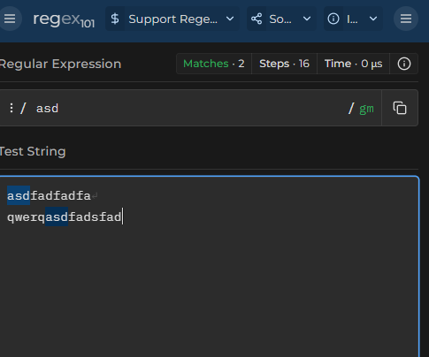

3. **Special Charcters**

Dot(`.`) - Matches any single charcter except newline

example - `a.c` matches "abc", "adc", "a_c" etc

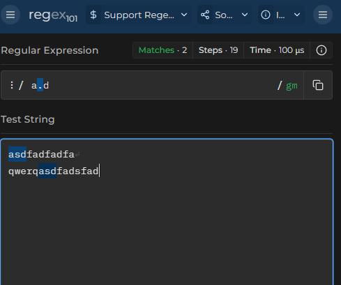

4. **Character Classes**

* **Square brackets** `[]` matches **any one** of the enclosed characters
  * Example - `[abc]` matches "a" , "b" or "c".

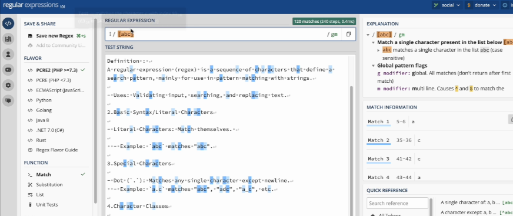

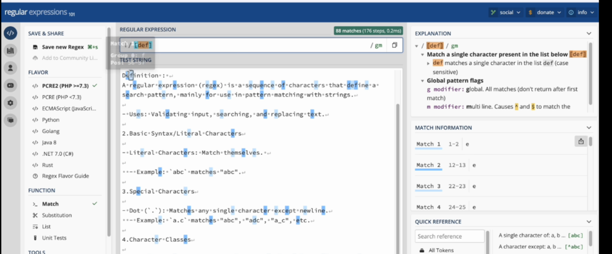

* **Range** - Inside square brackets to specify a range of characters.
  * Example - `[a-z]` matches any lowercase letter

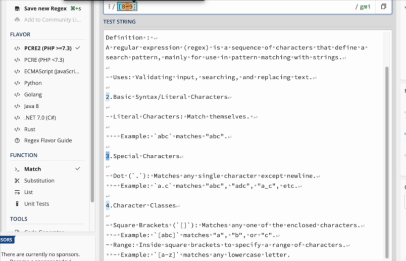

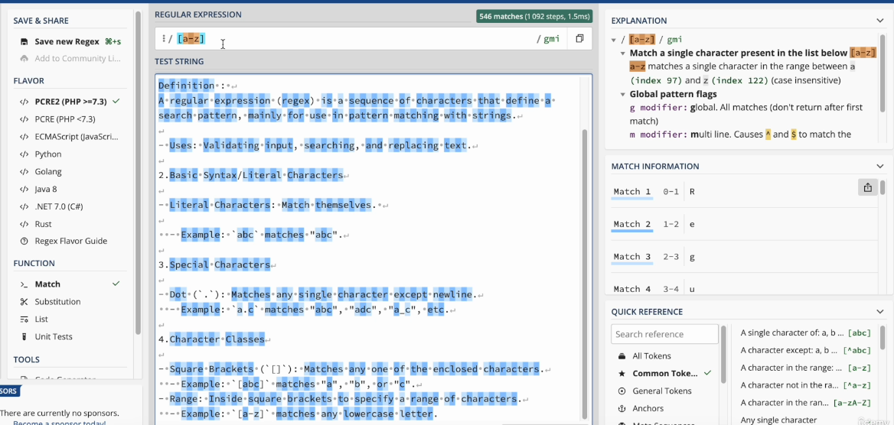

5. **Predefined Character Classes**

* `\d` - Matches any digit (0-9)
* `\w` - Matches any word character(alphanumeric plus underscore)
* `\s` - Matches any whitespace character (space, tab, newline)

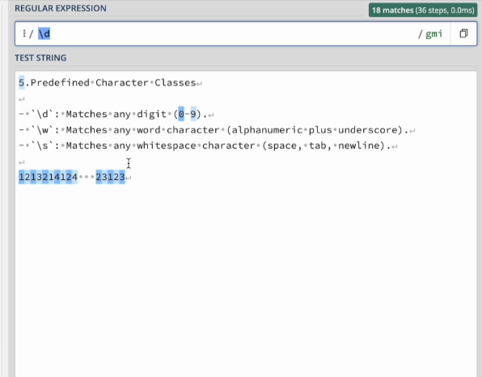

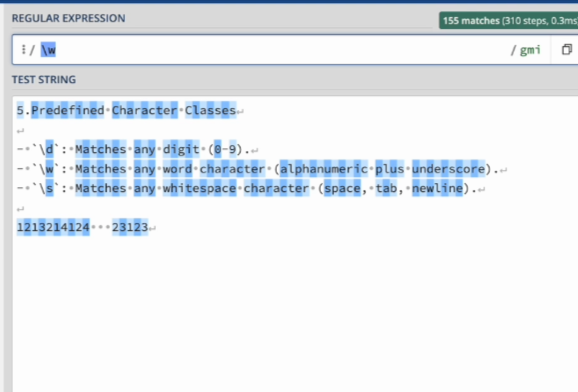

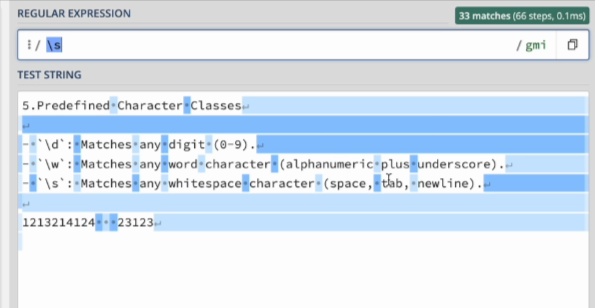

6. **Quantifiers**

* Asterisk - `*` Matches 0 or more of the preceding element.
  * Example - `a*` matches "", "aa" etc
* Plus - `+` Matches 1 or more of the preceding element.
  * Example - `a+` matches "a", "aa" etc
* Question Mark - `?` Matches 0 or 1 of the preceding element
  * Example - `a?` matches "" or "a"

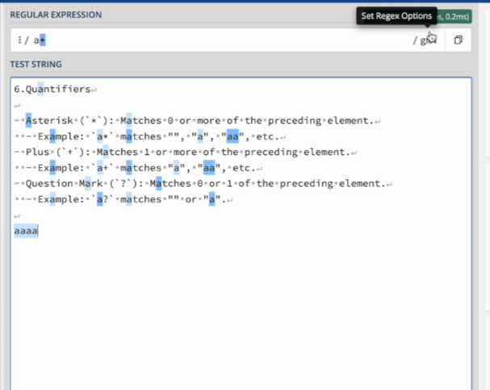

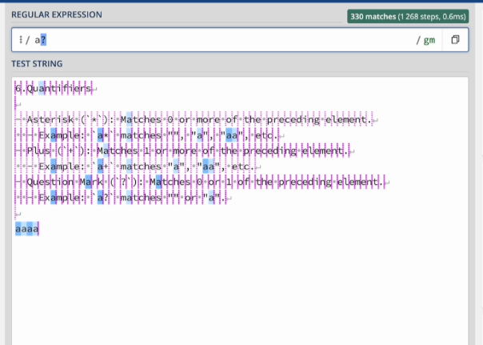

7. **Exact Quantifiers**

* Curly Braces - `{}` Matches a specific number of times
  * Example - `a{2}` matches "aa"
  * Range `a{2,4}` matches "aa", "aaa" or "aaaa"

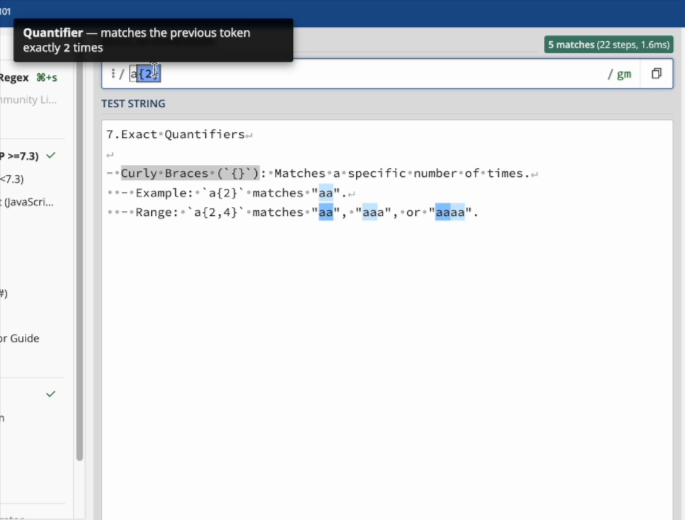

below example for 2 or more

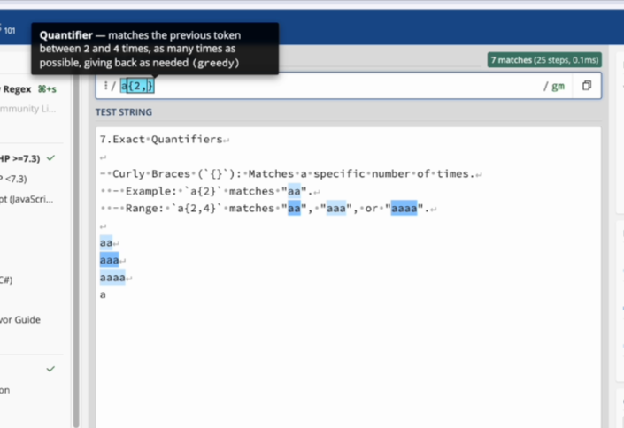

8. **Anchors**

* **Caret** - `^` Matches the start of a string
  * Example - `^a` matches "a" at the start of the string
* **Dollar** - `$` Matches the end of a string
  * Example - `a$` matches "a" at the end of the string

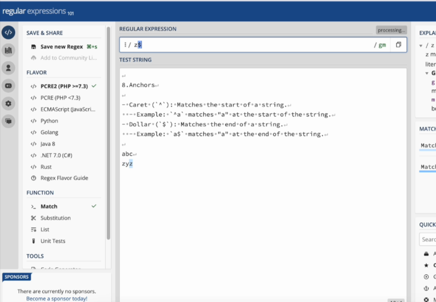

9. **Grouping and Alteration**

* **Parentheses** - `()` Groups patterns together
  * Example - `(abc)+` matches "abc", "abcabc" etc
* **Pipe** - `|` Alteration (OR Operator)
  * Example - `a|b`  matches "a" or "b"

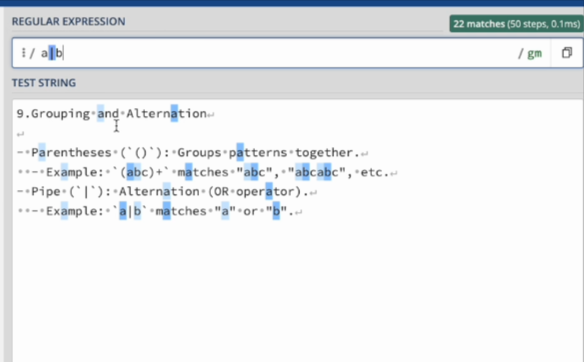

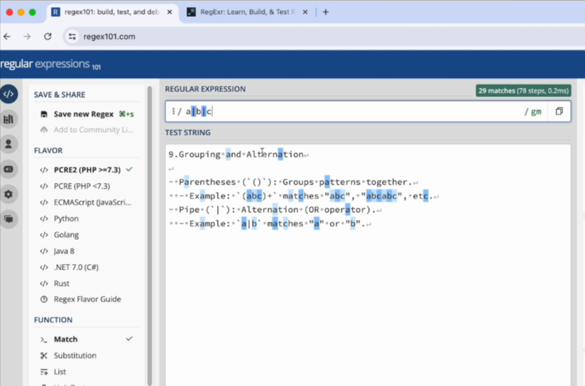