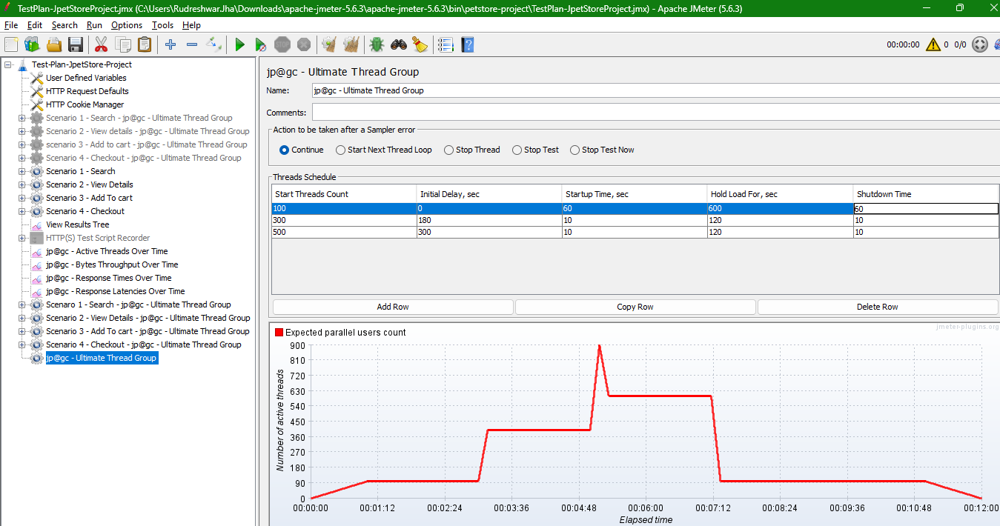
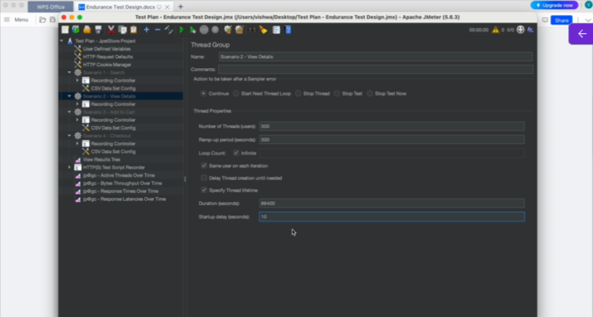
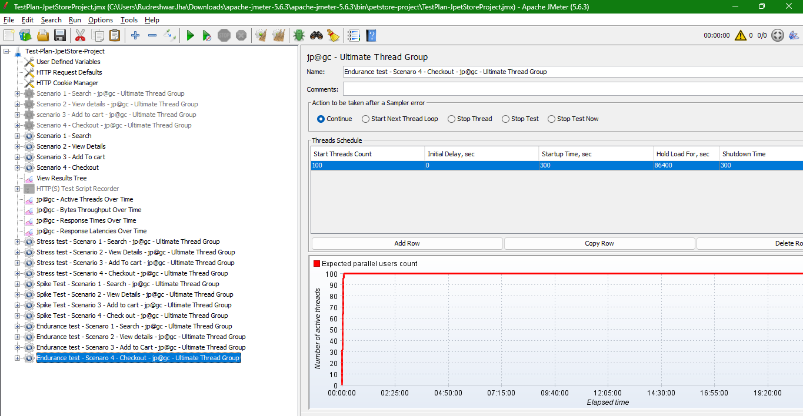

# Understand Performance Test Design in JMeter

* **Illustration of Load Test Design**

Application - An online banking website

We need to ensure the test accurately reflects real-world usage and provides meaningful results

**User Load Profile**  
* Expected User Load - 1000 users
* Ramp-Up Time - 30 minutes
* Steady-State Duration - 1 hour
* Ramp-Down Time - 30 minutes

We can Use -  
**Ultimate thread group**  
or  
**Stepping Thread group** 

* **User Behavior Scenarios**
  * Login - 25% of users
  * View Balance - 20% of users
  * Transfer Funds - 15% of users
  * Bill Payments - 10% of users
  * Logout - 30% of users

> We also need to add "Think Time" and "Pacing to Samplers". We can use timers for this

```txt
So in this way, what we have done is this load or the user profile is for an entire application.
So we need to do this.
division that is called workload modeling, and each user might be doing different transactions in the system.
```
so in this way you can design a load test


* **Performance Metrics**
  * **Response Time** : < 2 seconds for 95% of requests
  * **Throughput** : > 100 requests per second
  * **Error Rate** : < 1%
  * **Resource Utilization** : CPU < 70%, Memory < 80%, Network < 50% capacity

* Test Data
  * **User Accounts** : 1000 unique accounts


## How to Design Stress Test in JMeter using Ultimate Thread Group

* Illustration of Stress Test Design

**Objective of Stress test**  
Determining the maximum capacity of your application or identifying breaking points.

* Illustration  
  * Normal Load(Expected Load) : 100 concurrent users

**Phase 1/Run 1/cycle 1:**  
Number of threads: 100  
Ramp up: 60 seconds  
Ramp down: 60 seconds  
Hold Time/Steady state: 10 mins (600 sec)  

**Phase 2:**  
Number of threads: 200  
Ramp up: 60 seconds  
Ramp down: 60 seconds  
Hold Time/Steady state: 10 mins (600 sec)  

**Phase 3:**
Number of threads: 300  
Ramp up: 60 seconds  
Ramp down: 60 seconds  
Hold Time/Steady state: 10 mins (600 sec)  

**Note:** Above Values can be changed based on application under test and purpose of testing.  
So on... till you find breaking point  

JMeter Setup:  
Stepping thread group and Ultimate thread group are most suited for stress testing. Add appropriate think time and pacing. Add listeners for analyzing the results

**Breaking point:**
Identify the maximum load the application can handle before performance degrades. This istypically seen when **response times significantly increase**  or **error rates rise**

**Max Load (Identify Breaking Point):**  
Example:  
Continue increasing by 100 users, with a 60-second ramp-up & ramp-down, 10 min steadystate until performance degradation is observed.


**Workload Modelling/Distribution based on user behaviour:**  
**User Behavior Scenarios**  
* **Search**: 35% of users  
* **View Details:** 30% of users  
* **Add to Cart:** 25% of users  
* **Checkout:** 10% of users  

**Performance Metrics**  
* Response Time: < 2 seconds for 95% of requests  
* Throughput: > 100 requests per second  
* Error Rate: < 1%  
* Resource Utilization: CPU < 70%, Memory < 80%, Network < 50%capacity  

**Command to Run the Test :**
Synatx :
Windows OS:
Go to Jmeter bin folder in command line, using command : cd “path_to_bin_folder”jmeter –n –t [location of jmeter test script] -l [location of result file] -e –o [locationof output report folder

Windows OS:
Example command on Windwos:
jmeter -n -t "C:\Users\Vishwa\Softwares\Test Scripts and Test
Data\Scripts\testplan.jmx" -l "C:\Users\Vishwa\Softwares\Test Scripts andTest
Data\Results\results.jtl" -e -o "C:\Users\Vishwa\Softwares\Test Scripts andTest
Data\Reports\report"

## How to Design Spike Test in JMeter using Ultimate Thread Group

* **Spike Testing illustration / Design Spike Testing in JMeter**  

**Design**  
Designing spike testing involves creating sudden and intense load spikes to observe how the system handles unexpected surges in traffic.

Example -  Income Tax Filing near deadline date, Online sales promotion events with discount, events like black friday in USA

**Objectives**  
* Identify performance bottlenecks
* Assess System Stability and Reliability
* Test Scalability
* Check Resopnse Time and Throughput
* Validate Resource Utilization

**Using JMeter for spike test design**  
Ultimate Thread Group is well-suited for spike testing due to its flexibility  

note - We need to Add appropriate Think time and pacing for request samplers  

**Stage 1 - Initial Load**  
* Number of Threads - 100
* Ramp up time - 60
* Hold load for - 10 minutes
* Shutdown time - 60 seconds

**Stage 1 - Spike Load**(ex - starts 2 mins after initial load is steady & spike runs for 1 mintue)
* Number of Threads - 300
* Ramp up time - 10 seconds
* Hold load for - 2 minute
* Shutdown time or Ramp-down time - 10 seconds

Spike 2  
Starts 5 mins after initial load is steady & spike runs for 1 mins  
* Number of Threads - 500
* Ramp up Time - 10 seconds
* Hold Load for - 2 minute
* Shutdown time - 10 seconds



We have done for 1 thread, but we need to do workload modelling bascially for different transactions to simulate the realistic user load  

Note: More than 1 spike(Multiple spikes) can be added like above  

**Stage 3: Post-Spike Load**  
* Number of Threads: 100  
* Ramp-Up Time: 10 seconds  
* Hold Load For: 5 minutes  
* Shutdown Time: 60 second  

**Stage 3 : Post-Spike Load**  
* Number of Thread - 100
* Ramp-up time - 10 seconds
* Hold load for - 5 minutes
* Shutdown time - 60 seconds

**Workload Modelling/Distribution based on user behaviour:**
**User Behavior Scenarios ( Example: JpetStore shopping website )**  
* Search: 35% of users  
* View Details: 30% of users  
* Add to Cart: 25% of users  
* Checkout: 10% of users  

**Performance Metrics**
 Response Time: < 2 seconds for 95% of requests  
 Throughput: > 100 requests per second  
 Error Rate: < 1%  
 Resource Utilization: CPU < 70%, Memory < 80%  
Network < 50%capacity  

## How to Design Endurance Test in JMeter

* **Endurance/Soak/Longevity Test Design**  

Endurance or soak testing is a type of performance testing conducted to evaluate howa
system behaves under an expected load over an **extended period.**  

**Objective:**
The goal is to identify potential memory leaks, performance degradation, or other issues that
may arise from **prolonged use of the system.**

**Designing test in JMeter**  
Example Configuration  
Ex: JpetStore Online shopping website, Assume normal user load is 1000concurrent users.  
We can use : Ultimate Thread Group / Thread Group  

 Number of Threads (users): 1000  
 Ramp-Up Period (seconds): 300  
 Duration: 86400 seconds (24 hours)   
 Loop Count: Forever ( If you are using Thread Group)

**Workload Modelling/Distribution based on user behaviour:**
**User Behavior Scenarios**
 Search: 35% of users  
 View Details: 30% of users  
 Add to Cart: 25% of users  
 Checkout: 10% of users  

**Focus is to Identify:**  
 Memory Leak  
 Performance degradation  
 Any other issues due to longe running of an application  

**Test Data**  
User Accounts: 1000 unique accounts

example -  



you can also use ultimate thread group

