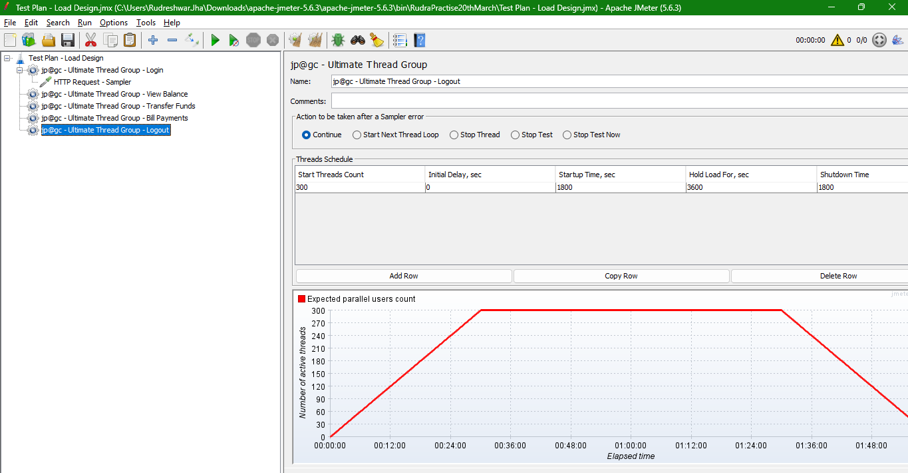

# Understand Performance Test Design in JMeter

* **Illustration of Load Test Design**

Application - An online banking website

We need to ensure the test accurately reflects real-world usage and provides meaningful results

**User Load Profile**  
* Expected User Load - 1000 users
* Ramp-Up Time - 30 minutes
* Steady-State Duration - 1 hour
* Ramp-Down Time - 30 minutes

We can Use -  
**Ultimate thread group**  
or  
**Stepping Thread group** 

* **User Behavior Scenarios**
  * Login - 25% of users
  * View Balance - 20% of users
  * Transfer Funds - 15% of users
  * Bill Payments - 10% of users
  * Logout - 30% of users

> We also need to add "Think Time" and "Pacing to Samplers". We can use timers for this

```txt
So in this way, what we have done is this load or the user profile is for an entire application.
So we need to do this.
division that is called workload modeling, and each user might be doing different transactions in the system.
```
so in this way you can design a load test



* **Performance Metrics**
  * **Response Time** : < 2 seconds for 95% of requests
  * **Throughput** : > 100 requests per second
  * **Error Rate** : < 1%
  * **Resource Utilization** : CPU < 70%, Memory < 80%, Network < 50% capacity

* Test Data
  * **User Accounts** : 1000 unique accounts


## How to Design Stress Test in JMeter using Ultimate Thread Group

* Illustration of Stress Test Design

**Objective of Stress test**  
Determining the maximum capacity of your application or identifying breaking points.

* Illustration  
  * Normal Load(Expected Load) : 100 concurrent users

**Phase 1/Run 1/cycle 1:**  
Number of threads: 100  
Ramp up: 60 seconds  
Ramp down: 60 seconds  
Hold Time/Steady state: 10 mins (600 sec)  

**Phase 2:**  
Number of threads: 200  
Ramp up: 60 seconds  
Ramp down: 60 seconds  
Hold Time/Steady state: 10 mins (600 sec)  

**Phase 3:**
Number of threads: 300  
Ramp up: 60 seconds  
Ramp down: 60 seconds  
Hold Time/Steady state: 10 mins (600 sec)  

**Note:** Above Values can be changed based on application under test and purpose of testing.  
So on... till you find breaking point  


