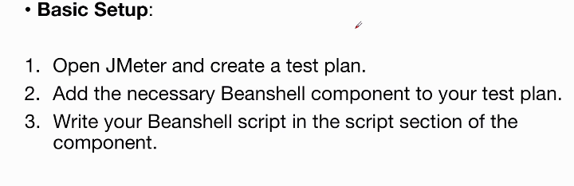
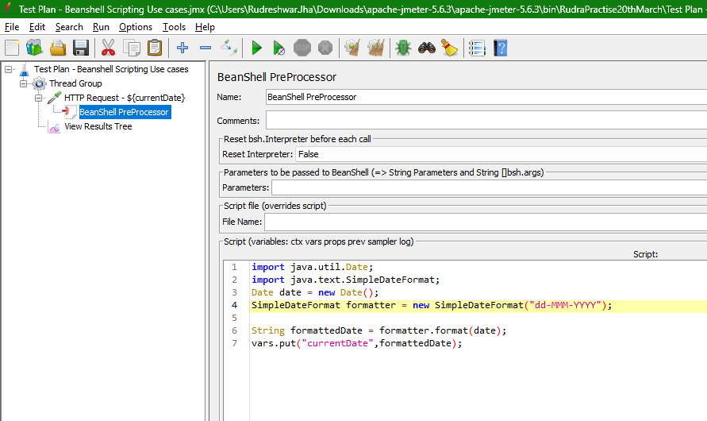
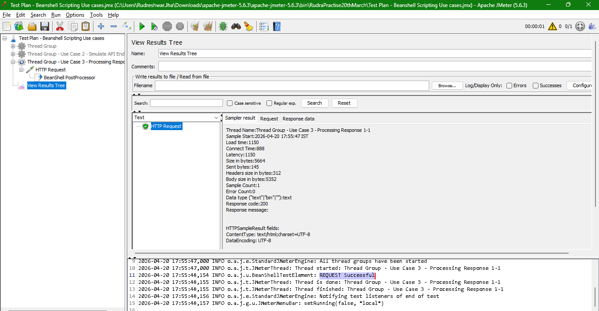
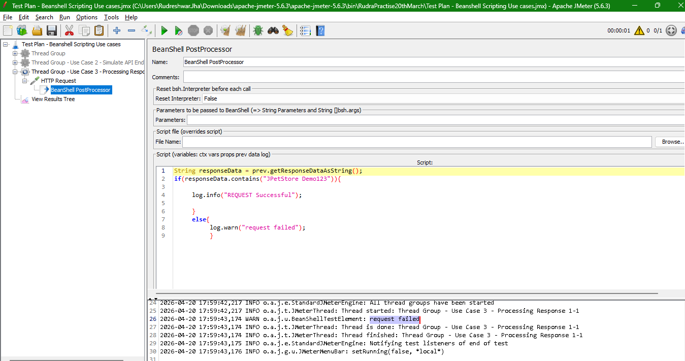
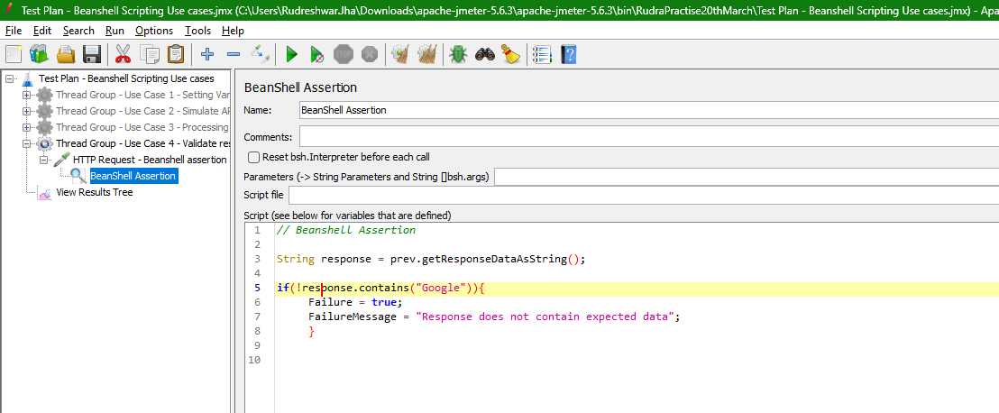

# BeanShell scripting in JMeter

## Introduction to BeanShell Scripting in JMeter

Overview  

* Beanshell is a lightweight scripting language that supports Java syntax
* In JMeter, Beanshell scripting allows users to customize test plans with dynamic behavior and complex logic that isn't achievable through JMeter's default components

## Beanshell Components in JMeter

1. **Beanshell Sampler** - Executes Beanshell script during test execution
2. **Beanshell PreProcessor** - Runs script before a sampler request is made 
3. **Beanshell PostProcessor** - Runs script after a sampler request is mode 
4. **Beanshell Assertion** - Validates the sampler response using a script
5. **Beanshell Timer** - Introduces a delay using a script
6. **Beanshell Listener** - Processes the results using a script

## Commonly used variables in JMeter Beanshell scripts
➤log: For logging messages.
➤vars: For accessing JMeter variables.
➤props: For accessing JMeter properties.
➤ctx: For accessing the JMeter context.
➤prev: For accessing the previous sampler result.

## Guideline for Using Beanshell Scripting



## BeanShell Pre-Processor(Use Case 1-Set variable value in JMeter)

```java
import java.util.Date;
import java.text.SimpleDateFormat;
Date date = new Date();
SimpleDateFormat formatter = new SimpleDateFormat("dd-MMM-YYYY");

String formattedDate = formatter.format(date);
vars.put("currentDate",formattedDate);
```



> So in this way, this is one of the use case where we are storing the value of the variable using the Beanshell preprocessor. And we can use the variable whereever necessary

## BeanShell Sampler(Use Case 2 - Simulate API End Point)

* Custom Sampler Logic
  * Simulate API End Point using Beanshell Sampler Custom logic.

```java

// Define the simulated response data
String response = "This is Simulated API response";

// Set the response data for the sampler
SampleResult.setResponseData(response,"UTF-8");

// Set response code for sampler
SampleResult.setResponseCode("200");

// Set response message for sampler
SampleResult.setResponseMessage("OK");

// Mark sampler as successful
SampleResult.setSuccessful(true);

// set Data type for sampler
SampleResult.setDataType(SampleResult.TEXT);

// set content type
SampleResult.setContentType("application/json");
```
## BeanShell Post-Processor(Use Case 3 - Handle Response Data)

* Processing Response Data
  * Use Beanshell PostProcessor to handle response data

```java
String responseData = prev.getResponseDataAsString();
if(responseData.contains("JPetStore Demo")){
	log.info("REQUEST Successful");
}
else{
	log.warn("request failed");
}


```

change the string -  



## BeanShell Assertion (Use Case 4 - Validate Response)

* Adding Assertions
  * Use Beanshell Assertion to validate response


```java
// Beanshell Assertion

String response = prev.getResponseDataAsString();

if(!response.contains("Google")){
	Failure = true;
	FailureMessage = "Response does not contain expected data";
	}
```



Above is simple beanshell assertion

## BeanShell Timer(Use Case 4 - Introduce Delay)
* Beanshell Timer
  * We can use Beanshell Timer to add a delay.


