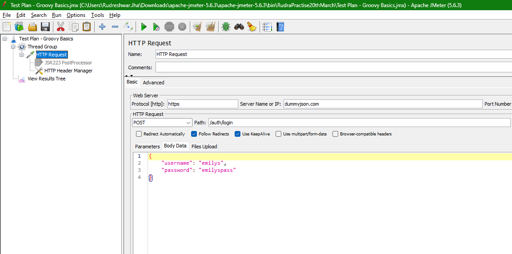
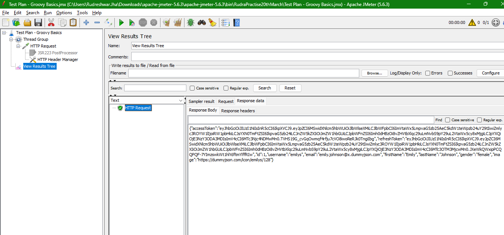
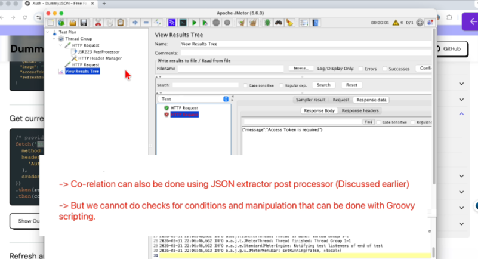
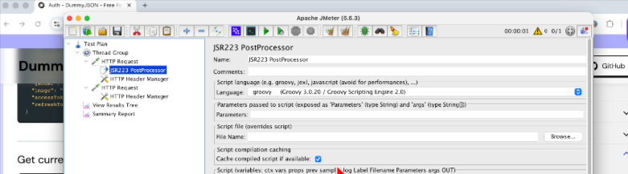

## Groovy Power - Building Intelligent & Real World JMeter Tests

## Groovy Basics for JMeter
> Your JMeter test works perfectly fine until APIs start returning a dynamic value like tokens or session IDs or user IDs and suddenly everything breaks whenever you get a dynamic value.
> Think it as a Smart assistant inside a JMeter

* Where to write Groovy Script
* How Store that value in a variable
* how to access and use that store value

Website - https://dummyjson.com/docs/auth

run the test




We need to extract this access token



to access the "access token" we will extract using post processor



```groovy
import groovy.json.JsonSlurper

// Get response from previous sampler
def response = prev.getResponseDataAsString()

// Parse JSON
def json = new JsonSlurper().parseText(response)

// Try multiple possible locations for token
def accessToken = json?.accessToken ?: json?.access_token ?: json?.data?.accessToken

if (accessToken) {
    vars.put("authToken", accessToken)
    log.info("Access token found: " + accessToken)
} else {
    log.warn("Access token not found. Full response: " + response)
}
```

selec the cache checkbox to reduce compilation time



groovy scripting is faster than beanshell extractor