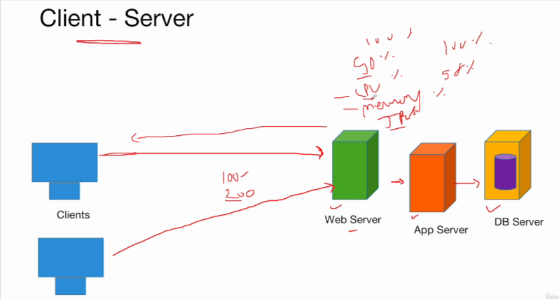
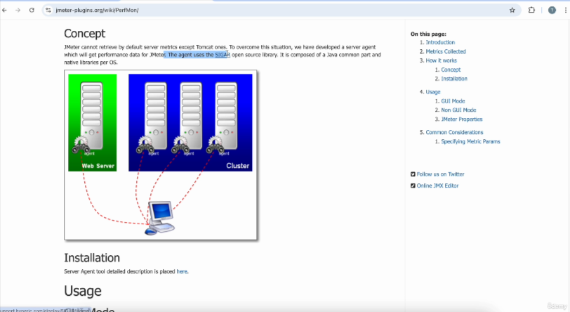
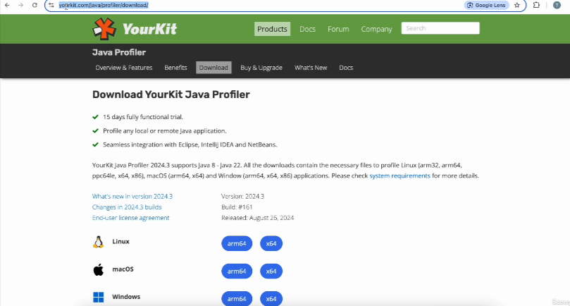
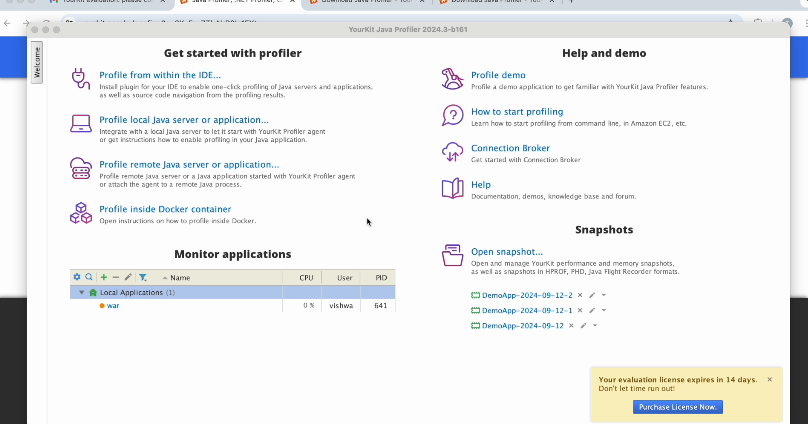

# Server-Side Performance Metrics Monitoring

## Client - Server

There are various clients that will be sending the request to the server.

These applications can have multiple servers such as web server, application server and database server.

and when multiple requests are sent to the server, the server will utilize its memory, CPU, etc.
to serve this request.

## Importance of Monitoring Server-side metrics

1. **Identifying Bottlenecks**
   1. > If it is fully utilizing its CPU and memory, then it it is not able to handle any more requests.
2. **Capacity Planning**
   1. > You can determine whether server has enough resources to handle the load.
3. **Preventing Outages**
   1. > For example, if you are not monitoring the usage of resources on the server side, if suddenly it is utilizing 100% of CPU and memory, suddenly it crashes, then application will go down
4. **Performance Tuning**
   1. > After identifying the high CPU usage and memory, you can adjust the server configuration.
5. **Baseline Comparison**
   1. > Based on how many users are using the system, we can plan for load/stress testing
6. **Resource Utilization Efficiecy**
   1. You will know you want to scale up or scale down your CPUs

## Server-Side Performance Monitoring Tools and Installing YourKit Java Profiler
* **Perfmon**
  * It was popular tool earlier
  * It is outdated and no longer supported by latest system anymore

* **Yourkit Profiler**
  * 15 days trial purpose
  * yourkit.com/java/profiler/download

These are paid tools and each tool will have its own advantages and disadvantages

* New Relic
* Datadog
* Zabbix
* Nagios
* Prometheus + Grafana

> above can be used for Infrastructure monitoring, Realtime analytics, Customizable dashboards, Proactive Alerting and more...
> You can select based on cost, organization and your requirement, skillset

## CPU Monitoring and Profiling using YourKit Java(Monitor Server)

* Ideally Install YourKit Java Profiler on the server side to monitor server side usage 
* We donot have server side infrastructure but we will use our local machine/pc/laptop