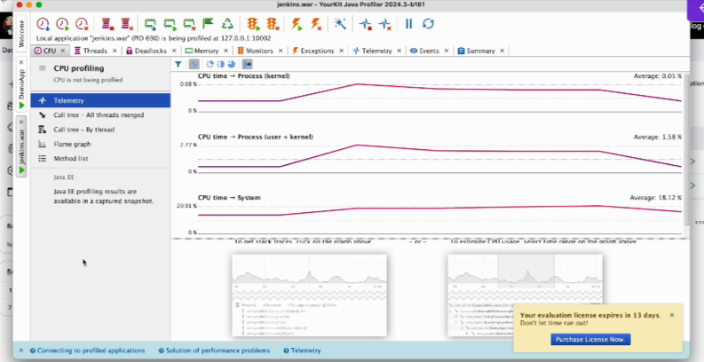
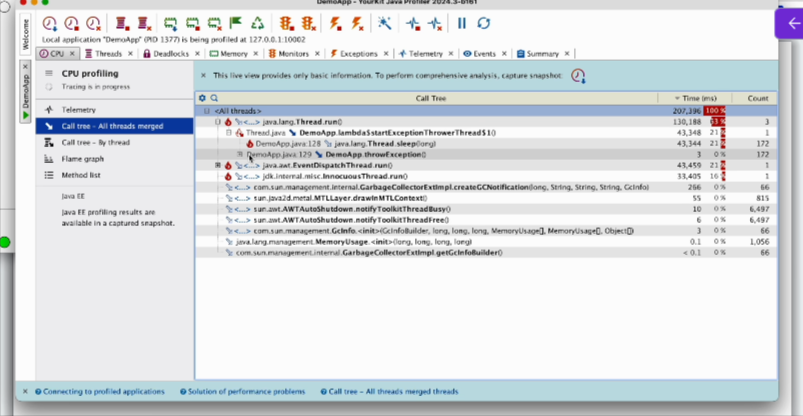
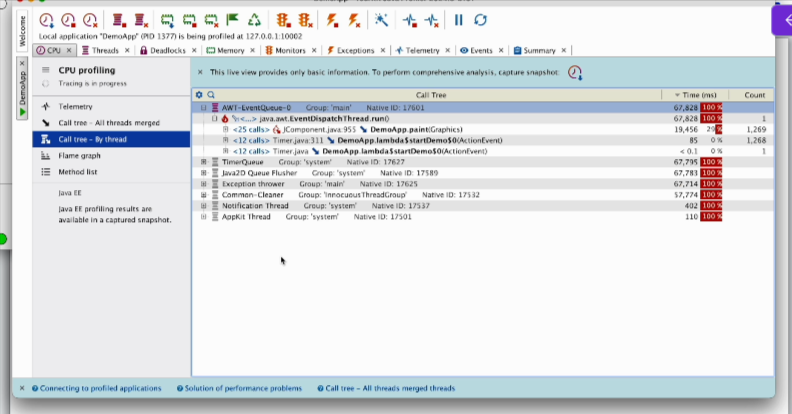
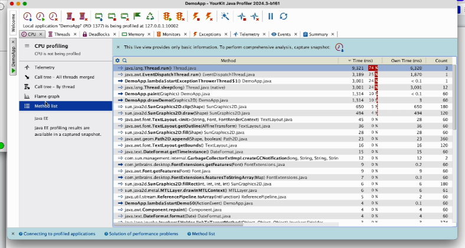
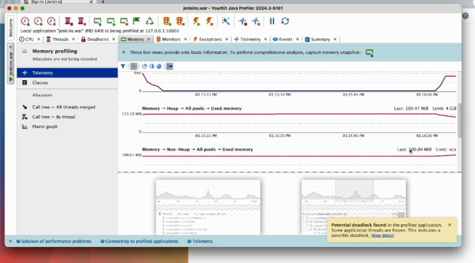
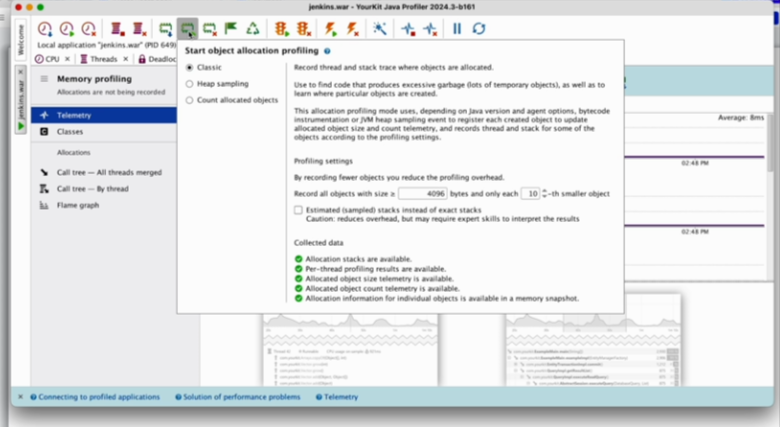
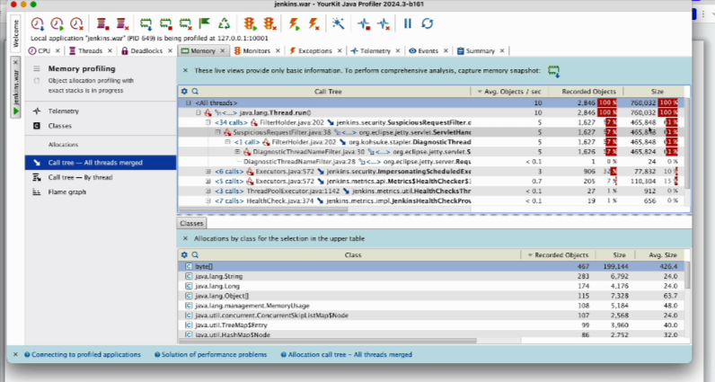
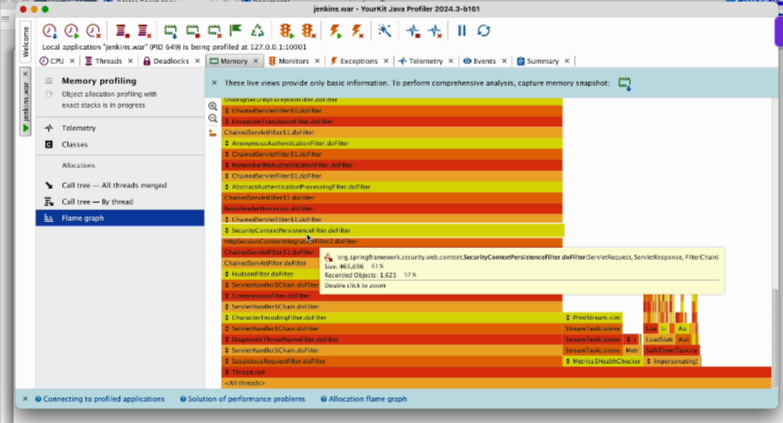

# Server-Side Performance Metrics Monitoring

## Client - Server


There are various clients that will be sending the request to the server.

These applications can have multiple servers such as web server, application server and database server.

and when multiple requests are sent to the server, the server will utilize its memory, CPU, etc.
to serve this request.

## Importance of Monitoring Server-side metrics

1. **Identifying Bottlenecks**
   1. > If it is fully utilizing its CPU and memory, then it it is not able to handle any more requests.
2. **Capacity Planning**
   1. > You can determine whether server has enough resources to handle the load.
3. **Preventing Outages**
   1. > For example, if you are not monitoring the usage of resources on the server side, if suddenly it is utilizing 100% of CPU and memory, suddenly it crashes, then application will go down
4. **Performance Tuning**
   1. > After identifying the high CPU usage and memory, you can adjust the server configuration.
5. **Baseline Comparison**
   1. > Based on how many users are using the system, we can plan for load/stress testing
6. **Resource Utilization Efficiecy**
   1. You will know you want to scale up or scale down your CPUs

## Server-Side Performance Monitoring Tools and Installing YourKit Java Profiler
* **Perfmon**
  * It was popular tool earlier
  * It is outdated and no longer supported by latest system anymore


* **Yourkit Profiler**
  * 15 days trial purpose
  * yourkit.com/java/profiler/download


These are paid tools and each tool will have its own advantages and disadvantages

* New Relic
* Datadog
* Zabbix
* Nagios
* Prometheus + Grafana

> above can be used for Infrastructure monitoring, Realtime analytics, Customizable dashboards, Proactive Alerting and more...
> You can select based on cost, organization and your requirement, skillset

## CPU Monitoring and Profiling using YourKit Java(Monitor Server)

* Ideally Install YourKit Java Profiler on the server side to monitor server side usage 
* We donot have server side infrastructure but we will use our local machine/pc/laptop



**CPU Time(Process Kernel)** - Time spent by your application on system-level tasks(kernel interactions)

**CPU Time(Process User + Kernel)** - Total time spent by your application, including both its logic(user mode) and system-level tasks(kernel mode)

**CPU Time(System)** - Total CPU usage by the entire system(all applications and the OS)

CPU Profiling  





> These will be more meaningful for the developers when they get the report
> For a developers, once they get this report, it will be very useful for them to troubleshoot.
> If at all there is a scope for improvement, then the improvement can be done in these methods.



## Memory Monitoring and Profiling using YourKit Java profiler(Monitor Server)

Steps - 
* Click on the application and attach the application to your profiler




* **Heap Memory**

```txt
The heap memory means the memory allocated by the system for the objects created by the program.

The objects in Java will be created using new keyword and when the object is created, it will be allocated

a heap memory and heat memory is dynamically allocated during the program execution.

This particular graph indicates amount of heap memory used by your application at a given point of time.

In this heap, memory objects like arrays classes are stored when they are created using new keyword,

and this heap memory is dynamically allocated.

It means it is allocated when the program is running.

The importance of heap memory is that this is.

The heap memory keeps on increasing and if it never gets released, then it might lead to memory leak

and also it might can impact the application performance.

So it is important to monitor the heap memory.
```

* **Garbase Collector** - It is an automatic memory management system for heap memory

> Whenever a garbage collector is called, this heap memory gets reduced because unused objects will be removed from the heap.
> It is important to ensure that this heap memory never keeps increasing continuously.

* **Non Heap Memory**

> If a non heap memory usage is too high, it indicates there is a lot of classes being loaded and there is a lot of metadata that is getting stored and it may impact the performance of your applications.

* **Memory Profiling**

> Memory profiling means which objects and which threads and which methods in your application are consuming.







> Above data can be used for memory optimization

