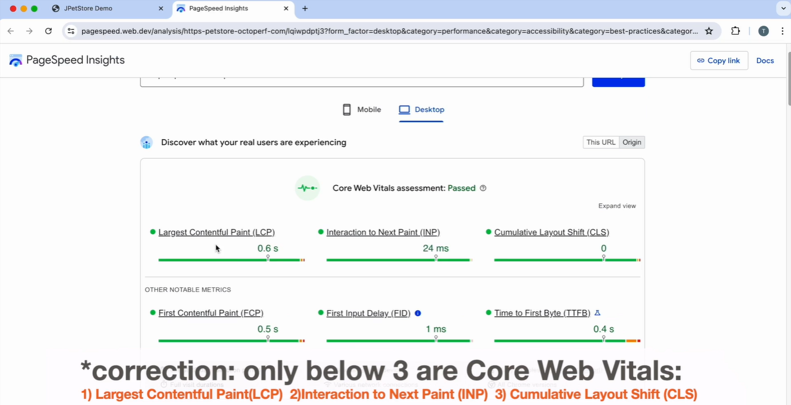
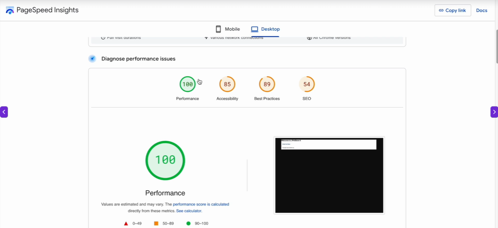
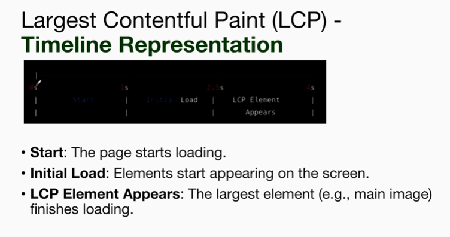
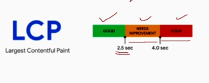
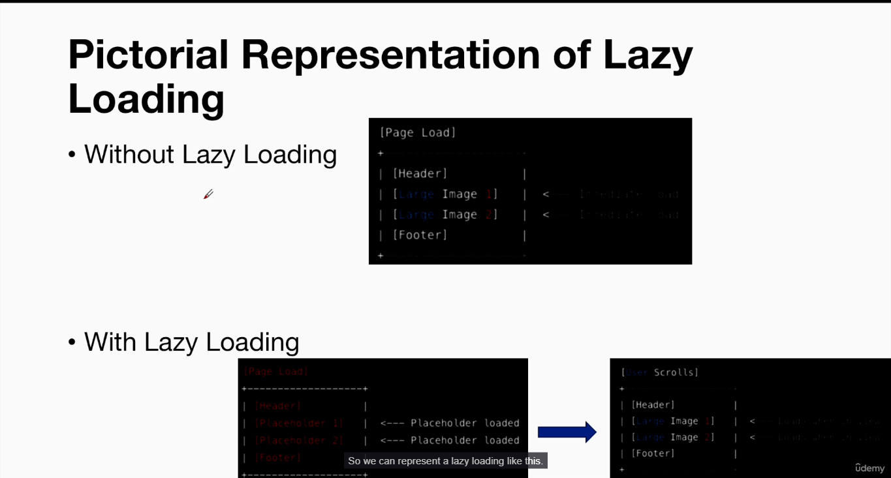
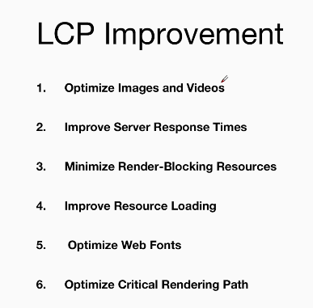

# Client Side Performance Testing and Client side Performance Engineering

## Client side Performance Testing vs Server side Performance Testing

|#|Aspect|Client-Side Performance Testing|Server-side Performance Testing|
|---|---|---|---|
|1|**Definition**|Measures how quickly a webpage or application renders(displaying) and responds(e.g. clicking) on the user's device|Measures the performance and scalability of the server and backend systems|
|2|**Focus**|Frontend performance(e.g., HTML, CSS, JavaScript execution, rendering times)|Backend performance (e.g. database queries, server response times, API performance).|
|3|**Tools**|Browser Developer Tools(e.g. Chrome DevTools, Lighthouse, WebPageTest|JMeter, LoadRunner, NeoLoad, Gatling|
|4|**Metrics**|Page Load time, Time to first Byte(TTFB), First Contentful Paint(FCP), JavaScript execution time|Response time, Throughput, Error rates, server resource utilization(CPU, memory, disk I/O)|
|5|**Objective**|Enhance the user experience by reducing load times and ensuring smooth interactions|Ensure the server can handle expected loads, maintain performance under stress, and scale efficiently|
|6|**Scope**|Browser and client-side resource usage and performance|Server, network, and database performance|
|7|**Typical Issues Detected**|Slow page loads, unoptimized images inefficient JavaScript, rendering delays|High server response times, bottleneck(limited resources), memory leaks, server crashes under load|
|8|**Optimization Techniques**|Minifying CSS and JavaScript, optimizing images, leveraging browser caching, reducing HTTP requests|Database indexing, load, load balancing, optimizing server configurations, scaling infrastructure.|

## Client-Side Performance using Google Lighthouse(Introduction) - Part 1
* It's a browser plugin

## Client Side Performance Engineering - Largest Contentful Paint(LCP)

**LCP Definition** -  

* LCP measures the loading performance of the **largest visible element** on the webpage.
* This could be an image, a video, a block-level text element, or any other significatnt element.

* **How LCP is measured?**
  * **Page Load Starts** - The browser begins to load the HTML of the page
  * **Initial Content Load** - The initial text, images, and other elements start to appear
  * **LCP Element Appears** - The largest element, like the main image or headline, finishes rendering and becomes visible to the user
  * **LCP Time recorded** - The time from the start of the page load to the point where this element is fully loaded is recorded as the LCP

* Good LCP Score
  * Good < 2.5 second
  * 2.5 < LCP Needs Improvement < 4 second
  * Greater than 4 Second, LCP is poor

* **How to Improve LCP score**
  * Improving the Largest Contentful Paint (LCP) score involves optimizing various as cts of our webpage to ensure that the largest visible content loads quickly

1. **Solution 1** - Optimize Images and Videos
   1. **Compress Images**
      1. Use modern image formats like WebP or AVIF
      2. Compress images using tools like TinyPNG or ImageOptim
   2. **Lazy Load Images**
      1. Implement lazy loading for images that are not immediately visible on the viewport using the loading = "lazy" attribute
   3. **Optimize Video Delivery**
      1. Use efficient video formats
      2. Implement lazy loading for videos

### Lazy Loading
Lazy loading delays the loading of resources (e.g., images,
videos, iframes) until they are needed, typically when they enter the viewport (i.e., when the user scrolls to them).

2. Solution 2 - Improve Server Response Times

* **Use a Content Delivery Network(CDN)**
  * Distribute your content globally to reduce latency
* **Optimize Server Configuration**
  * Upgrade to faster servers
  * Implement server-side caching
* **Reduce Server Processing Time**
  * Optimize database queries
  * Minimize the use of heavy server-side logic

3. Solution 3 - Minimize Render-Blocking Resources

* **Defer or Asynchronously Load CSS and JavaScript**
  * Use the async or defer attribute for non-critical JavaScript
  * *Inline critical CSS and load non-critical CSS asynchronously
* **Optimize CSS Delivery**
  * Minimize CSS files
  * *Use media queries to load CSS only when needed

4. **Solution 4 - Improve Resource Loading**

* **Preload Important Resources**
  * Use <link rel="preload"> to prioritize important resources like fonts, images, and scripts
* **Use HTTP/2**
  * Ensure your server supports HTTP/2 to enable multiplexing and faster resource loading
* **Reduce Third-Party Scripts**
  * Limit the number of third-party scripts that can slow down loading

5. **Solution 5 - Optimize Web Fonts**

* Preload Web Fonts
  * Use `link rel="preload"` to load important fonts earlier
* Use Font Display
  * Use the font-display:swap; CSS property to ensure text is visible while fonts are loading

6. **Solution 6 - Optimize Critical Rendering Path**

* **Minimize Main Thread Work**
  * Use **web workers** for heavy computations
  * Optimize JavaScript to reduce execution time  
* **Reduce CSS complexity**
  * Simplify your CSS to reduce render time 

