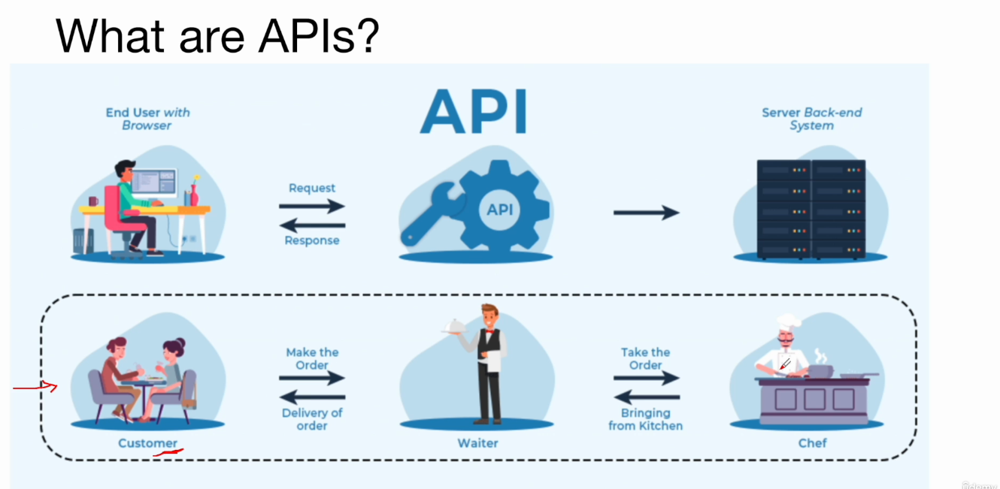
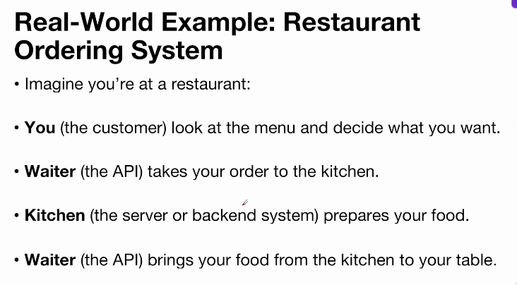
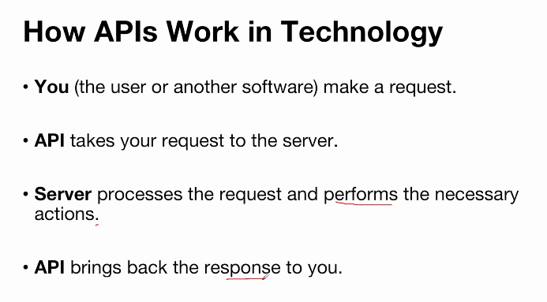
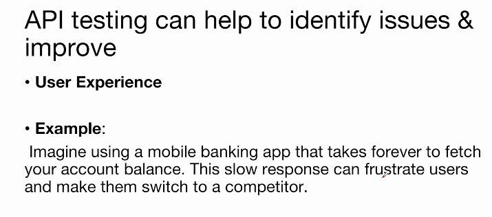
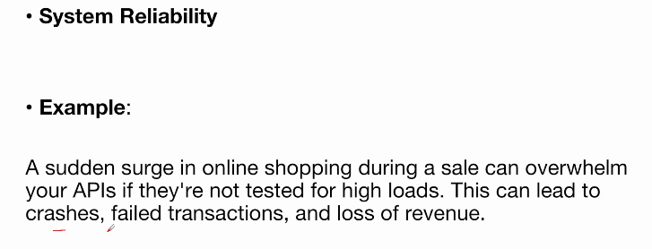
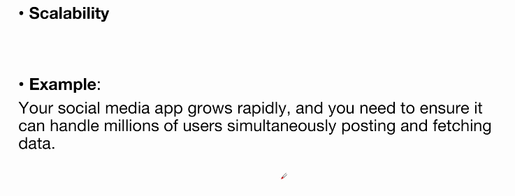
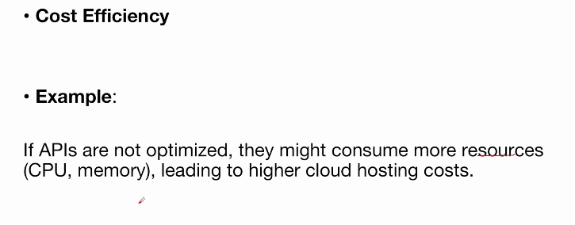
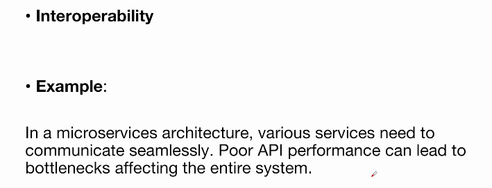
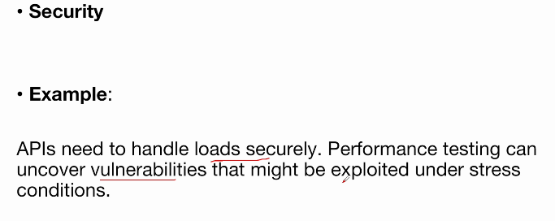
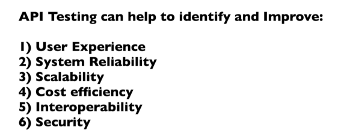

# API Testing using JMeter

## What is an API

* An API, or Application Programming Interface, is like a waiter in restaurant.
* It's a way for different software programs to talk to each other and share information or services.

## Importance of API Performance Testing or Why API Performance Testing is needed
* **Importance of API Performance testing**
  * API performance testing is like a stress test for your application's backbone.
  * It helps ensure that your application remains responsive,
reliable, and efficient even under high load conditions.
  * API performance testing is crucial because it ensures that the APIs are fast, reliable, and can handle the expected load. 
  * By regularly testing and optimizing your APIs, you can provide a better user experience, maintain system reliability, and manage costs effectively.

* **API Testing can help to identify issues & improve** 

* **API Testing - Practical Scenario - 1**
* **E-Commerce Application**
  * **Scenario**: During Black Friday, an e-commerce site expects a 1Ox increase in traffic. Performance testing ensures that the APIs handling product searches, checkout, and payment processing can handléffe load withöÜt crashing.
  * Outcome: Smooth user experience, higher sales, and customer satisfaction.

* **API Testing - Practical Scenario - 2**
* Banking System
* **Scenario**: An online banking system must process thousands
of transactions per second. Performance testing ensures that
money transfers, account updates, and transaction histories
are fast and reliable.
* **Outcome**: Trustworthy and efficient banking services, reduced risk of transaction failures.

## Difference between API Performance Testing and Web Performance Testing

|Aspect|API Performance Testing|Web Performance Testing|
|---|---|---|
|Focus|Testing the performance of backend services and endpoints e.g. Checking the response time of a login API|Testing the performance of the entire web application, including frontend and backend. e.g. Checking the loading time of the login page|

