# Question and Answer

## How to read large JSON payload(request body) from external file

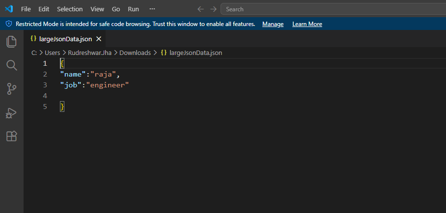

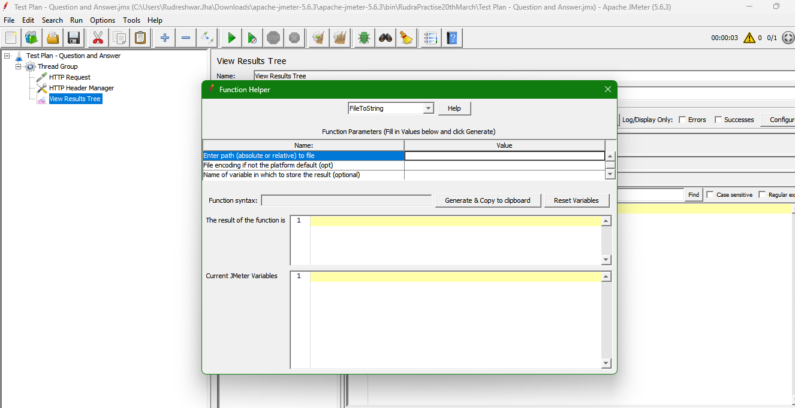

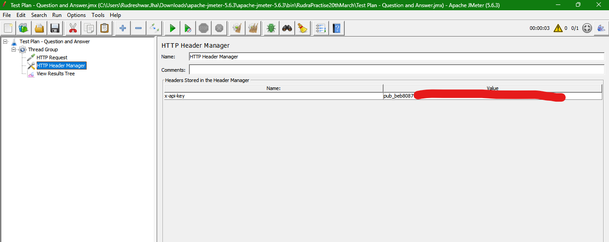

```txt
If the body is huge, then it is recommended to use the JSON file to read the data rather than copying

the data directly here
```

Example - `${__FileToString(/path/to/data/file/fileName.json,,)}`
Syntax - ` ${__FileToString(<file path>,<encoding>,<variable>)}`

## Understand Hold Load for and Design Load Test

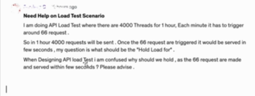

> The purpose of "Hold Load" is to keep the pressure/Load on the system steady for a specific amount of time.
> Analogy - Suppose let us say you want to test a bridge.Whether 100 cars can pass through a bridge in one minute, but you want to test that for one hour in one minute. All 100 cars will pass through the bridge, but you don't want to stop the testing. After one minute. You want to test for one hours whether the bridge can sustain the continuous traffic.

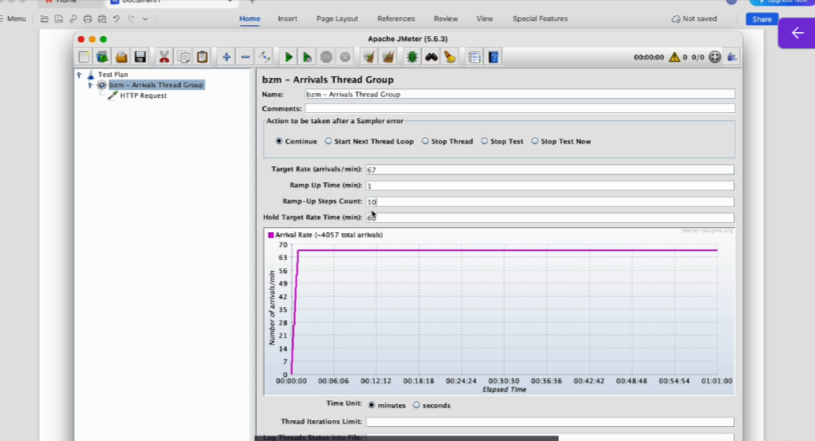

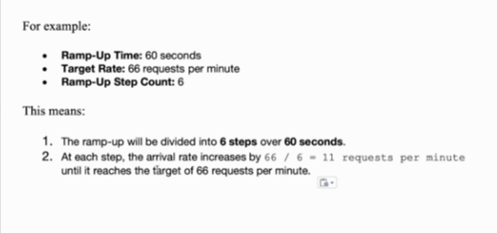

## How to Co-relate Session ID or Login Token

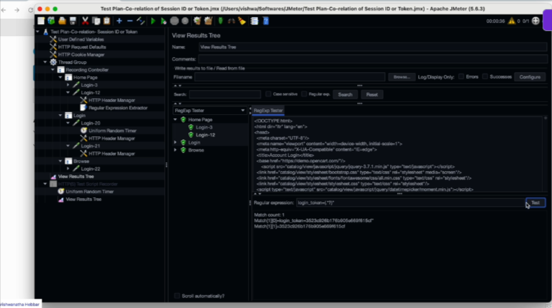

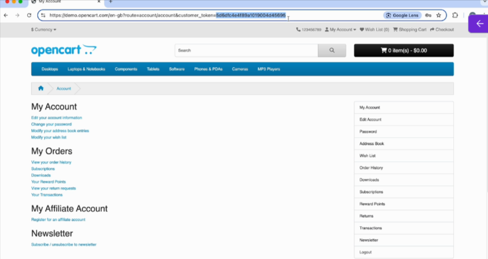

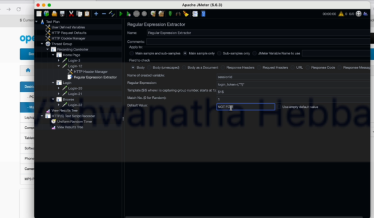

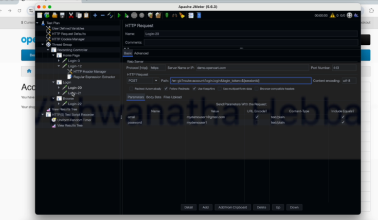

## How to Filter JMeter Results using Plugin Tool

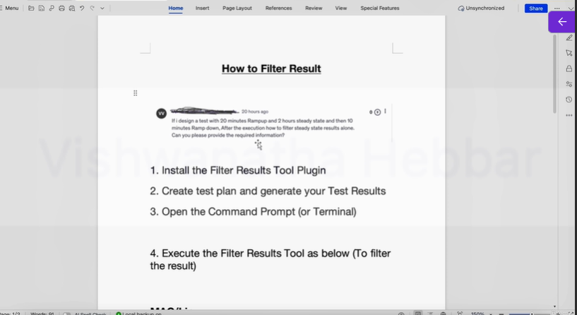

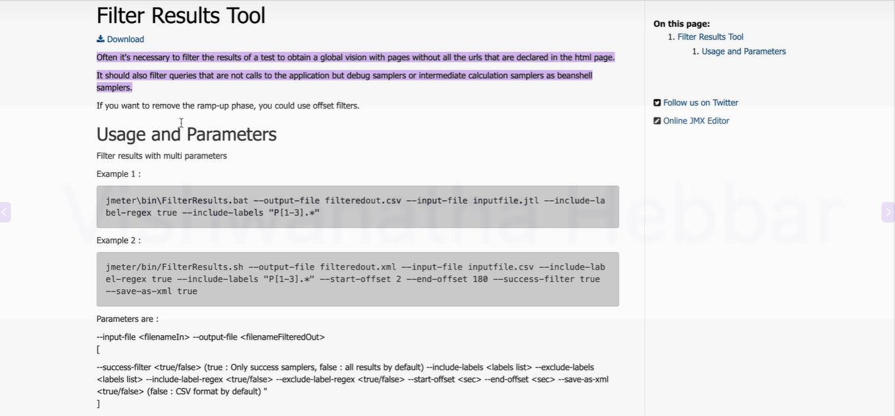

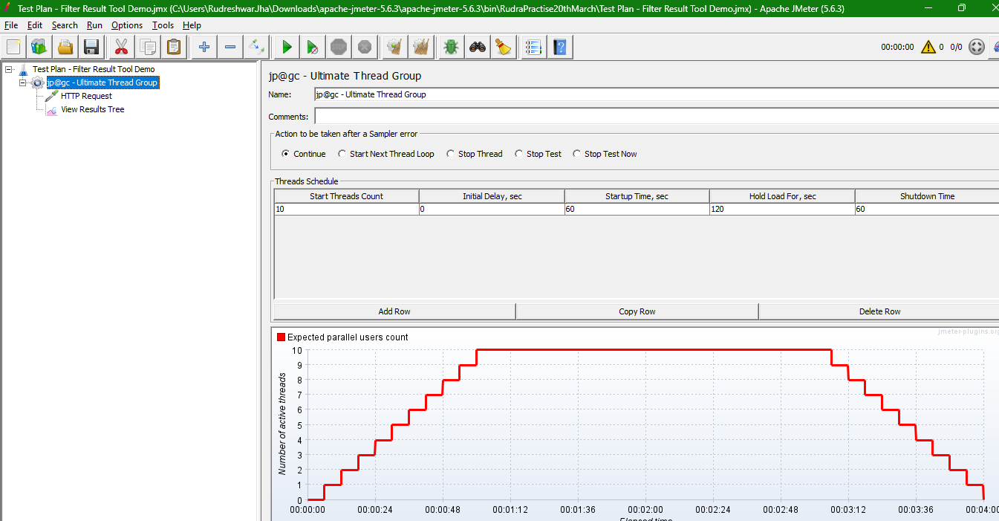

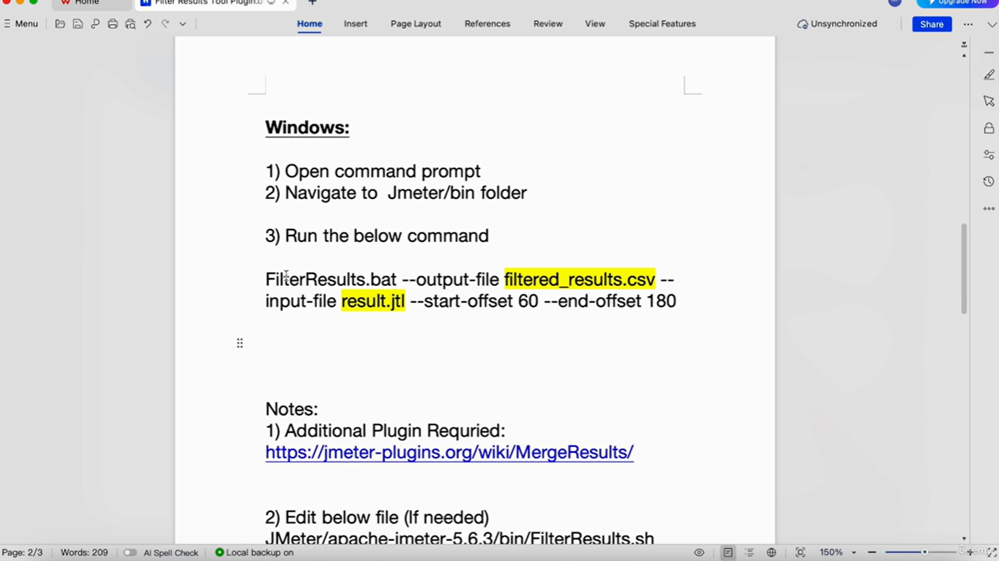

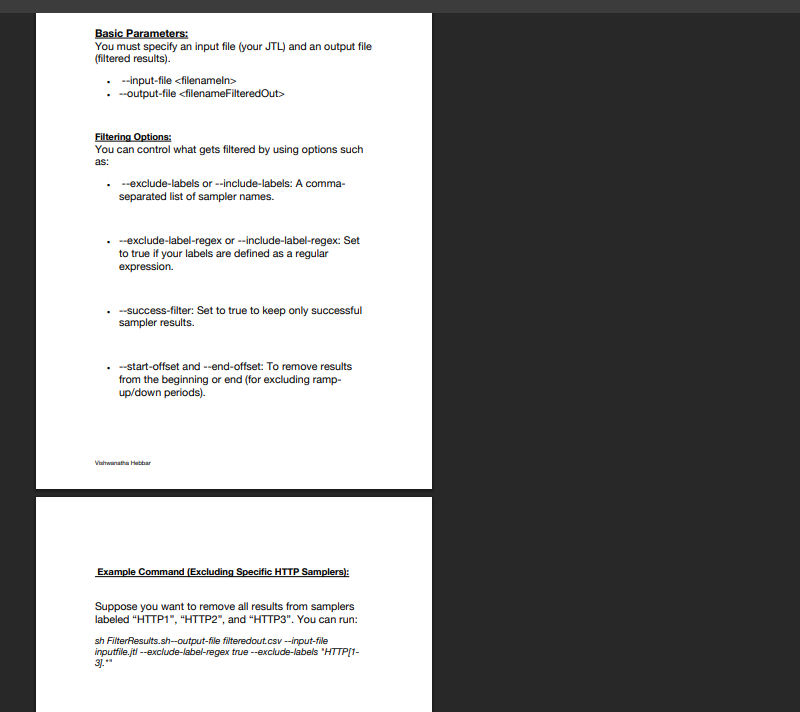


## How to Stop a JMeter Test Plan when a Thread Group Finishes
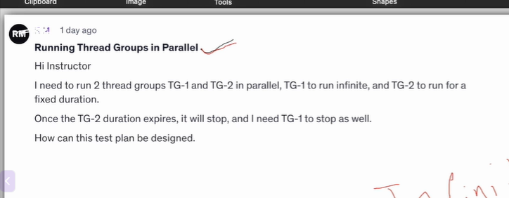

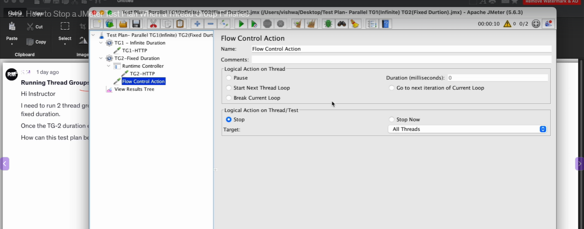

> File attached in jmx folder

## How to Convert JMeter HTML Report Response time Milli Seconds to Seconds
Navigate to following file

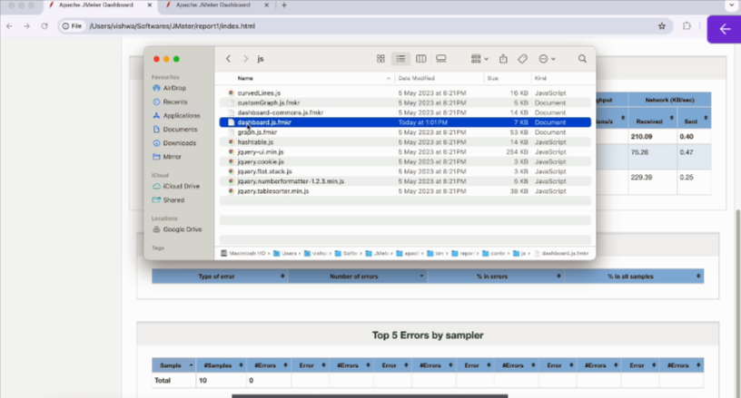

search the following in file

`cell.innerHTML` and change to seconds(for header)

`statistics`

change the code - 

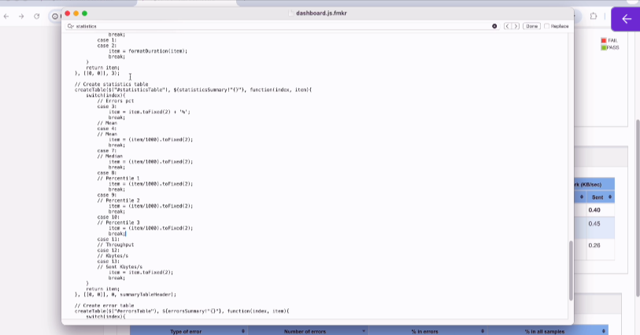

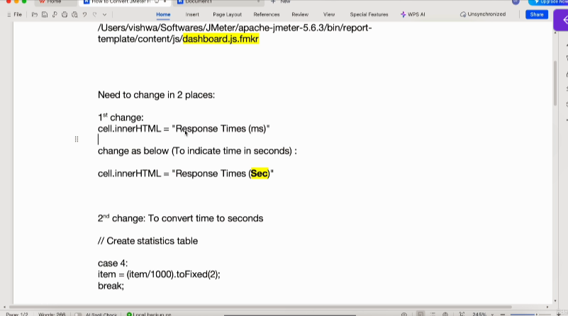


