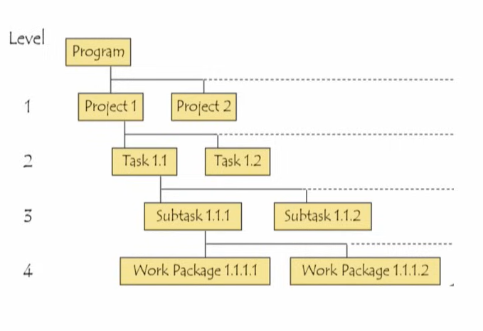

# Lecture 01: Introduction to Project Management - I

## Introduction

* Project management advances rapidly in all domains
* Projects are getting much more sophisticated and complex, involving  
multiple organisations and billions of dollars
* While success rates for standard projects improved, nontraditional  
projects struggled.
* Rapid growth in project management in organisations
* Shift from external to internal projects
* Success in executing internal projects improves efficiency and  
competitiveness
* Project management provides powerful tools for planning, implementing,  
and controlling activities.

## The definition of a "Project"

* A temporary endeavour undertaken to create a unique product, service, or  
result" (PMBOK, Project Management Institute, 2013)
* In its early days, project management was used mainly for extensive, complex  
research and development (R&D) projects
* Massive construction programs were also organised as projects, including the  
construction of dams, ships, refineries, and freeways.

## History of Project Management

* As the techniques Of project management were developed,  
mostly by the military, the use Of project organisation began to  
spread
* Project-based organization helped private construction firms  
on smaller projects like warehouses or apartment complexes  
* Automotive companies used project organization to develop  
new automobile models
* Most striking has been the widespread adoption of project  
management techniques for the development of computer  
software

## Example of Project Management : Chandrayaan-3

* Chandrayaan-3 mission is one of the finest
examples of project management.
* It is the lesson from the failure of Chandrayaan-2
in 2019.
* The error was identified and corrected, leading to
the successful soft landing of the Chandrayaan-
3 lander on the lunar South Pole.
* **Clear Objectives**
    * To explore the Moon and conduct scientific
experiments.
* **Detailed Planning**
    * extensive planning, including designing spacecraft, calculating and trajectories,
specifying scientific payloads.
* **Collaboration**
    * Collaboration between various institutions,
including ISRO (Indian Space Research
Organization), academia, and industry.
* **Monitoring and Control**
    * Continuous monitoring and control mechanisms
were in place to track progress and make
adjustments as needed, another key aspect of
project management.

## Program, Project, Task and Work Packages

* The military, the source of most of these terms,
generally uses the term program to refer to a
substantial, long-range objective that is broken
down into a set of projects
* Projects are divided further into tasks, which are, in
turn, split into work packages that are themselves
composed of work units

## Triple Constraint

* This illustration implies that some "function" relates
them, one to another
* Although the functions vary from project to project
and from time to time for a given project
* Two primary tasks of the project manager (the
"PM")
    * to manage these trade-offs and
    * anticipate and address risks to the project

## Availability of outcome itself is part of the outcome

* There is a tendency to think of a project solely
in terms of its outcome—that is, its scope
* But the time at which the outcome is available
is itself a part of the outcome, as is the cost
entailed in achieving the outcome
* The completion of a building on time and
within budget is quite a different outcome from
the completion of the same physical structure a
year later, 20 per cent over budget, or both

## Concept of Scope

## Ancillary goals

* Improving the organization's project management competency and methods
* Developing individuals' managerial experience through project management
* Gaining a foothold in a new market

## Health of the Project Team

* The PM should not exhaust the team
* When making project trade-offs, consider the
external factors that impact or are impacted by the
project, even if they are outside the sponsoring
organisation
* Examples:
    * Environmental groups
    * Trade unions
    * Competitive firms and the like.

## Three - Characteristics of Projects

* Every project is unique
* Project is a one-time occurrence
* Projects is that they have a finite duration

## Interdependencies
* Projects often interact with other projects being carried out simultaneously by their parent organization
* These interactions take the form of competition for
scarce resources between projects
* Projects always interact with the parent organization's standard, ongoing operations
* PM must keep all these interactions clear and maintain the appropriate interrelationships with all external groups

## Limited budgets

* Often, the budget is implied rather than detailed,
particularly concerning personnel, but it is strictly limited
* The attempt to obtain additional resources (or any
resources) frequently leads to the next attribute—conflict

## Summary

History of projects
The Definition of a "Project"
Program, Project, Task and Work Packages
Triple Constraint
Concept of Scope
Ancillary goals
Characteristics of Projects