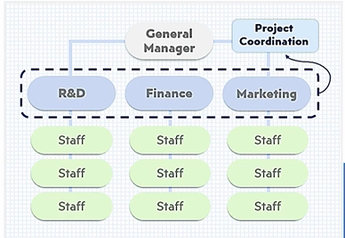
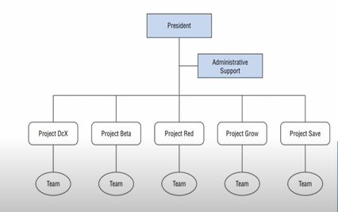
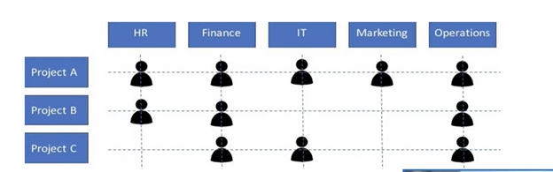
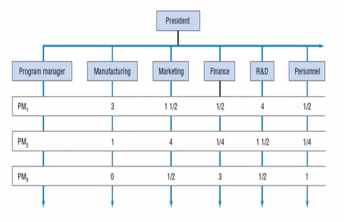
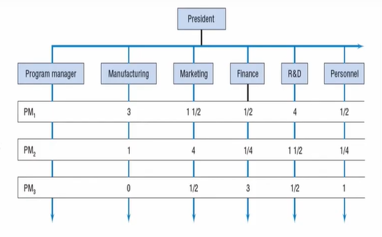
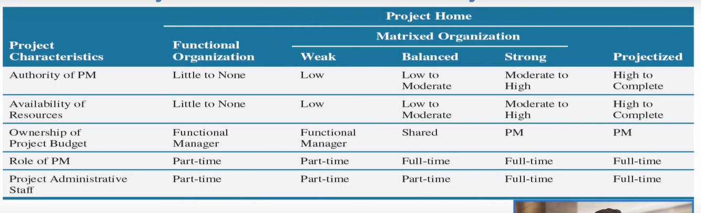
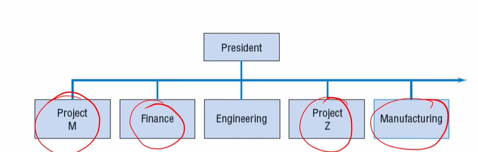
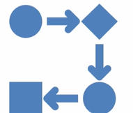

# Lecture 11 : Project in the Organization structure

## Agenda

Need for Organization Structure  
Need for project-oriented organisations  
Organizational issues for project-oriented structure  
Major organizational forms  
Project Characteristics and Project Home  
Selecting a Project Form  

## Need for Organization structure

* The focus of the structure is the specialization of the
human elements of the group
* As long as its organisational structure is sufficient for
its imposed tasks, the structure tends to persist
* When the structure begins to inhibit the work Of the
firm, pressures arise to reorganize along some other
line

## Type of organization structures - Project organization

* In the past decade or so, a new kind of organization structure has appeared in growing numbers - **the project organization**
* Other Names
    * Enterprise project management
    * Managing organizations by projects
    * Project-oriented firm
* Such organizations have been described as **applying
"project management practices and tools across an
enterprise"**

## Need for Project-oriented organizations

* Speed and market responsiveness
* Traditional methods for developing new products orl
services are no longer competitive
* First-to-market is a powerful competitive advantage
* Requirement of diverse specialised knowledge, but
the exact mix is rarely suitable for another product or
service
* Teams of specialists
* Traditional mechanisms cannot handle large-scale
change satisfactorily, but project organizations can

## Organizational issues for Project-oriented structure

* Regardless of the organization's project orientation or occasional projects, any
project initiated immediately triggers three organizational issues
* First, a decision must be made about how to tie the
project to the parent firm.
* Second, a decision must be made about how to organize
the project itself.
* Third, a decision must be made about how to organize
activities that are common to other projects.

## Major organizational forms

1. Functional
2. Projectized
3. Matrix
4. Composite

### 1. Functional Organizational Structure

* Make it a part of one of the functional divisions
— More than one choice may exist  
— If support from other areas is needed, they are
expected to help support the project  
* Another way is to assign the work to all divisions with
the top management overseeing the effort

### Advantages-Functional organisation

* Maximum flexibility in the use of staff
* Experts can be utilized by many different projects
* Specialists can be grouped to share knowledge and
experience
* Functional division serves as a base of technological
continuity
* Functional division contains the normal path of
advancement

### Disadvantages-Functional organisation
* Client is not the focus of the activity
* Functional units ten to e oriented towar t e activities
of that function
* No individual is given full responsibility
* Response to client needs is slow and arduous
* Tendency to suboptimize the project
* Motivation tends to be weak
*  A holistic approach to the project is not facilitated

## 2. The Projectized Organization

* Here the firm's administrative support
groups (HR. Legal, Finance, Controller, etc.)
report to the President or CEO as staff units
* Projects have a full compliment of functions
* Each project is stand-alone with its own
technical team, its own staff, and so on

### Advantages - Projectized Organization

Project manager has full authority  
All members report to the project manager  
Short lines of communication  
For similar projects, expertise can be retained  
Strong and separate identity  
Swift decisions  
Unity of command  
Structurally simple and flexible  
Supports a holistic approach  

### Disadvantages - Projectized Organization

Duplication in staffing  
Stockpiling  
Workers tend to fall behind in other areas of their
technical expertise  
Inconsistency in policies and procedures  
A project takes on a life of its own  
Worry about life after the project is over  

## 3. Projects in Matrixed Organization

* It is a combination of standalone projectized
and functional organization structures
* In effect, the functional and the projectized
organizations represent extremes
* It can take on a wide variety of specific
forms, depending on which of the two
extremes (functional or standalone) it most
resembles

### Types of Matrixed Organization

* The "projectized" or "strong" matrix most
resembles the projectized organization
* The "functional" or "weak" matrix most
resembles the functional organisation
* Finally, the "balanced" matrix lies in between the
other two

**Strong matrix**  

* Being a standalone organization, like the
standalone project, the matrix project is not
separated from the parent organization
* Although not always the case, here the project
manager of Project 1, reports to a program
manager who also exercises supervision over
two other projects having to do with the same
program

* These individuals are assigned to the project
full-time or part-time, depending on the
project's needs
* PM controls **when and what these** people will
do while Functional managers control **who
will be assigned** to the project and
**how the
work will be done**, including the technology
used

* Project 1 has assigned to it three people
from the manufacturing division, one and
one-half people from marketing, one-half of
a person each from finance and personnel,
four individuals from R & D, and perhaps
others not shown

* Project 1 might involve the design and installation of a new type of
manufacturing process for a new product Alpha
* Project 2 could involve marketing for the new product
* Project 3 might concern the installation of a new financial control system
for the new product
* All the while, the functional divisions
continue on with their routine activities
* The project manager may report to a
program manager, or a functional
manager

**Weak Matrix**
* At the other end of the spectrum of matrix organizations is the functional
or weak matrix
* A project might have only one full-time person, the PM
* Functional departments devote capacity to the project
* Primary task of the project manager is to coordinate project activities
carried out by the functional departments
* For example, the PM of a project set up to create a new database for
personnel might request that the basic design be done by the information
technology (IT) group in the administrative division
* The personnel job would then be added to the normal workload of the IT
group

**Balanced Matrix**
* Between these extremes is the balanced matrix, which is typically anything
but balanced
* There are many different mixtures of project and functional responsibilities
* When a functional group's work is frequently required by projects, it is
common to operate the group as a functional unit rather than to transfer
its people to the project

### Advantages - Matrix Structure
The project is the point of emphasis  
The project as access for labor and technology in the
entire or anization  
The project's completion has reduced anxiety.  
Response to client needs is rapid  
Access to administrative units of firm  
Better balance of resources  
Great deal of organizational flexibility  

### Disadvantages - Matrix Structure
Power balance is delicate  
Projects compete for resources  
Projectitis is still a serious disease  
Division of authority and responsibility is complex  
Matrix management violates the management principle
of unity of command  

## Project Characteristics and Project Home

## Projects in Composite Organizational Structures

* We often see combinations of the previous forms
* So what we tend to see in practice is some combination of two or three or
more different forms
* We call these "composite" structures.
* If both functional and projectized divisions
coexist in a firm, this would result in the
composite form shown in Figure
* This form is rarely observed for a long duration.
* What is done, instead, is to spin off the large,
successful, long-run projects as subsidiaries or
independent operations.
* Many firms nurture young, unstable, smaller projects under the wing of an
existing division, then wean them to standalone projects with their own
identity, as in Figure , and finally allow the formation of a venture team—
or, for a larger project, venture firm—within the parent company.

## Selecting a Project Form

* Firms typically do not set out to pick an
organizational form
* Rather, the structure evolves over time
* The structure is not static
* Rather, it changes as the organization, its goals, and
its environment changes

### Functional Form Best for...

1. In-depth application of technology
2. Large capital investment, especially when that investment is concentrated in one functional area

### Project Form Best for...
* Handling a large number of similar projects
* Handling a one-time project that requires much control, but is
not focused on one functional area

### Matrix Form Best for...
* Projects that require inputs from several functional areas
* Projects that use technology from several functional areas

