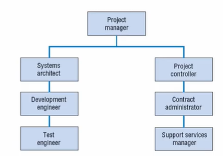
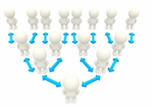

# Lecture 12 : Human factors and the Project Team

Reference -   
Ciccotti, K. (2014). The human factor in project management. Paper
presented at PMI Global Congress 2014—North America, Phoenix, AZ.
Newtown Square, PA: Project Management Institute.

## Agenda

Project Team  
Problems that prevent a team from performing   effectively  
The Six Basic Human Needs  
Our Driving Needs  
Becoming a Better Leader  
Two Specific Strategies to drive engagement and gain
commitment  

## Project Team

* A project team or team is defined as
"an interdependent collection of
individuals who work together
towards a common goal and who
share responsibility for specific
outcomes of their organizations."

## An Example of Software Project Team

Systems architect  
Development engineer  
Test engineer  
Contract administrator  
Project controller  
Support services manager  

## Problems that prevent a team from performing effectively

* Internal conflict  
* Member frustration  
* Wasting time  
* Poor decision making  
* Team members are more concerned
finishing the job than doing a good job
with  

## Organizational breakdown structure(OBS)

* WBS is prepared to determine the exact nature of
the tasks required to complete the project
* OBS can be defined as "a company's hierarchical or
structural organization, which should identify team
members in order of importance from the top of
the company down and what tasks these
employees are responsible for".

## Human factor in project management

"When dealing with people, remember you are not dealing with creatures
of logic, but creatures of emotion." — Dale Carnegie

* How do we lead, influence, and inspire our teams to work together more
effectively?
* The challenge of taking a diverse group of individuals
* Why do some projects fail?
    * lack of resources, poor communication, unclear objectives, competing priorities, scope creep, etc.
* The most often ignored factor is easily the most important one - **the human factor.**

## What is "The Human Factor in Project Management?"

* It seeks to answer the fundamental question of how we can get our teams
to work together more effectively from the start.
* It is built upon the foundation of Human Needs
Psychology, and Emotional Intelligence
* Provides project managers and leaders with the most
effective tools and strategies for understanding and
responding to the behaviour of team members.

## Human Needs Psychology

* The premise of Human Needs Psychology is that every human being has the same six basic human needs, regardless of upbringing, experiences,
education, etc. (Madanes, 2009)
* There are several vital elements to understand when considering how human needs affect behaviour.
* In any relationship, you must understand the other person's needs, as well as your own
* As Stephen Covey said
    * "**Seek first to understand, then to be understood**"

## The Six Basic Human Needs

Certainty  
Uncertainty or Variety  
Significance  
Love & Connection  
Growth   
Contribution  

### 1. Certainty

* We all want to feel safe, avoid pain, and feel comfortable in our
environment
* Every individual needs some sense of certainty and security, knowing
that our basic needs are being met

### 2. Uncertainty or Variety

* We all need variety and challenges to exercise our emotional and physical range
* As a project manager, think about how uncertainty can challenge you
* So many times, in work and life, the situations we face are unfamiliar, and
we experience levels of uncertainty

### 3. Significance

* We all need to feel important, needed, and special
* we want to feel worthy of attention
* This is the single most significant contributor to conflict ever encountered by the teams
* When a person has a high driving need for significance, it tends to lead to
counterproductive behaviours that negatively impact the rest of the team
* Those behaviours can include hijacking meetings, putting other team members down, comparing themselves to others, and generally disrupting things to feel significant — making themselves more important than the team

### 4. Love & Connection

* The fourth need is to experience love and connection with others
* Everyone needs to feel a connection with other human beings, and everyone strives for relationships that give them love
* Human beings are wired for love and connection
* The feeling of being disconnected and alone can be devastating 
* Scientists have discovered that the same part of the human brain triggered by hunger and thirst - basic survival needs — is the same part
triggered by feelings of loneliness and disconnection(Rock, 2009)

### 5. Growth

* When we stop growing, we die
* It's a biological imperative in nature
* Human beings seek to grow intellectually, spiritually, and emotionally
* Growth equals progress

### 6. Contribution

* This is about going beyond your needs to contribute beyond yourself and
give to others.
* What happens to your problems or challenges when giving to others?
* Typically, they disappear — you don't think about them when focused on
helping others.
* Contribution is essential to feelings of fulfilment and happiness.
* This can manifest itself in the workplace through mentoring programs and training that seeks to improve the individual in meaningful ways
* When we genuinely contribute to the project, the team, and the organisation, it doesn't matter who gets the credits
* The whole team shares in that success!

## Our Driving Needs(Identify it)

* Out of those six basic needs, every person has two
that are the primary needs in their life.
* We call these the driving needs because they filter
every thought, action, and decision we make.
* We will do almost anything to satisfy these two
needs, which are experienced more intensely than
our other needs

## Becoming a Better Leader

**Gain confidence & clarity**  
— Know how to handle difficult people and situations more effectively  
— Maintain control of your emotions  
— Learn to understand your team members and their needs  

**Learn groundbreaking strategies for success**  
— Learn the most effective ways to lead teams  
— Gain commitment to objectives without coercion  

**Eliminate self-doubt**  
- Become rock-solid in handling conflict  
- Learn to confidently set boundaries that everyone will honor  

**Create a roadmap to building sustainable teams**  
— Learn new ways to meet your team members' needs
— Initiate repeatable steps for sustaining successful teams
— Have a profound impact on your teams and organisation

## Two Specific Strategies to drive engagement and gain commitment

**Making the Connection**  

* One of the most effective tools — and one of the first you should use with any new team — is to create a connection with them and among them.
* create that feeling of connection with your teams
* Satisfy the most powerful human needs from the start

**You're Important to this Project**  

* Another great way to engage team members is by
making them feel significant.
* All it takes is a simple comment in a status meeting, such
as, "Aparna, I really want to thank you for your work on
the report you did for the Executive Committee. It was
very well done, and it provided everything they were
looking for."
* A simple statement like this in front of peers can pay huge dividends.
* Tom Peters, world-renowned author, business leader, and leadership
consultant, put it best when he said, **"We wildly underestimate the power of the tiniest personal touch."**

## Essential Points

* It's critical to first clarify what you want the result to be.
    * Do you want to have more cohesive teams?
    * Do you want to learn to manage your own emotions more effectively in stressful
situations?
    * Do you want to become a more effective leader, capable of gaining commitment
and loyalty from your teams?
    * Do you want a more connection with your coworkers?
    * If you want to excel, and master your leadership skills truly, then you must
expect more from yourself than others expect.
    * Lead by example, and your teams will follow.
    * Raise your standards for yourself first and then for your teams.