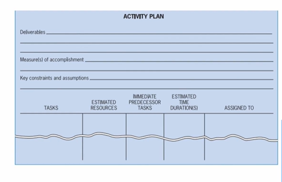

# Lecture 13 : Traditional Project Activity Planning

## Part2 - Project Planning

Traditional project activity planning  
Project Charter and Agile project planning  
Coordination through integration management  
Project feasibility analysis  
Estimating project budgets  
Project risk management  
Quantitative risk assessment methodologies  
Critical path method (CPM)  
Programme evaluation and review technique (PERT)  
Risk analysis with simulation for scheduling  
Scheduling with scrum  
Crashing a project  
Resource loading  
Resource levelling  
Goldratt's critical chain  
## Agenda

* Importance & Purpose of Planning
* Tools for gathering information for planning
* Requirement for good planning
* Objective & Process of planning
* Traditional Project Activity Planning
    * Launch meeting
    * Planning and project success
    * Requirements Traceability Matrix
* Outside Clients
* Whole-Brain Approach
    * Mind Mapping
* Project Planning in Action
* The WBS: A Key Element
    * Hierarchical Planning System
* Work Breakdown Structure
* Responsible, Accountable, Consult
and Inform (RACI) Matrix

## Importance of Planning

* Peter Drucker has quoted on planning: "Plans are only good intentions unless they immediately degenerate into hard work."
* To make such a transformation possible is no easy task.
* Every minute given to planning saves 10 minutes in execution.
* Effective planning requires avoiding the opposite pitfall of killing the plan with over-analysis.
* This leads to the well-known "paralysis by analysis."

## Purpose of planning

* The primary purpose of planning is to establish a set of directions in sufficient
detail to tell the project team
    * Exactly what must be done
    * When it must be done
    * What resources will be required to produce the
deliverables of the project successfully
    * When each resource will be needed.

## Tools for gathering information for planning

* The entire planning process is dependent on gathering the correct
requirements from the client or project owner in the first place
* PMBOK lists several tools and techniques to help in doing this, including
— Interviews  
— Focus groups  
— Facilitated workshops  
— Group creativity techniques questionnaires  
— Surveys  

## Requirements for a good planning

* The plan must be designed by the PM, overseen by the
project owner and sponsor
* The plan should meet the Project outcome and the direct
and ancillary objectives of the parent organisation, as
reflected by the project portfolio, business case, or other
strategic selection process used to approve the project.
* It is always carried out in an environment of uncertainty
* The plan must include allowances for risk and features that allow it to be adaptive, that is, to be responsive to things that might, and often do,
disrupt it while it is being carried out
* The plan must also contain methods to ensure its integrity, which is to say
it must include means of controlling the work it prescribes
* The plan must include any constraints on activities and input materials
proscribed by law and society, a group of critical stakeholders
* Among the many sources of outside constraints are the
    * Food and Drug Administration
    * Occupational Health and Safety Administration
    * Other Central and state laws and regulations
    * Various engineering societies
    * Labor unions and "Standard Practices" of many industries

## Objective of planning

* To facilitate later accomplishment
* The world is a whole of plans that never become
deeds
* It is a complicated process to manage a project, and
plans act as a map of this process
* The map must have sufficient detail to determine
what must be done next but be simple enough that
workers are not lost

## Process of Planning

* The process may be described formally, but it does not occur formally.
* Bits and pieces of plans are developed by individuals, by informal group
meetings, or by formalised planning teams, and then improved by other
individuals, groups, or teams, and improved again and again.
* Both plans and the process of planning should start
simply with the **project charter**, which is then
elaborated on and eventually becomes the **project
plan**

## Traditional Project Planning - Launch Meeting

* A senior manager call and be present at the project chartering workshop
or "launch" meeting, an initial coordinating meeting, as a visible symbol of
top management's commitment to the project
* The sponsor and other key stakeholders should
participate in this meeting for the purpose of
establishing the project, agreeing on the top
deliverables, discussing resourcing, establishing
schedule and budget tolerances and defining risks
* Having these critical stakeholders involved early on
creates buy-in and fosters early communication on
potential issues and risks.
* The individual leading the launch meeting first defines
the project's scope as detailed in the charter.
* The success Of the project launch meeting is dependent
on the existence of a well-defined set of objectives.
* The project is discussed in sufficient detail that potential contributors
develop a general understanding Of what is needed
* If the project is one of many similar projects, the meeting will be short and
routine, a sort of "touching base" with other interested units
* If the project is unique in most of its aspects, extensive discussion may be
required

## Launch Meeting

* Review the significant risks facing the project during the launch meeting.
* The risk management plan for the project must be started at the launch
meeting so that later risk identification can be extended to include the
technology of the process/product, the project's schedule, resource base,
and a myriad of other risks facing the project but not identifiable until the
final project plan has begun to take form.
* To fix plans in more detail at this initial meeting tends to prevent team
members from integrating the new project into their ongoing activities
and from developing creative ways of coordinating activities that involve
two or more organisational units
* Everyone who has ever worked on a project is aware
of the extraordinary propensity of preliminary
estimates to metamorphose instantaneously into firm
budgets and schedules

## Outcomes of the project planning process

* Formulation of the project's risk management group
and the initial risk management plan
* It is essential not to allow plans, schedules, and
budgets to go beyond the most aggregated level,
especially if the project deliverables are simple and do
not require much interdepartmental coordination

## Plannig and project success

* Four top-ranking factors critical to project success were as follows:
— a realistic schedule  
— adequate resources  
— clear scope  
— support from senior management  
— all products of careful planning with a solid charter

Whatever the process, the outcome must be that  

1. Technical scope is established  
2. The participants accept essential areas Of performance responsibility  
3. Any tentative delivery dates or budgets and their tolerances set by the
parent organisation are noted and  
4. A risk management group is created.

## Management of Change - Requirements Traceability Matrix

* If the project is not large or complex, informal written memoranda can
substitute for the change order
* The main point is that no significant changes in the project are made
without written notice, following top management's approval
* A **valuable tool for facilitating the management of changes to a project's
scope is the Requirements Traceability Matrix**

## Requirement Traceability Matrix

* With this matrix, a table is created that links
the source of each project requirement to the
project objectives, WBS deliverables, etc.,
intended to satisfy it.
* A variety of fields (columns) can be
incorporated in the Requirements Traceability
Matrix depending on the intended use of the
matrix.

## Outside Clients

* When the project is to deliver a product/service to an
outside client, the fundamental planning process described
above is unchanged except for the fact that the **project's
scope cannot be altered without the client's permission**
* A common "planning" problem is that marketing has
promised deliverables that engineering may not know
how to produce on a schedule that manufacturing
may be unable to meet
* This sort of problem usually results when the various
functional areas are not involved in the planning
process at the time the original proposal is made to
the potential client
* Two objections to such early participation by engineering and
manufacturing are likely to be raised by marketing.
* First, the sales arm of the organisation is trained to sell and is expected to
be fully conversant with all technical aspects of the firm's
products/services.
* Further, salespeople are expected to be
knowledgeable about design and manufacturing lead
times and schedules.
* On the other hand, it is widely assumed by marketing that manufacturing
and design engineers do not understand sales techniques, will be
argumentative and pessimistic about client needs in the presence of the
client, and are generally not "housebroken" when customers are nearby
* Second, it is expensive to involve so much technical
talent so early in the sales process—typically, prior to
issuing a bid or proposal.

## A Whole-Brain Approach to Project Planing

* Project managers typically use left side of brain- logical and analytical
* Should also use right side — creative
* A whole-brained approach is **mind mapping**

## Mind Mapping

* One whole-brain approach that is particularly
applicable to project management in general, and
project planning in particular, is "mind mapping."
* Mind mapping is a visual approach that closely
mirrors how the human brain records and stores
information.
* Mind mapping helps to tap the creative potential of the
entire project team, which, in turn, helps increase both the
quantity and quality of ideas generated.
* Because project team members tend to find mind mapping
enjoyable
* Mind Mapping generates enthusiasm, helps obtain buy-in
from team members, and often gets quieter team members
more involved in the planning process.

## Project Planning in Action

Concept Evaluation => Requirements identification=> Design => Implementation => Test => Integration => Validation => User Test and Evaluation => Operations and Maintenance =

## The WBS - A Key Element

* What is to be done  
* When it is to be started and finished  
* Who is going to do it  
* Some activities must be done sequentially
* Some activities may be done simultaneously
* Many things must happen when and how they are I
supposed to happen
* Each detail is uncertain and subjected to risk

## Hierarchical Planning System - Method of constructing a WBS

* To accomplish any specific project, a number of major activities must be undertaken
and completed
* Make a list of these activities in the general order in which they would occur. This is
Level 1
* A reasonable number of activities at this level might be anywhere between 2 and 20.
* Two is the minimum possible breakdown, and 20 is about
the largest number of interrelated items that can be
comfortably sorted and scheduled at a given level of
aggregation.
* It is important to be sure that all items in the list are at roughly the same
level of task generality.
* It is difficult to overstate the significance of this simple dictum.
* It is central to the preparation of most of the planning documents

## Hierarchical Planning

* Major tasks are listed
* Each major task is broken down into detail
* This continues until all the activities to be
completed are listed
* Need to know which activities "depend on"
other activities

## A Form to Assist Hierarchical Planning

## WBS - Career Day

## The Work Breakdown Structure (WBS)

* A hierarchical planning process
* Breaks tasks down into successively finer levels of
detail
* Continues until all meaningful tasks or work
packages have been identified
* These make tracking the work easier
* Need separate budget/schedule for each task

## A Visual WBS

## Steps to Create a WBS

List the task breakdown in successive levels  
Identify data for each work package  
Review work package information  
Cost the work packages  
Schedule the work packages  
Continually examine actual resource use  
Continually examine schedule  

## The RACI Matrix

* Another approach is the Responsible, Accountable, Consult, Inform (RACI) matrix  
— Also known as a responsibility matrix, a linear responsibility chart, an
assignment matrix, a responsibility assignment matrix
* Shows critical interfaces
* Keeps track of who must approve and be notified

## Sample RACI Matrix

