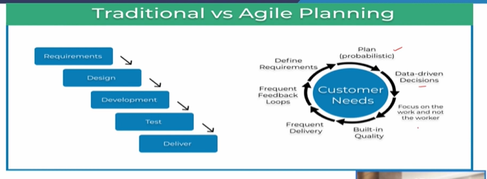

# Lecture 14 : Agile Project Planning, Project Charter

## Agenda

* Project Charter
* Agile Project Planning
* Comparison of Agile Project Management with Traditional Waterfall Approach
* Project Planning with Scrum
* Scrum Artifacts Supporting Project Planning
* Scrum Events for Project Planning

## Project Charter

* A charter is a high-level document that helps define the scope of the project and is typically submitted to get project approval to move on to develop a project plan.
* The project charter serves as a reference point
throughout the project's lifecycle and helps ensure
that everyone involved in the project has a shared
understanding Of its goals, objectives, and
requirements.

## A Typical Project Charter - Elements

* **Project purpose and goals:** A clear and concise
statement of the project's purpose and objectives.
* **Project scope:** A description of what is included and
excluded from the project.
* **Project stakeholders:** A list of all individuals and
organisations involved in the project and their roles
and responsibilities.
* **Project timeline:** A schedule of project milestones,
including start and end dates.
* **Project Budget:** An estimate of the cost of the project
and its resources.
* **Project risks:** An assessment of the potential challenges
and obstacles that may arise during the project.
* Project deliverables: A list of the expected outcomes and
results of the project

## Agile Project Planning

* We have been discussing the traditional method for planning projects, known as the "Waterfall" approach.
* Traditional approaches have proven to work well for many projects.
* There are projects for which the traditional methods do
not suffice, mainly because they assume that the
project's scope can be well determined and the
technology of developing the scope is well understood.

## Traditional vs Agile Planning

* Since change is a constant,
**Agile Project Management
(APM)** was developed to embrace change rather than
resist it like Waterfall project management.
* Indeed, a key characteristic of APM is that it
incorporates adaptive planning such that the project
plan is updated as circumstances change.
* Employing adaptive planning is particularly valuable for
projects characterised by uncertainty, requirements that vary, and short deadlines
* From time to time, we have mentioned the fact that software and IT projects have had a very high failure rate—over budget, over schedule, and delivering less than the desired output.
* Software projects are more uncertain than construction projects, often due to unclear project objectives and lack of understanding by the client
or project team.
* The result, understandably, has a high probability of client
dissatisfaction with the completed project.
* The table in the next slide further contrasts APM from the traditional
Waterfall approach on multiple dimensions.

## Agile Project Management vs Traditional Waterfall Approach

### Waterfall vs agile

* While the Waterfall method is commonly viewed as a
"batch" process, APM is viewed as a flow process,
where deliverables are produced in a "flow" manner.
* An analogy often used is that of a cake, which is built
in horizontal layers, but consumed in vertical slices.
* Waterfall project management attempts to deliver
the **entire cake**, while APM delivers a tiny layer at a
time.
* That is, the work is divided up so that smaller
segments can be completed rapidly, that is, via
sprints, and presented for review, feedback, and
hopefully offering value for the client.
* During the duration of each sprint, the client has
agreed to "freeze" the scope so that the tasks can
be considered fixed or concrete.
* This feedforward of results from the project team to
the client and the feedback from the client to the
team allows for a collaborative project environment,
which strongly enhances the likelihood of project
success.
* This close and continuing contact distinguishes APM
between clients and the project team and an
iterative and adaptive planning process.
* Project requirements are a result of client/team
interaction, and the requirements change as the
interaction leads to a better understanding of both sides
of the project requirements, priorities, and limitations
* Waterfall approach with its emphasis on the schedule
first, then the scope, and lastly, the team
* APM emphasis is on the customer first, the team second, and the scope third
* The willingness of team members to share
knowledge is an essential condition for Agile projects.
* Not incidentally, the willingness to share knowledge
is also a key to success in traditionally organized
projects.
* A PM who attempts to control an Agile project as he
or she might control a traditional project is most
certainly the wrong person for the job.
* With all the attention that APM receives, it is
essential to point out that many of its tenants can be
easily incorporated into more traditional project
management approaches.
* There is nothing prevents increasing customer
involvement in the traditional Waterfall approach.
* There is nothing inherent to traditional project management that prohibits
greater experimentation.
* There is nothing that prevents a project manager from adopting a subset of APM best practices

## Project Planning with Scrum

* In the traditional waterfall approach the emphasis is
placed on upfront planning.
* Often the intent of these change management processes
is to discourage changes to the initial plan.
* In contrast, the emphasis of project
planning with Agile in general, and
Scrum in particular, is on **flexibility.**
* With its roots in lean management,
scrum takes a more just-in-time (JIT)
approach to planning, where planning
is done **as late as** possible and when
the most is known about the project.

* With a JIT approach, project planning is done broadly at first and in more
detail later as more is learned about key aspects of the project including customer requirements, the market, the competitive environment, and
technology.
* While in more traditional approaches planning takes place primarily at the beginning of the project, in Agile planning permeates the entire project.
* Project planning is done more uniformly throughout
the project as opposed to being frontloaded at the
start of the project.

## Scrum Artifacts Supporting Project Planning

* Scrum is the most popular Agile approach
* Well-defined team roles, artefacts, and events are
associated with the scrum methodology.
* The scrum artefacts are documents designed to
facilitate project planning and enhance the
transparency of the project's status.
* The scrum master ensures the artefacts are
accessible to all project team members.

* One key scrum artifact is the product backlog, which contains a complete list
of the requirements for developing or improving the product.
* Typically, these requirements are expressed from the customers' perspective.
* The product backlog evolves as more is learned about the project, customer requirements, the competitive environment, and technology.
* Product backlog should be kept up to date, which is the product owner's responsibility.

## Scrum Events for Project Planning

* The foundation of scrum is the sprint.
* Effectively, each sprint is a mini-project with a corresponding goal of creating
value.
* Typically, the creation of value entails creating some additional product functionality.
* The scrum framework defines several events that
facilitate project planning.
* To facilitate project planning, all sprints within a project are the same duration.
* Additionally, the duration of the sprints is limited to less than 1-month ie. one to two weeks.
* Limiting the sprint duration means that the project's
critical aspects are much more predictable with shorter
planning horizons.

* Using a constant duration for the sprints facilitates estimating the amount of
work that can be accomplished during the sprint.
* In addition to the sprint, scrum defines four
other events associated with project
planning, as shown in Figure.
* These events all take the forrn Of
defined meetings.
* On the surface, including four separate
types Of meetings may create the
impression that scrum requires excessive meeting time

* The sequence of the scrum planning events
(or meetings) is shown in Figure.
* As shown in the figure, the first event is the
sprint planning meeting.
* A sprint planning meeting is held at
beginning of each sprint and is attended by
the entire scrum team (product owner,
scrum master, and developers).
* The sprint planning meeting is time-
boxed to two hours per week for the
sprint duration.
* Thus, a sprint planning meeting for a
one-week sprint is limited to two hours, a
sprint planning meeting for a two-week
sprint is limited to four hours, and so on.
* The sprint planning meeting is held on the first day of the
sprint to determine the goal(s) for the sprint and to choose
the product requirements from the product backlog aligned
with the sprint goal.
* Typically, the sprint goal specifies the product functionality
to be completed during the sprint.
* Based on the goal selected, the items from the product
backlog are identified that need to be completed during the
sprint to achieve the sprint goal.
* While the sprint planning meeting is held once on the first day of the
sprint, the daily scrum meeting is held at the beginning of each
workday of the sprint.
* During the meeting, each developer addresses three issues to help
the entire team plan and coordinate the work for the coming day:
    * The work completed during the prior day to meet
the sprint goal
    * What will be worked on that day to help meet the
sprint goal
    * Any challenges encountered that might hinder
meeting the sprint goal

* To minimise complexity, the daily scrum is held in
the exact location and simultaneously each day.
* While the daily scrum is open to all stakeholders,
only the scrum team may talk during the meeting.
* The scrum master is responsible for ensuring
outsiders do not disrupt the meeting and that the
meetings take place and do not go over the 15-
minute time-box.
* **If issues or challenges are uncovered during the daily
scrum**, a separate problem-solving meeting, often called
the **after-party**, is held.
* A key benefit of the daily scrums is that they enhance
team communication while eliminating the need for other
meetings.
* The sprint review and sprint retrospective are the other
two scrum events and are held at the end of the sprint.
* Like the sprint planning meeting and the daily scrums, these events
have well-defined purposes and time-boxes.
* As these events occur at the end of the sprint, project planning is not
their focus, although the outcomes of the events provide important
inputs for the next sprint planning meeting as shown in Figure

