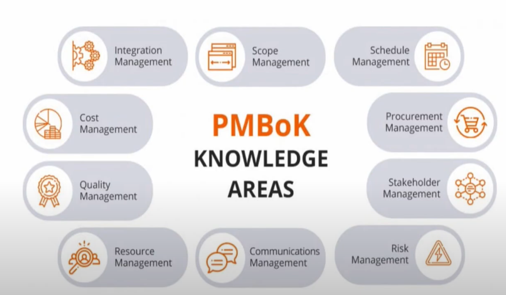
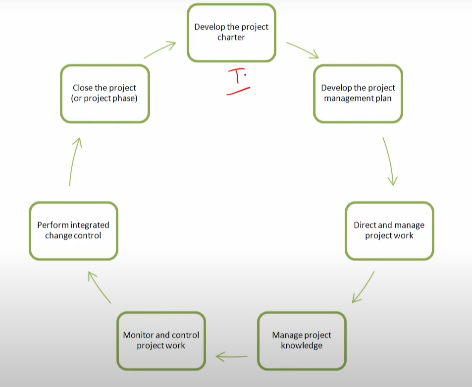
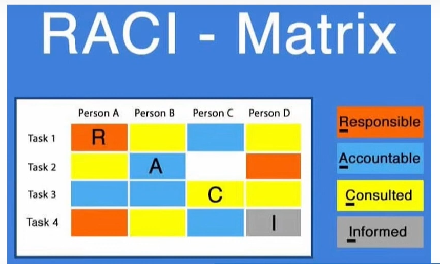

# Lecture 15 : Coordination through Integration Management

## Agenda

What Is Project Integration Management  
Importance of Integration Management  
Multidisciplinary teams (MTs) and Integration Management  
Problems of lack of Coordination  
RACI matrix for integration Management  
Managing Projects by Phases and Phase-Gates  
Fast tracking and Interface control systems  

## Areas

Project Management Body of Knowledge -  

## What is Project Integration Management

* Project integration management is the coordination of all elements of a project.
* This includes coordinating tasks, resources, stakeholders, and any other project elements, in addition to managing conflicts between different aspects of a project, making trade-offs between competing requests, and
evaluating resources.

## Why is project integration management so important?

* Keeping track of everything and knowing how one
factor impacts the others can be very challenging.
* However, if it is not done properly, it can lead to project failure
* The most difficult aspect of implementing the plan for
a complex project is the coordination and integration
of the various elements of the project so that they
meet their joint goals of scope, schedule, and budget
in such a way that the total project meets its goals.

## Multidisciplinary teams(MTs) and Integration Management

* As projects become more complex, the problem of
coordinating multidisciplinary teams (MTs) becomes
more troublesome.
* At the same time, and as a result, uncertainty is
increased.
* Rather than operating as a team, they work as separate and distinct parts,
each of which has its own tasks and is not much interested in the other parts.
* The intricate process of coordinating the work and timing of the different
groups is called *integration management.*
* There is general agreement that MT has a favorable
impact on product/service design and delivery
* Hauptman et al. (1996, p. 161) shows that MTS have
had a "favorable impact on attainment of project
budget goals, but achieves this without any adverse
impact on quality, cost or schedule."
* Recent work on managing the interfaces focuses on the use of MTS to plan the project as well as design the products/services the project is intended to produce.
* The process was also associated with higher levels of team job satisfaction
* The use of MTS in product development and planning is not without its difficulties
* Successfully involving cross-functional teams in project planning requires that some structure be imposed on the planning process
* The most common structure is simply to define
the task of the group as having the responsibility
to generate a plan to accomplish whatever is
defined as the project scope.
* There is considerable evidence that this is not sufficient for complex projects.
* Using MT creates what might well be considered a "virtual" project.
* In previous lecture, we noted the high level of conflict in many virtual projects.
* It follows that MT tends to involve conflict.

## Problems of lack of Coordination

* As the project proceeds from its initiation through
the planning and into the actual process of trying
to generate the project's deliverables, still more
problems arise.
* One hears, "We tried to tell you that this would
happen, but you didn't pay any attention."
* This, as well as less-printable remarks, are what one
hears when the members of an Multi disciplinary
Teams do not work and play well together
* In other words, when the various individuals and
groups working on the project are not well integrate

## Coordination through Integration Management

* Conflict raises uncertainty and thus requires risk management.
* Obviously, many of the risks associated with MT involve **intergroup political issues**
* The PM's negotiating skill will be tested in dealing with intergroup problems,
but the outcomes of MT seem to be worth the risks
* Mostly the risks arise when dealing with an outside group

## Why is Project integration management so important?

* For example, if you don't understand how a scope change will impact your schedule, costs, and resource requirements, how do you manage the change?
* It increases the chances of not having the people you need, going over budget, delivering your project late, or all three.

## Seven processes of project integration management

## RACI matrix for integration Management

* The RACI matrix is a useful aid to the PM in carrying out this task
  
* 

* It displays the many ways the
members of the project team must
interact and what the rights, duties,
and responsibilities of each will be.

## Managing multi disciplinary teams

* In addition to mapping the interfaces (a necessary but not sufficient condition for MT peace), the process of using MTS on complex projects must be subject to some more specific kinds of control
* One of the ways to control any process is to break the overall
objectives of the process into shorter-term phases and to focus the MT on achieving the milestones, as is done in APM

## Managing Projects by Phases and Phase-Gates

* If this is done, and if multidisciplinary cooperation and
coordination can be established, the level of conflict will
likely fall
* At least there is evidence that if team members work
cooperatively and accomplish their short-term goals, the
project will manage to meet its long-term objectives
* Moreover, the outcome of any conflict that does arise will
be creative work on the project
* The project life cycle serves as a readily available way of breaking a
project up into component phases, each of which has a unique,
identifiable output
* Careful reviews should be conducted at the end of each "phase" of
the life cycle, with feedback given to the entire project team each
time a project review was conducted
* Another attack on the same problem was tied to project quality, again, via the
life cycle (Aaron et al., 1993)
* They created 10 phase-gates associated with milestones for a software project
* To move between phases, the project had to pass a review.
* Managing quality on a project means managing the **quality of the
subprocesses** that produce the delivered product
* The quality-gate process here did not allow one phase to begin until
the previous phase had been successfully completed
* But many of the phase-gate systems allow
sequential phases to overlap in an attempt to
make sure that the output of one phase is
satisfactory as an input to the next

## Fast tracking

* Another approach that also overlaps phases is called "fast tracking,"
* Here the phases are run in parallel as much as possible to reduce
the completion time of the project
* This also increases the project risk as well

## Interface control systems

There are many such interface control systems, but the ones that appear to
work have two elements in common.
    * First, they focus on relatively specific, short-term, interim outputs of a
project with the reviews including the different disciplines involved with
the project
    * Next, feedback between these disciplines is emphasized

* No matter what they are called, it must be made clear to all involved
that cooperation between the multiple disciplines is required for
success, and that all parties to the project are mutually dependent
on one another
* Finally, it should be stressed that phase-gate management
systems were not meant as substitutes for the standard
time, cost, and scope controls usually used for project
management
* Instead, phase-gate and similar systems are intended to
create a process by which to measure project progress, to
keep projects on track and aligned with the current strategy
* And to keep senior management informed about the current
state of projects being carried out