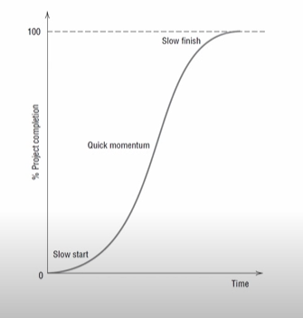
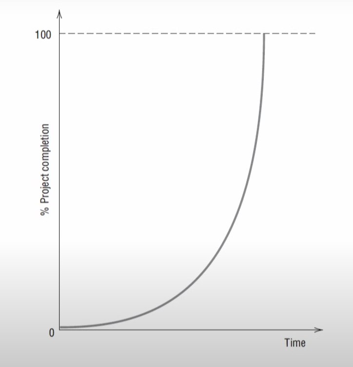
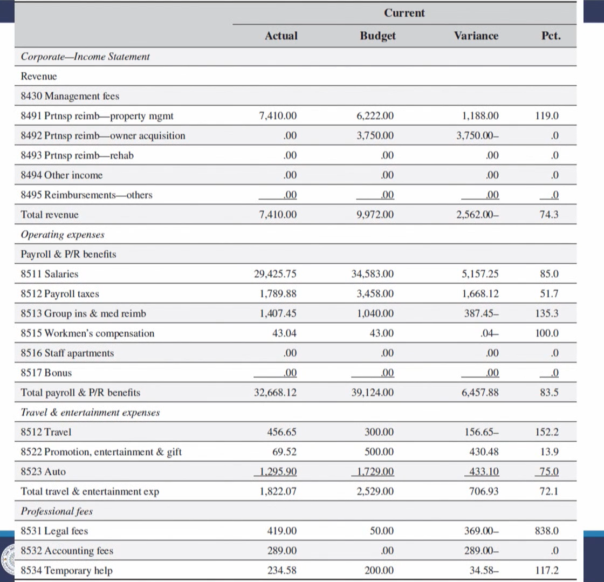
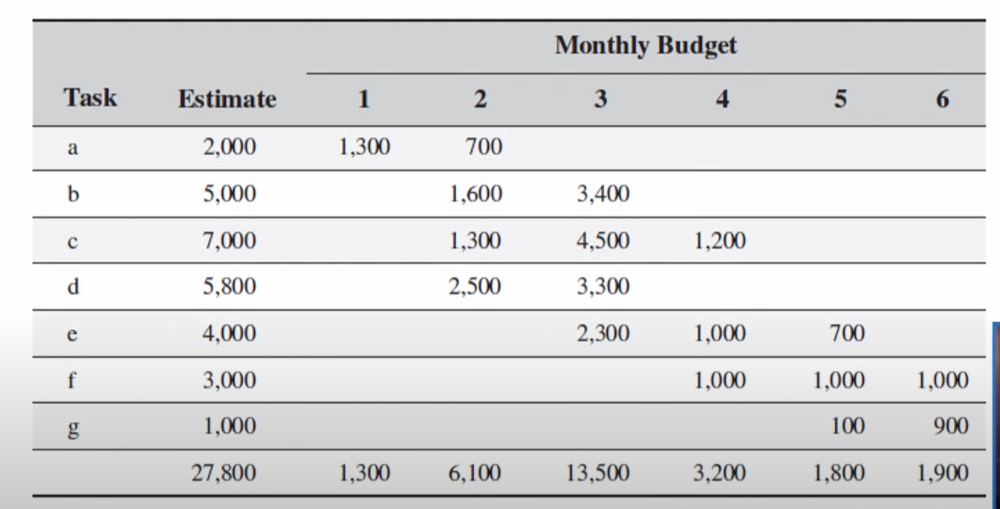

# Lecture 17 : Estimating Project Budgets

## Agenda 
* Importance of project cost management
* Budget and its Importance
* Estimating Project Budgets
* Top-Down Budgeting
* Bottom-Up Budgeting
    * a reserve analysis
* Bottom-up process as risky
* Work Element Costing
* **Iterative Budgeting Process**
* Budgeting with Agile

## Importance of project cost management
* First priority is obtaining resources with which to do the work.
* Here, the project manager (PM) needs to work with the project owner and
the project sponsor to develop a budget that will be acceptable to the
funder and/or the project steering committee representing senior
management.

## What is Budget?

WBS(Work breakdown structure) => Project Budget

* A budget is a plan for allocating resources.
* The budget is a reflection of the WBS in another form.
* Act of budgeting is the allocation of scarce resources to
the various endeavors of an organization.
* The outcomes of the allocation process often do not
satisfy managers

## Right Level of Budget
* The degree to which the different activities of an organization are fully supported by an allocation of resources is one measure of the **importance placed on the outcome of the activity.**
* Most of the senior managers try hard to be unbiased in the budgetanj
process, funding each planned activity at the "right" level
* Overfunding produces waste and encourages slack
management
* Underfunding inhibits accomplishment and frustrates the committed.
  
## Importance of Budget
* The budget is not simply one facet of a plan, nor is it
merely an expression of organizational policy; it is
also a monitoring and control mechanism.
* The budget serves as a standard for comparison, a
baseline from which to measure the difference
between the actual and planned uses of resources.
* As the manager directs the deployment of resources
to accomplish some desired objective, resource
usage should be monitored carefully.
* This allows deviations from planned usage to be
checked against the progress of the project, and
exception reports can be generated **if resource
expenditures consistent with not are accomplishments.**
* Indeed, the pattern of deviations (variances) can be  
examined to see if it is possible, or reasonable, to  
forecast significant departures from the budget.
* We discuss the use of **"earned value"** (costs derived from  
the project budget) to monitor and control the project  
and forecast the project completion time and costs.
* With sufficient warning, it is sometimes possible to  
implement corrective actions
* The budget expended (resource usage) does not
measure the actual level of work completed on the
project.
* The budget alone, therefore, is not a sufficient
measure of a project's progress.
* Budgets play an important role in the entire process
of management.

## Estimating Projects Budgets
* In order to develop a budget, we must forecast what resources the project
will require, the required quantity of each, when they will be needed, and
how much they will cost, including the effects of potential price inflation.
* Uncertainty is involved in any forecast, though some forecasts have less
uncertainty than others.
* An experienced cost estimator can forecast the number of bricks that will be used to construct a brick wall of known dimensions within 1 to 2 percent.
* The errors, however, are apt to be much larger for an estimate of the number
of programmer hours or lines of code that will be required to produce a specific piece of software.
* While the field of software science makes such estimates possible, the level
of uncertainty is considerably higher, and the typical error size is much larger
* In many fields, cost-estimating methods are well codified
* For example, in fields such as construction, costs can often be estimated by
**scaling** the various cost elements appropriately

### Cost Estimation Method
* Parametric estimating relies on well-known statistical correlations between
various factors such as the total cost of a house relative to the square feet of
living area.
* The databases of purchasing departments include multitudes of information
devoted to the techniques of estimating the quantities of materials and labor
required to accomplish specific jobs.
* Every business has its own rules of thumb for cost
estimating
* An experienced producer of books, for example, can leaf through a  
manuscript and, after asking a few questions about the number and type of  
illustrations and the quality of paper to be used, can make a fairly accurate  
estimate of what it will cost to produce a book.

### Difficulties in Estimating Project Budgets
* Developing project budgets is much more difficult than developing budgets for
more permanent organizational activities.
* The influence of history is strong in the budget of an ongoing activity.
* Many entries are simply "last year's figure plus X  
percent," where X is any number the budgeter feels  
"can be lived with" and is probably acceptable to the  
person or group who approves the budgets.

## Data Gathering For Project Budget
1. Top-Down Budgeting
    * This strategy is based on collecting the judgments and experiences of top
concerning similar
and middle managers, and available past data
activities.
    * These managers estimate overall project cost as well as the costs of the
major subprojects that comprise it.
    * These cost estimates are then given to lower-level managers, who are
expected to continue the breakdown into budget estimates for the
specific tasks and work packages that comprise the subprojects.
    * This process continues to the lowest level.
    * The budget is broken down into successively finer detail, starting from the
top, or most aggregated level following the WBS.
presumed that lower-level managers will argue for more funds if the
    * It is budget allocation they have been granted is, in their judgment, insufficient
for the tasks assigned.
    * This presumption is, however, often incorrect.

**Advantage of Top-Down Budgeting**  
* Aggregate budgets can often be developed quite
accurately, though a few individual elements may be
significantly in error
* Not only are budget categories stable as a percent of
the total budget, the statistical distribution of each is
also stable, making for high predictability

2. Bottom-up Budgeting

* In this method, **elemental tasks, their schedules, and their individual
budgets are constructed**, again following the WBS.
* The people doing the work are consulted regarding times and budgets for
the tasks to ensure the best level of accuracy.
* Initially, estimates are made in terms of resources, such as labor hours and
materials
* These are later converted to dollar equivalents
* Standard analytic tools such as learning curve analysis and work sampling
are employed where appropriate to improve the estimates
* Differences of opinion are resolved by the usual discussions between senior
and junior managers
* If necessary, the PM and the functional manager(s) may enter the discussion
to ensure the accuracy of the estimates
* The resulting task budgets are aggregated to give the total direct costs of the
project
* The PM adds such indirect costs as general and administrative (G&A),
possibly a project reserve for contingencies, and then a profit figure to arrive
at the final project budget

## Reserve Analysis
* A reserve analysis is typically done for the risks in a
project that might escalate the costs.
* The reserve is included within the baseline budget and
is known as a contingency reserve.
* It is for the **"known unknowns"** in the project where
the defined responses to the risks are detailed, but
their amounts are not yet precisely known.

## Contingency reserve
The contingency amounts can be for individual activities, either a percentage  
or fixed amount, which would then be aggregated for the entire project and  
added to the baseline budget or could just be a percentage of the entire  
baseline budget, such as 7 percent, or both.

### Managing unknown unknown
* Management reserve  
* Time reserve  
* Buffers for activity and project

**Advantages of Bottom-up Budgeting**  
* The advantages of the bottom-up process are those
generally associated with participative management.
* Individuals closer to the work are apt to have a more
accurate idea of resource requirements than their
superiors or others not personally involved.
* In addition, the direct involvement of low-level
in budget preparation increases the
managers
likelihood that they will accept the result with a
minimum of grumbling
* Involvement also is a good managerial training
technique, giving junior managers valuable experience
in budget preparation as well as the knowledge of the
operations required to generate a budget
### Bottom-up process as risky
* While top-down budgeting is common, true bottom-up budgets are rare.
* Senior managers see **the bottom-up process as risky.**
* They tend not to be particularly trusting of ambitious subordinates who may
overstate resource requirements in an attempt to ensure success and build
empires.
* Besides, as senior managers note with some justification, **the budget is the
most important tool for control of the organization.**
* They are understandably reluctant to hand over that control to subordinates
whose experience and motives are questionable.
* This attitude is carried to an extreme in one large
corporation that conducts several dozen projects
simultaneously, each of which may last 5 to 8 years
and cost millions of dollars.

## Work Element Costing
* The actual process of building a project budget—either top-down or bottom-
up or a combination of both—tends to be a straightforward but tedious
process.
* While the budget may include revenues, the major task in creating the
budget is estimating the costs for each of the project's work elements.
* Basically, each work element in the WBS is evaluated I
for its resource requirements, and the cost of each
resource is estimated.

### Example of Work element costing
* Suppose that a work element is estimated to require 25 hours of labor by
a technician
* The specific technician assigned to this job is paid $17.50/hr
* Overhead charges to the project are 84 percent of direct labor charges
* The appropriate cost appears to be `25hr * $17.50*1.84 = $805.00`
* Industrial engineers have noted that during a normal 8-hour day, no one
actually works for all 8 hours.
* Even on an assembly line, workers need breaks called "personal time."
* This covers such activities as visiting the water cooler, the restroom,
making a call home, and all the other time-consuming activities engaged
in by normal people in a normal workplace.
* A typical allowance for personal time is 12 percent of total work time.
* If personal time was not included in the 25-hour estimate made earlier,
then the cost calculation becomes `1.12*25hr*$17.50*1.84 = $901.60`

## An Iterative Budgeting Process - Negotiation in-Action

* It is recommended an iterative planning process with subordinates
developing WBS plans for the tasks for which they were responsible.
* Superiors review these plans, perhaps suggesting amendments.

## Example - An Iterative Budgeting Process
* Let us refer to the superior's estimate of resource requirements for a
particular task as R.
* Similarly, the subordinate responsible for that task estimates the resource
requirements as r.
* In a perfect world, R would equal r.
* As a matter of fact, the probable relationship between the original
estimates made at the different levels is R << r.

### Reason for R << r
* First, the farther one moves up the organizational chart away from  
immediate responsibility for doing the work, the easier, faster, and  
cheaper the job looks to the superior than to the one who has to do it.
* This is because the superior either does not know the details of the task or  
has conveniently forgotten the details, as well as how long the job takes  
and how many problems can arise.
* Second, wishful thinking leads the superior to underestimate cost (and
time), because the superior has a stake in representing the project to
senior management as a profitable venture.
* Third, the subordinate is led to build in some level of protection against
failure by adding an allowance for "Murphy's Law" onto a budget that
already may have a healthy contingency allowance.

## Negotiation-in-Action
* Assuming that the superior and subordinate are reasonably honest with
one another (any other assumption leads to a failure in win-win
negotiations), the two parties meet and review the subordinate's WBS.
* Usually, the initial step toward reducing the difference in cost estimates is
made by the superior who is "educated" by the subordinate in the realities
of the job.
* The result is that the superior's estimate rises.
* The next step is typically made by the subordinate.
* Encouraged by the boss's positive response to reason, the subordinate surrenders some of the protection provided for by the budgetary "slop,"
and the subordinate's estimate falls.
* The subordinate's cost estimate is still greater than the superior's, but the difference is considerably decreased.

### Subordinate's estimate >> superior's estimate

* Diminishing marginal returns, we opt
for the superior's estimate because
of the small impact on completion
that results from withholding a small
amount of resources

Increasing marginal returns, the  
subordinate's estimate should be  
chosen because of the potentially  
drastic effect a resource shortage  
would have on project completion.

### Cost Category Budgeting vs. Project/Activity Budgeting
* The traditional organizational budget is category-oriented often based
upon historical data accumulated through a traditional, category-based,
cost accounting system
* Individual expenses are classified and assigned to basic budget lines such
as phone, materials, personnel-clerical, utilities, direct labor, etc., or to
production centers or processes.

### Typical Monthly Category Budget for a Real-Estate Project

## Budgeting with Agile
* Calculating the initial budget with Agile approaches is less complicated
* It is based on the cost of the scrum team per sprint, the project's duration
(derived from the product backlog), and estimates for additional resources
* Because Agile utilizes dedicated project teams and the sprints are all of the
same duration, the labor costs of the scrum team are generally fixed per
sprint.
* Estimating the project duration is facilitated by having an up-to-date product
backlog and by tracking the project team's rate of completing tasks, called its
"velocity."
* At this point we simply point out that the product backlog and the scrum team's velocity provide a straightforward approach for determining project
costs