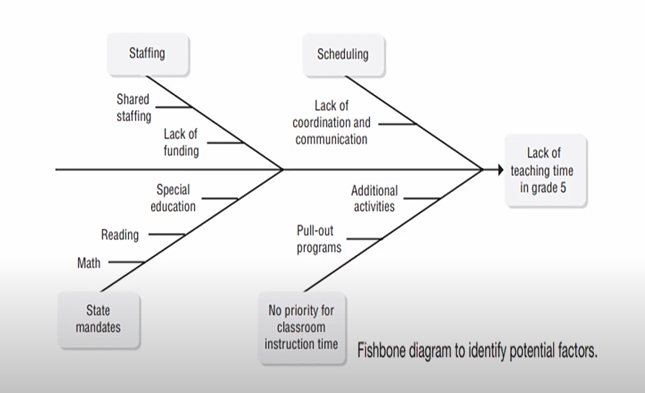

# Lecture 18 : Project Risk Management

## Agenda
Project risk management  
Risk Management Planning  
Risk Identification  
Qualitative Risk Analysis  
Quantitative Risk Analysis  
Risk Response Planning  
Risk Monitoring and Control  
The Risk Register  

## Project risk management
* There has been a great leap of interest in risk management in
the last few years
* The managers' most difficult task was identifying metrics for
project success that included nonfinancial aspects such as
customer satisfaction, meeting requirements and objectives,
and project value.
* Secondary problems related to communicating with
external stakeholders and finding the right definition of
the project objectives.
* Human factor is still probably the central element in risk
management.
* As described in PMBOK, the risk attitudes of both
organisations and individual stakeholders can be
influenced by their risk appetite, tolerance and threshold
* Their risk attitude can be influenced by their perceptions,
biases, and tolerances
* What is Project risk management? - PMBOK states that project risk management includes the processes of
conducting risk management planning, identification, analysis, response
planning, and monitoring and controlling

## Process of Project risk management
1. Risk Management Planning
    * deciding how to approach and plan the risk management activities for
a project.

2. Risk Identification
    * determining which risks might affect the project and documenting
their characteristics

3. Qualitative Risk Analysis
performing a qualitative analysis of risks and conditions
to prioritise their impacts on project objectives.
4. Quantitative Risk Analysis
estimating the probability and consequences of risks
and hence the implications for project objectives.
5. Risk Response Planning
Develop procedures and techniques to
enhance opportunities and reduce threats
to the project's objectives.
6. Risk Monitoring and Control
Monitoring residual risks, identifying new
risks, executing risk reduction plans, and
evaluating their effectiveness throughout the
project life cycle.
7. The Risk Management Register
creating a permanent register of identified risks, methods to mitigate
or resolve them, and the results of all risk management activities.

### Step1 - Risk Management Planning
* It is never too early in the life of a project to begin
managing risk.
* A sensible project selection decision cannot be made
without knowledge of the risks associated with the
project.
* Therefore, the risk management plan and initial risk
identification must be carried out before the project
can be formally selected for support.
* The risk management group must, therefore, start
work as soon as a potential project is identified
* Consolidate the risk management tasks for all projects
at the portfolio level rather than the project level
* Classification of Risk
  * Preventable Risk
  * Strategy risk
  * External risk
    * Economic
    * Legal
    * Natural
    * Political
    * Competitive

### Step 2 - Risk Identification
* The risks a project faces depend on the technological
nature of the project and the many environments
(economic, cultural, etc.) in which the project exists.
* Indeed, how the process of risk management is
conducted depends on how one or more
environments impact the project
* The **Delphi method** is proper when identifying project
risks and opportunities for risk analysis models
* The Delphi method is commonly used when a group
must develop a consensus concerning the importance of
technological risk, an estimate of cash flows, a forecast
of some economic variable, and similar uncertain future
conditions or events.
* Another method
  * Brainstorming
  * Checklists
  * Attribute listing, and
  * Other such creativity and idea-generation methods

* Cause-effect("fishbone") diagrams
    * Flow charts
    * Influence diagrams
    * SWOT analysis,
    * The flexibility of cause—effect makes them a valuable tool in many situations.

* Another approach to identifying risks is to watch for **early warning signs**
(EWS) as the project begins and progresses through to completion

### Step 3 - Qualitative Risk Analysis
* The purpose of qualitative risk analysis is to prioritise the risks identified in
the previous step so attention can be directed to the most important ones.
* The qualitative nature makes it quite flexible, useful, and quick to apply
* It can be used for both threats and opportunities.
  
**Method -**   

* A subjective estimate of the probability of the risk
* The probability values need not be precise and, for that matter, could just be
a rank on a I to 5 scale or even simply "Iow," Umedium," or "high."
* Once the probability and impact levels are found, a
Risk Matrix can be constructed as in Figure
* Here, we show the simplest version with nine cells
corresponding to the "Iow, medium, and high"
categories.
* Still, a 1 to 5 range would have 25 cells to consider,
and a percentage of 100 could be divided into as
many cells as would be useful.

* Critical
  * high probability—medium impact, high on each,
and medium probability—high impact.
* Monitor
* Ignore

### Step 4 - Quantitative Risk Analysis
* A quantitative risk analysis is sometimes conducted after the
qualitative risk analysis has identified the critical (and perhaps some of
the "monitor") risks facing a project.
* It is more precise (using more precise quantitative data) and typically
more accurate, if the data are available.
* We include here three techniques:
    * Failure mode and effect analysis (FMEA) is a more rigorous approach to the Risk Matrix and includes an additional factor in the process
    * Decision tree analysis using expected monetary values
    * Simulation

### Step 5 - Risk Response Planning
There are four standard approaches for dealing with
risk threats and, somewhat equivalently, for
enhancing risk opportunities.
* Threats
  * Avoid
  * Tranfer
  * Mitigate
  * Accept

* Opportunities
  * Exploit
  * Share
  * Enhance
  * Accept

**Threats -**  
1. Avoid

* The idea here is to eliminate the threat.
* This might be accomplished by using alternative
resources or adding contingent resources at some
cost.
* If the threat is client scope creep, up-front avoidance
by adding scope change procedures to the contract
might avoid the threat.

2. Transfer

* Although this approach does not eliminate the
threat, it does remove the project contractor from
the danger of the threat.
* The classic approach here for monetary risk is
insurance, but other approaches are also available:
warranties, bonding, cost plus contracting, etc

3. Mitigate

* This is a "softening" of the danger of the threat,
either through reducing the likelihood it will occur,
or through reducing its impact if it does happen.
* Ways to reduce the likelihood are to do research or
testing to improve our understanding of the
probability elements of the threat and then spend
some effort (and money) on reducing the more
probable threats.

4. Accept

* The risk is accepted because no other response is
available or because the responses are deemed
too costly relative to the risk threat.
* This might be appropriate for noncritical threats,
such as those in the "ignore" category of the risk
matrix.

**Opportunities -**  
1. Exploit - 
* The goal here is to try to increase the probability that
the opportunity will occur.
* This might be done with higher quality resources, such
as equipment, materials, or human skills, again at a
cost

2. Share

This involves partnering with another party or
parties who can better capture the value of the
opportunity or at least reduce the cost of exploiting
the opportunity.

3. Enhance

Similarly, to "mitigate", this involves either
increasing the probability that the opportunity risk
will occur or increasing its impact if it does.

4. Accept

Here the project firm is prepared to
capitalise on the opportunity
should it occur (a contingency
plan), but is not willing to invest the
the resources to improve the
probability or impact of the
opportunity occurring

## Risk Monitoring and control
* Four risk-oriented measures that Organisations should track - 
(1) How often a risk assessment is conducted/updated  
(2) How often a risk assessment is reviewed  
(3) The number of risks initially rated as low that later became high  
(4)The percentage of actual risks that developed that had been identified beforehand.  

## The Risk Register

* If the risk management system has no memory, the task of risk identification will be terrible.
* But the system can have a memory—at least the
individuals in the system can remember.
* Relying on the recollections of individuals, however, is itself "risky."
* The risk management system should maintain an up-to-date risk register that  
includes, but is not restricted to, the following  
    * identification of all environments that may impact on
the project
    * identification of all assumptions made in the preliminary
project plan that may be a source of risk for the project
    * a list of all risks identified by the risk management
group, complete with their estimated impacts on the
project and estimates of their probability of occurring
* A complete list of all "categories" and "keywords" used to
categorize risks, assumptions, and environments so that all risk
management groups can access past work done on risk
management
* The details of all qualitative and quantitative estimates made
on risks, on states of the project's environment, or project
assumptions, complete with a brief description of the methods
used to make such estimates
* Minutes of all group meetings including all actions the
group developed to deal with or mitigate each specific
risk, including the decision to ignore a risk.
* the actual outcomes of identified risks and, if a risk came
to occur, the results of actions taken to mitigate or
transfer the risk or invoke the contingency plan