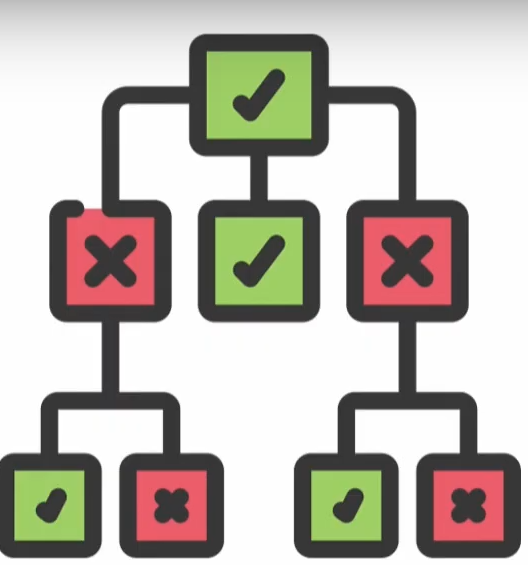

# Lecture 19 : Quantitative Risk Assessment Methodologies

## Agenda
* Failure Mode and Effect Analysis
* Decision Tree Analysis
* General Simulation Analysis
    * Monte-Carlo Simulation
* Sensitivity Analysis

## Failure Mode and Effect Analysis(FMEA)
* FMEA is the application of a scoring model
* It is straightforward and extensively used, particularly in engineering, and is easily applied to risk using six steps.

### Step - 1 & 2 Failure Mode and Effect Analysis(FMEA)
1. List the possible ways a project might fail.
2. Evaluate the **severity** (S) of the impact of each type of failure on a 10-point scale

"1" is "no effect" and "10" is "very severe."

3. For each cause of failure, estimate the **likelihood** (L) of its occurrence
on a 10-point scale where "1" is "remote" and 10 is "almost certain."

4. Estimate the inability to **detect** (D) a failure associated with each cause.
Using a 10-point scale, "1" means detectability is almost certain using normal
monitoring/control systems and "10" means it is practically certain that
failure will not be detected in time to avoid or mitigate it.

5. Find the Risk Priority Number(**RPN**) where **RPN = S*L*D**
6. Consider ways to reduce the S,L and D for each casue of failure with significantly high RPN

### Failure Mode and Effect Analysis (FMEA) - Example

As we see from the RPN numbers, the  
biggest threats are: Can't acquire tech  
knowledge and Client changes scope  

## Decision Tree Analysis
* This tool is simple in concept and especially useful for situations where
sequential events happen over time.
* For example, it would be appropriate to calculate the
probability of getting one head and one tail in two
tosses of a fair coin
* Probability of getting a head on the first toss and a tail
on the second toss
* The probability of getting a tail on the second toss.

### Probability Tree vs Decision Tree

* If we are only interested in probabilities, we call the tree a **probability tree.**
* But if there are some actions we are considering
anywhere along the tree—before the first probability
event, say, or between events—and we want to
evaluate which action(s) would be best, then it is called a **decision tree**

### Decision Tree Analysis - An Example

* Decision tree based on Expected Monetary Value(EMV)

**Decision Tree Analysis**  
* The figure illustrates such a tree (solved one here), but a straightforward one with only one set of actions to
choose from and one set of events
* However, it could be extended to multiple actions
and/or events, if desired, quite easily

* A decision tree is **created from the left (but solved from the right, at the
end),** with either a decision node (a square) or a probability node (a circle)
* In the example shown, an automobile
manufacturer is considering whether a
new car model development project
should consider only a gas, hybrid, or
both gas and hybrid models.
* In this example, three options are
being considered
* So there are three alternatives
emanating from the decision node,
each one posing some risk and
opportunity depending on what
happens to the price of fuel over the
coming years.
* Thus, there is an event that affects
the returns the auto manufacturer
gets
* We have simplified the possible
event outcomes into three categories
of "gas prices increase," "gas prices
fluctuate up and down," or "gas
prices decrease."
* Note that the probabilities of each
outcome are identical for each
decision choice because the decision
the auto manufacturer makes does
not affect the price of gas
* Under each possible outcome of the event
(whose probabilities we need to be able to
estimate), the auto manufacturer's decision
choice will result in a different payoff, shown
on the far right.
* Note, for example, that if the auto
manufacturer chooses to develop only a hybrid
model and gas prices decrease, the firm would
expect to lose $200 million dollars.
* To evaluate each of these outcomes
and make a decision, the auto
manufacturer needs a decision rule.
* If our rule were to "never pursue any
alternative that might lose money,"
then rule out the hybrid-only
decision alternative.
* Another rule, if the decision-makers at the
auto manufacturer were optimists, might be
to pursue whichever alternative provides the
greatest opportunity for maximising the
payoff
* Then the auto manufacturer would choose
the hybrid-only option with a maximum payoff
of $1,500 million from "gas prices increase."

**Expected Monetary Value -**  
* However, we normally use a different
rule, called expected monetary value
(abbreviated EMV) because this
maximizes our return over the indefinite
future, that is, the long-run average.
* The process of "solving" the decision tree is to
work from the right,
with the outcomes
(profits, in this case),
and multiply each
outcome times the probability of the event
resulting in that outcome, called the expected
value of that outcome, and then adding up all
the expected values for that event node—
decision choice combination.
* For example, the EMV for event node 2 would be
(0.5 + (0.3 x 600) + (0.2 x 300) = 840, which
we write on the tree next to its event node.
* When we have done this with all of the event
nodes for that decision, we compare them, double
strike the lesser valued decision choices, and can
then choose the best alternative choice for that
decision node, in this case, developing a "gas-only
model."

## General Simulation Analysis
* Simulation combined with sensitivity analysis is also
useful for evaluating projects while they are still in
the conceptual stage.

### Monte Carlo - Simulation - Risk Analysis Example
Product Name: Portable Printer  
Selling Price = $249 per unit  
Administrative Cost = $400,000  
Advertising Cost = $600,000  
Probabilistic input:  
— Direct labour cost = $ 45 per unit  
— Parts cost = $90 per unit  
— First year demand = 1500 units  
* Profit = ($249 - Direct labour cost per unit - Parts cost per unit) Demand - $1,000,000

`Profit = (240-C1-C2)(x)-1000000`
* C1 = Direct Labour cost
* C2 = Parts cost
* X = First year demand

Example - ?

## Sensitivity Analysis
* Sensitivity analysis, or what-if analysis, can be used for both quantitative
models, its most common use, but also with qualitative models.
* The process is to go back into the model and change one of the parameters
or variables and see what the impact is on the final result.
* In this way, we can see what will have a major effect
on the result, and thus our decision about what to do,
and what won't affect it, or will have a trivial effect on
the results so we don't need to worry about it.
* For example, with FMEA, we might see what a change
in the severity of a threat might do, or in a decision
tree, how the change in an outcome will change the
result, or in simulation what changing a distribution
might do to our profits.
* We can also consider what adding a new threat might
do to our analysis, or adding a new branch in the
decision tree, or inflation in our simulation.
* One weakness of sensitivity analysis is that a single change in the
environment doesn't usually happen, and instead, many variables or
parameters commonly change at the same time, which is harder to check
and determine how it might affect our decision.

### Sensitivity Analysis - Why
* There is also a form of scenario sensitivity analysis, where the impact of
alternative developments or scenarios in the completion of the project are
predicted.
For example,
* what would be the impact on the success of the project if the PM left the
organization?
* If a major contractor suffered a strike by a labor union?
* If an important new technology did not perform as expected?
* If a competitor beat us to market?
* Once alternative scenarios are identified, they can be analyzed with the
tools discussed earlier, including FMEA, decision trees, and Monte Carlo
simulation.
* Contingency plans should be developed for scenarios where the predicted
impact is particularly severe.