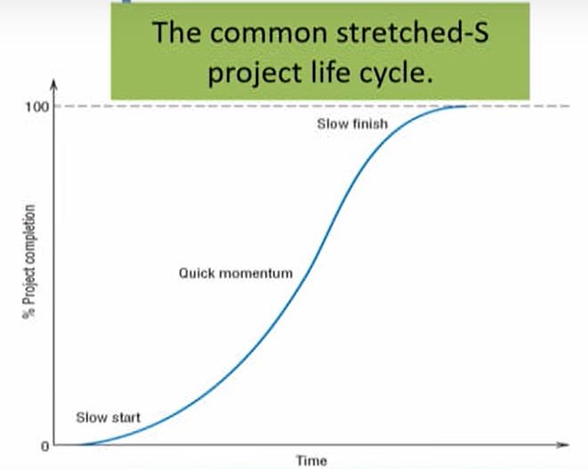
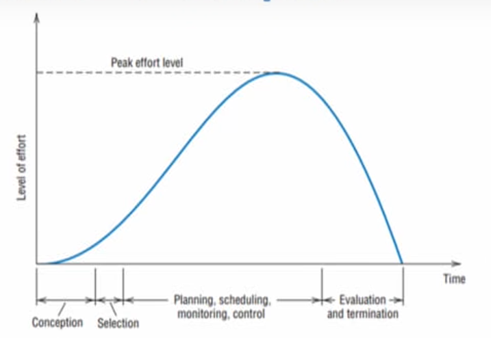
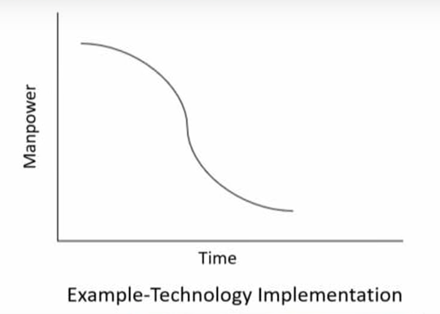
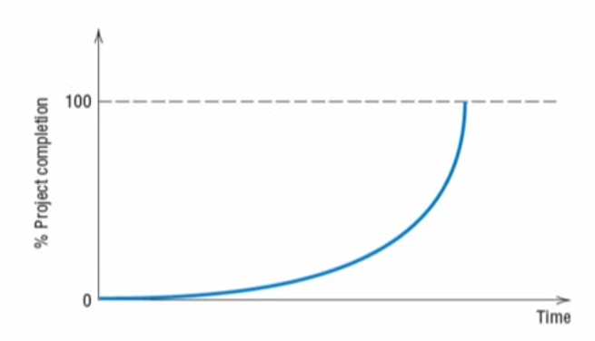
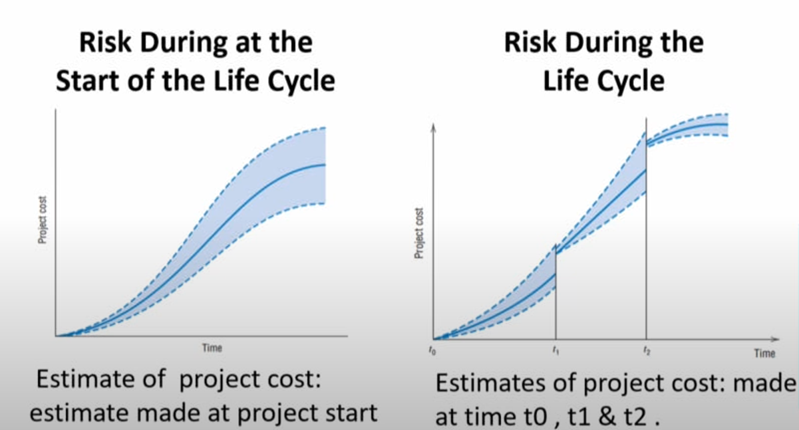

# Lecture 02 : Introduction to Project Management - II

## Agenda

* Non-projects, Quasi-Projects
* Why Project Management?
* Benefits of Project Organization
* Advantage of project-based organisations
* Disadvantage of project-based organisations
* Limitations on Project Management
* Trends in Project Management
* The Project Life Cycle and its types
* Risk During the Life Cycle

## Non-projects

* Non-project refers to all activities or tasks that
are ongoing and do not stop when the project
completes
* The use of a manufacturing line to produce a
flow of standard products is a non project
* e.g.  
    * production of weekly employment reports
    * preparation of school lunches
    * delivery of mail
    * Checking your e-mail
    * They are all routine
    * They are tasks that are performed repeatedly

## Quasi-Projects

* Quasi project is a project that does not have specific
tasks identified, no specific budget, and no specific
deadline
* There is a disconnect between the timeframes and
project objectives
* This poorly conceived notion trickles down into other
project parameters such as budgets, unique product or
service, project targets and due dates.

## Managing Quasi-Projects

* How can you plan a project when you don't
know the scope requirements?
* The project is determining the scope
requirements
* Set the determination of resources, budget,
deadline, capabilities, personnel, and any
other matters as the first milestone

## Why Project Management?

* Contemporary society demands the development of new methods of management
* Three forces are paramount:
    * Exponential expansion of human knowledge
    * Growing demand for a broad range of complex, sophisticated, customised goods and services
    * Evolution of worldwide competitive markets for the production and consumption of goods and services
* The primary purpose for initiating a project is to accomplish specific goals
* The reason for organising the task as a project is to focus the
responsibility and authority for the attainment of the goals on an
individual or small group

* Three forces combine to mandate the use of **teams
to solve problems** that used to be solvable by
individuals
* Combining also increases the complexity of **goods
and services** produced plus the **complexity of the
processes** used to produce them
* Leads to the need for more sophisticated systems to
control both outcomes and processes

## Benefits of Project Organization

Project form of organisation allows the manager to be responsive to
* The client and the environment
* Identify and correct problems at an early date
* Make timely decisions about trade-offs between conflicting project goals
* Ensure that managers of the separate tasks that comprise the project do
not optimise the performance of their tasks at the expense of the total
project

## Advantage of Project-based organizations

* Experience better control and better customer
relations
* Increase in their project's return on investment
* Shorter development times, lower costs, higher
quality and reliability, and higher profit margins
* Sharper orientation toward results, better
interdepartmental coordination, and higher
worker morale.

## Disadvantage of Project-based organizations

* Results in greater organisational complexity
* Increases the likelihood that organizational
policy will be violated
* Higher costs, more management difficulties,
and low personnel utilisation
* Conflict

## Limitations of Project Management

* The creation of a project may be an admission
that the parent organisation and its managers
cannot accomplish the desired outcomes through
the functional organisation
* Conflict seems to be a necessary side effect
* PM often lacks the authority of a position that is
consistent with the assigned level of responsibility
* PM must depend on the goodwill of managers in
the parent organisation for some of the necessary
resources

## Trends in Project Management

**Achieving Strategic Goals**
* There has been a greater push to use projects to achieve more strategic
goals and filter existing significant projects to make sure that their
objectives support the organization's strategy and mission
* Projects that do not have clear ties to the strategy and mission are
terminated, and their resources are redirected to those that do.

**Achieving Routine Goals**  

* On the other hand, there has also been a push to use project management to accomplish routine departmental tasks that would previously have been handled as a functional effort
* This is because lower-level management has become
aware that projects accomplish their scope objectives
within their budget and deadline and hope to employ
this new tool to improve the management of their
functions.
* Artificial deadlines and budgets are created to accomplish routine tasks within the functional departments
* This process is called "projectizing."

**Improving Project Effectiveness**  

* A variety of efforts are being pursued to improve the results of project
management, whether strategic or routine
* One well-known effort is the creation of a formal Project Management Office
in many organisations, which is responsible for evaluating and improving an
organization's project management "maturity," or skill and experience in
managing projects.

**Virtual Projects**  

* With the rapid increase in globalisation, many projects now involve global
teams with team members operating in different physical geographic
locations and time zones, each bringing a unique set of talents to the
project.
* These are virtual projects because the team members may never physically
meet before the team is disbanded and another team reconstituted.
* Advanced telecommunications and computer technologies allow such
virtual projects to be created, conduct their work, and complete their
project successfully.

**Dynamic Projects**  

* Agile project management is an iterative approach to managing software
development projects, focusing on continuous releases and incorporating
customer feedback with every iteration.
* It is also implied that minimal product development activities, project
documents, meetings, and other administrative activities should be used.

**Quasi-Projects**  

* Project management is now being extended into areas where the final scope
requirements may not be understood, the deadline unknown, and the
budget undetermined
* When any one or all the three primary project objectives are ill-defined, we
call this a "quasi-project."
* Quasi-projects are extremely difficult to manage and are often initiated by
setting an artificial due date and budget and then completed by "de-
scoping" the required deliverables as the project progresses to meet those
limits.

## Different Stages in Project Life Cycle  
* Conception
  * Selection
    * Planning
      * Scheduling
        * Monitoring
          * control
            * Evaluation
              * Termination

## The Project Life Cycle-"S" Shaped

* Most projects go through similar stages from
origin to completion.
* We define these stages, shown in Figure, as the
project's **life cycle.**
* The project is born (its start-up phase), a
manager is selected, the project team and initial
resources are assembled, and the work program
is organized.
* Then work gets underway, and momentum
quickly builds.

* Progress is made and continues until the end
is in sight.
* But completing the final tasks seems to take
an inordinate amount of time, partly because
several parts often must come together and
partly because team members "drag their
feet" for various reasons and avoid the final
steps.

## Time Distribution of Project Effort - "S" Shaped 

* Project effort in terms of person-hours plotted
against time
* Minimal effort is required at the beginning
when the project concept is being developed
and subjected to project selection processes
* Strong correlation between the life-cycle
progress curve and the effort curve because
effort usually results in corresponding progress

* Activity increases as planning is completed and
execution of the project gets underway.
* This rises to a peak and then begins to taper off as the
project nears completion, finally ceasing when
evaluation is complete, and the project is terminated
* There is no particular pattern that seems to typify all
projects, nor any reason for the slowdown at the end
of the project to resemble the buildup at its beginning.

## The Project Life Cycle-inverse "S" curve

* While technology starting any
implementation project, time vs resources
generally follows an "inverse S-shaped curve"
* For example, in the given figure, generally,
manpower would be required more at the
initial stage of technology implementation
* After some time, the manpower decreases
and at the last very little manpower is
required after the completion of technology
implementation.

## Project Life Cycle-Stretched J curve
* The analogy of baking a cake can capture an
essential alternative life-cycle shape.
* Once the ingredients are mixed, we are
instructed to bake the cake in a 3500 (F) oven
for 35 minutes.

* Experienced bakers know that the mixture
changes rapidly from "goop" to "cake" in the
last few minutes of the baking process.
* The life cycle of this process looks like the
stretched-J curve shown in Figure
* Several actual projects have a similar life cycle

## Risk During the Life Cycle
* Uncertainty about our ability to meet project goals due to various factors
in the project life cycle

## Summary
Non-projects, Quasi-Projects  
Why Project Management?  
Benefits of Project Organization  
Advantage of project-based organisations  
Disadvantage of project-based organisations  
Limitations on Project Management  
Trends in Project Management  
The Project Life Cycle and its types  
Risk During the Life Cycle  