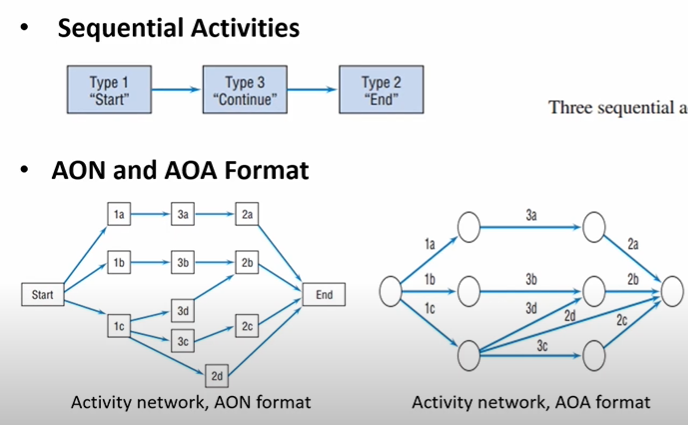
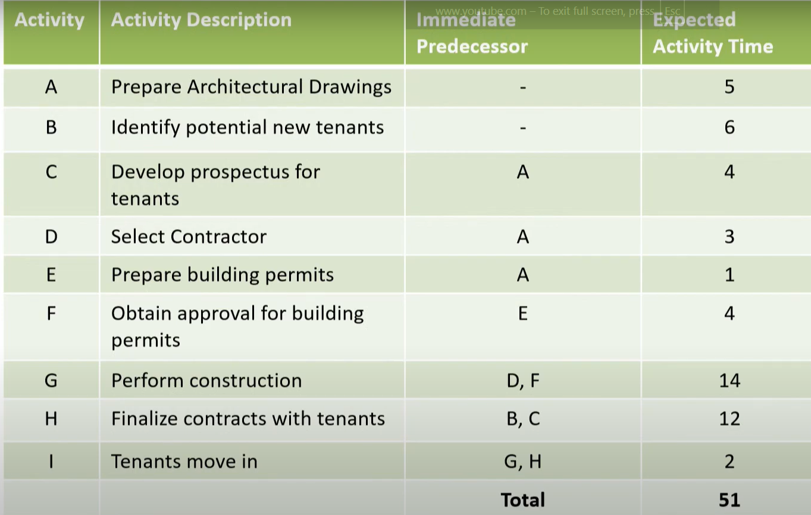

# Lecture 20 : Critical Path Method (CPM)

## Agenda

* Introduction  
* Terminologies  
* Project Scheduling Based on Expected Activity Times
Critical Path  
Forward Pass  
Backward Pass  
Slack  
* Contributions of PERT/CPM

## Scheduling
* A schedule is the conversion of a project work breakdown structure (WBS)
into an operating timetable.
* As such, it serves as the basis for monitoring and controlling project
activity and, taken together with the plan and budget, is probably the
major tool for the management of projects.
* In a project environment, the scheduling function is more critical than it
would be in an ongoing operation because projects lack the continuity of
day-to-day operations and often present much more complex problems of
coordination.
* Indeed, project scheduling is so important that a detailed schedule is
sometimes a funder-specified requirement.
* A properly designed, detailed schedule can also serve as a key input in
establishing the monitoring and control systems for the project.
* In general, the schedule is developed down to the work package level, but
in very large projects, the schedule for the project manager (PM) may only
be two or three levels deep, with supplemental schedules for each major
subproject.
* Projects are often so large or complex that
manager cannot possibly remember all
information pertaining to the plan, schedule,
progress of the project.
* In such situations the program evaluation and
review technique (PERT) and the critical path
method (CPM) have proven to be extremely
valuable.

## Common Applications
PERT and CPM can be used to plan, schedule, and control a wide variety of
projects.  
Common applications include:  
* Research and development of new products and processes.
* Construction of plants, buildings, and highways
* Maintenance of large and complex equipment
* Design and installation of new systems
* The various jobs or activities required to be done to ensure the entire
project is completed on time could often be interconnected with each
other.
* For example, some activities depend on the completion of other activities
before they can be started.
* Because projects may comprise as many as several
thousand activities, PERT and CPM help project
managers answer various questions.

### Typical Questions
* What is the total time to complete the project?
* What are the scheduled start and finish dates for each specific
activity?
* Which activities are "critical" and must be completed exactly as
scheduled to keep the project on schedule?
* How long can "noncritical" activities be delayed before they
cause an increase in the total project completion time?

## Origin & History
* Initially, CPM and PERT were two different approaches
    * CPM used deterministic time estimates and allowed project crunching
    * PERT used probabilistic time estimates
* CPM was developed originally by DuPont and
Remington Rand
**primarily for industrial projects for
which activity times were certain and variability was
not a concern.**
* CPM offered the option of reducing activity times by adding more workers
and/or resources, usually at an increased cost.
* Thus, a **distinguishing feature of CPM was that it identified trade-offs
between time and cost** for various project activities.

**Modern Interpretation** -  
* Today's computerized versions of PERT and CPM combine the best
features of both approaches.
* Microsoft Project (and others) have blended CPM and PERT into one
approach
* Thus, the distinction between them is no longer necessary.

## Terminologies
* **Activity** - A specific task or set of tasks that are required by the project,
use up resources, and take time to complete
* **Event** - The result of completing one or more activities
* **Network** - The combination of all activities and events that define a
project
— Drawn left-to-right  
— Connections represent predecessors
* **Path** - A series of connected activities
* **Critical** - An activity, event, or path which, if delayed, will delay the
completion of the project
* **Critical Path** - The path through the project where, if any activity is
delayed, the project is delayed
— There is always a critical path  
— There can be more than one critical path
* **Sequential Activities** - One activity must be completed before the next
one can begin
* **Parallel Activities** - The activities can take place at the same time
* **Immediate Predecessor** - That activity that must be completed just before
a particular activity can begin

### Project Scheduling Based on Expected Activity Times
**Example**
* The owner of a Shopping Center plans to modernize
and expand the current 32-business shopping centre
complex.
* The project is expected to provide room for 8 to 10 new businesses.
* The first step in the PERT/CPM scheduling process is to develop a list of the activities that make up the project.

**Table1 - List of Activities**

