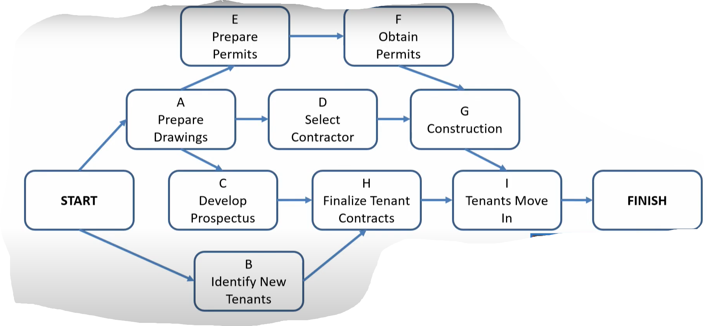
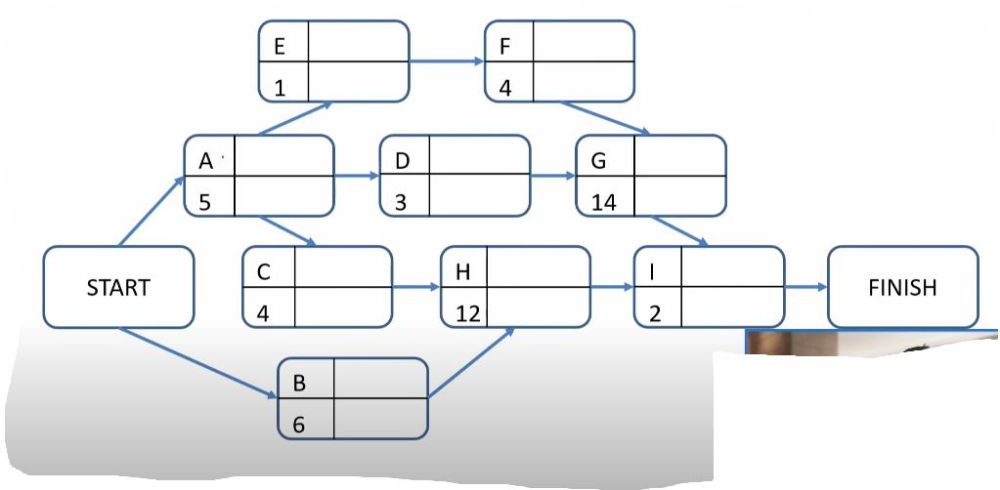
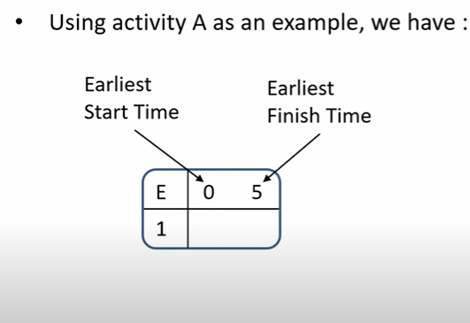
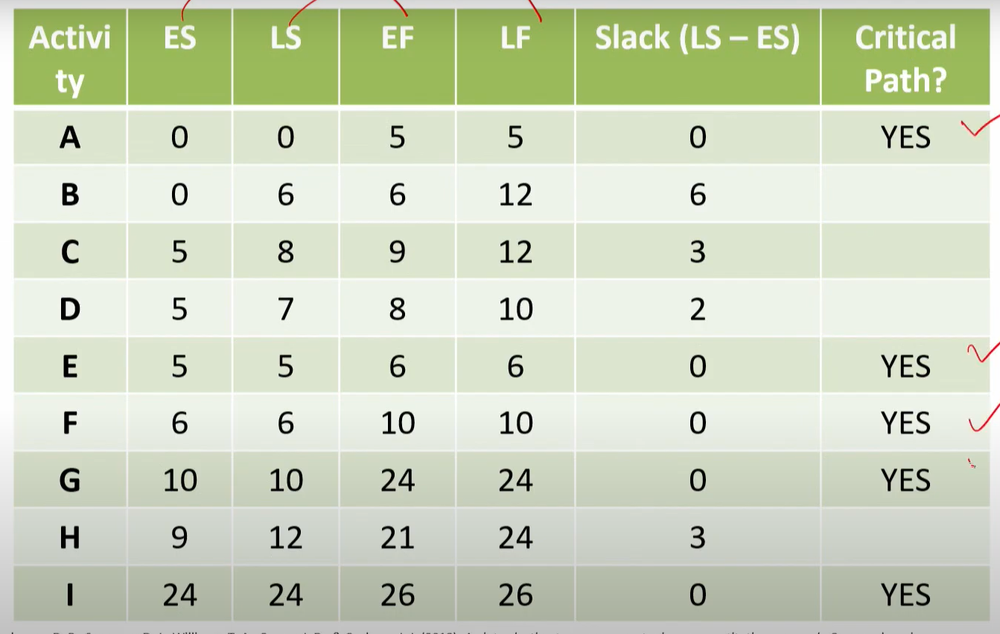

# Lecture 20 : Critical Path Method (CPM)

## Agenda

* Introduction  
* Terminologies  
* Project Scheduling Based on Expected Activity Times
Critical Path  
Forward Pass  
Backward Pass  
Slack  
* Contributions of PERT/CPM

## Scheduling
* A schedule is the conversion of a project work breakdown structure (WBS)
into an operating timetable.
* As such, it serves as the basis for monitoring and controlling project
activity and, taken together with the plan and budget, is probably the
major tool for the management of projects.
* In a project environment, the scheduling function is more critical than it
would be in an ongoing operation because projects lack the continuity of
day-to-day operations and often present much more complex problems of
coordination.
* Indeed, project scheduling is so important that a detailed schedule is
sometimes a funder-specified requirement.
* A properly designed, detailed schedule can also serve as a key input in
establishing the monitoring and control systems for the project.
* In general, the schedule is developed down to the work package level, but
in very large projects, the schedule for the project manager (PM) may only
be two or three levels deep, with supplemental schedules for each major
subproject.
* Projects are often so large or complex that
manager cannot possibly remember all
information pertaining to the plan, schedule,
progress of the project.
* In such situations the program evaluation and
review technique (PERT) and the critical path
method (CPM) have proven to be extremely
valuable.

## Common Applications
PERT and CPM can be used to plan, schedule, and control a wide variety of
projects.  
Common applications include:  
* Research and development of new products and processes.
* Construction of plants, buildings, and highways
* Maintenance of large and complex equipment
* Design and installation of new systems
* The various jobs or activities required to be done to ensure the entire
project is completed on time could often be interconnected with each
other.
* For example, some activities depend on the completion of other activities
before they can be started.
* Because projects may comprise as many as several
thousand activities, PERT and CPM help project
managers answer various questions.

### Typical Questions
* What is the total time to complete the project?
* What are the scheduled start and finish dates for each specific
activity?
* Which activities are "critical" and must be completed exactly as
scheduled to keep the project on schedule?
* How long can "noncritical" activities be delayed before they
cause an increase in the total project completion time?

## Origin & History
* Initially, CPM and PERT were two different approaches
    * CPM used deterministic time estimates and allowed project crunching
    * PERT used probabilistic time estimates
* CPM was developed originally by DuPont and
Remington Rand
**primarily for industrial projects for
which activity times were certain and variability was
not a concern.**
* CPM offered the option of reducing activity times by adding more workers
and/or resources, usually at an increased cost.
* Thus, a **distinguishing feature of CPM was that it identified trade-offs
between time and cost** for various project activities.

**Modern Interpretation** -  
* Today's computerized versions of PERT and CPM combine the best
features of both approaches.
* Microsoft Project (and others) have blended CPM and PERT into one
approach
* Thus, the distinction between them is no longer necessary.

## Terminologies
* **Activity** - A specific task or set of tasks that are required by the project,
use up resources, and take time to complete
* **Event** - The result of completing one or more activities
* **Network** - The combination of all activities and events that define a
project
— Drawn left-to-right  
— Connections represent predecessors
* **Path** - A series of connected activities
* **Critical** - An activity, event, or path which, if delayed, will delay the
completion of the project
* **Critical Path** - The path through the project where, if any activity is
delayed, the project is delayed
— There is always a critical path  
— There can be more than one critical path
* **Sequential Activities** - One activity must be completed before the next
one can begin
* **Parallel Activities** - The activities can take place at the same time
* **Immediate Predecessor** - That activity that must be completed just before
a particular activity can begin

### Project Scheduling Based on Expected Activity Times
**Example**
* The owner of a Shopping Center plans to modernize
and expand the current 32-business shopping centre
complex.
* The project is expected to provide room for 8 to 10 new businesses.
* The first step in the PERT/CPM scheduling process is to develop a list of the activities that make up the project.

**Table1 - List of Activities**

* The sum of expected activity times is 51.
* As a result, you may think that the total time required to complete the
project is 51 weeks.
* However, two or more activities often may be
scheduled concurrently (assuming sufficient availability
of other required resources), thus shortening the
completion time for the project.
* The activities correspond to the nodes of the network (drawn as rectangles),
and the arcs (the lines with arrows) show the precedence relationships
among the activities.
* In addition, nodes have been added to the network to denote the start and
the finish of the project.
* A project network will help a manager visualize the
activity relationships and provide a basis for carrying
out the PERT/CPM computations.

* To facilitate the PERT/CPM computations, we shall modify the project
network as shown in the next slide.
* Note that the upper left-hand corner of each node contains the
corresponding activity letter.
* The activity time appears immediately below the letter.

## Critical Path

* To determine the project completion time, we have to analyze the
network and identify what is called the critical path for the network.
* A path is a sequence of connected nodes that leads from the Start node to
the Finish node.
* All paths in the network must be traversed in
order to complete the project, so we will look for
the path that requires the **greatest time.**
* Because all other paths are shorter in duration, this longest path
determines the total time required to complete the project.
* If activities on the longest path are delayed, the entire project will be
delayed.
* Thus, the longest path is the critical path.
* Activities on the critical path are referred to as the
critical activities for the project.

### Earliest time for any activity
Let:  
ES = earliest start time for an activity  
EF = earliest finish time for an activity  
t = expected activity time  

The earliest time for any activity is:
* EF = ES + t

**Forward Pass**  
* Activity A can start as soon as the project starts, so
we set the earliest start time for activity A equal to O.
* With an expected activity time of 5 weeks, the
earliest finish time for activity A is :
* EF = ES + t = 0 + 5 = 5
* We will write the earliest start and earliest finish
times in the node to the right of the activity letter.

* Because an activity cannot be started until all immediately preceding
activities have been finished, the following rule can be used to determine
the earliest start time for each activity:  

**"The earliest start time for an activity is equal to the largest (i.e., latest) of
the earliest finish times for all its immediate predecessors."**

**Backward Pass**  
* Let us now continue the algorithm for finding the critical path by making a
backward pass through the network.
* Because the expected completion time for the entire project is 26 weeks,
we begin the backward pass with a latest finish time of 26 for activity I.

Let
LS = latest start time for an activity  
LF = latest finish time for an activity  
LS = LF-t

## Slack
* After we complete the forward and backward passes, we can determine
the amount of slack associated with each activity.
* Slack is the length of time an activity can be delayed without increasing
the project completion time.
* The amount of slack for an activity is computed as follows:  
`Slack = LS - ES = LF - EF`
* In other words, completing activity E exactly
as scheduled is critical in terms of keeping
the project on schedule, and so activity E is a
critical activity.
* In general, the critical activities are the
activities with zero slack.

## Contributions of PERT/CPM
* We previously stated that project managers look for procedures that will
help answer important questions regarding the planning, scheduling, and
controlling of projects.
* Let us reconsider these questions in light of the information that the
critical path calculations have given us.