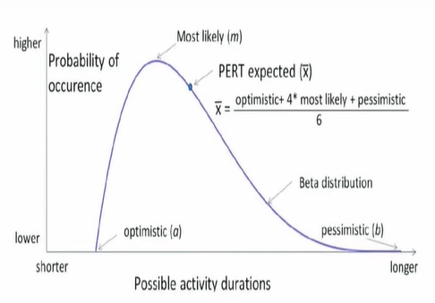
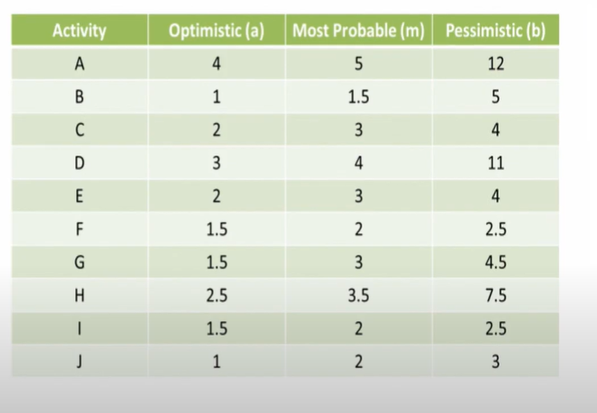
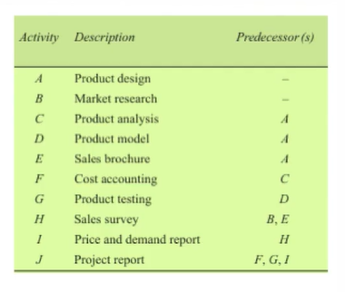

# Lecture 21- Programme Evaluation And Review Technique PERT

## Agenda

Project scheduling for uncertain activities  
Expected time for an activity  
Variance of an activity  
Variability in Project Completion Time  
Probability of the path meeting the deadline  

## Introduction
* PERT was developed in the late 1950s by the Navy specifically for
the Polaris missile project to handle uncertain activity times.

## Project scheduling for uncertain activities
* Once we develop the project network, we will need
information on the time required to complete each
activity.
* This information is used in calculating the total
time required to complete the project and in
scheduling specific activities.
* For repeat projects, such as construction and
maintenance projects, managers may have the
experience and historical data necessary to provide
accurate activity time estimates.
* However, for new or unique projects, estimating the
time for each activity may be quite tricky.

## Three time estimates a,m,b
* To incorporate uncertain activity times into the
analysis, we need to obtain three time estimates
for each activity:
    * Optimistic time a = the minimum activity time if
everything progresses ideally
    * Most probable time m = the most probable activity
time under normal conditions
    * Pessimistic time b = the maximum activity time if
substantial delays are encountered

### Example - 

Three time estimates a,m,b

## Expected time for an activity
* To illustrate the PERT/CPM procedure with uncertain activity times, let us
consider the optimistic, most probable, and pessimistic time estimates for
the project activities

t = (a + 4m + b)/6
