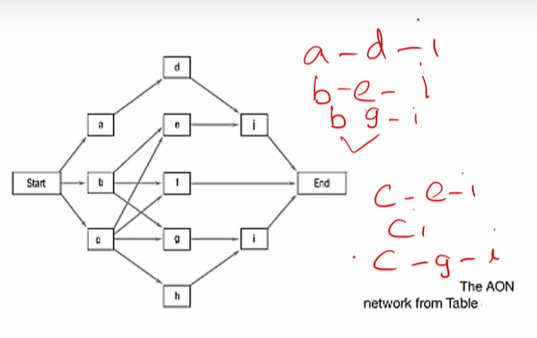

# Lecture 22 Risk Analysis with simulation for scheduling

## Agenda

* Uncertainty in Projects
* Risk analysis for managing uncertainty
* Example
    * NPV Prediction
    * Risk Analysis using simulation

## Uncertainty in Projects
Life with projects is characterized by uncertainty.  
Example
— The time required to carry out an activity  
— the cost and availability Of a resource  
— the success Of a research experiment  
— the wishes Of the client  
— the actions of a competitor  
— ups and downs of interest rates  
— the random moods of a senior manager  
* These are typical of the things that can upset the I
most carefully planned and managed project
* While it is possible through careful preplanning to reduce somewhat the
degree of uncertainty surrounding any project, uncertainty can never be
eliminated.
* We can, however, manage the uncertainty so as to reduce the impact Of
the ambiguities existing in our uncertain world.

## Risk analysis for managing uncertainty
* One method of managing uncertainty is to perform risk analysis on the
data involved in our managerial decisions.
* This requires us to make assumptions about the probability distributions
Of the variables and parameters affecting our decisions.
* These assumptions allow us to adopt Monte Carlo simulation models and
evaluate the impact of given managerial decisions.
* The decision is modeled mathematically.
* Individual values for each variable in the model are selected at random
from the probability distributions we specified, and the outcome of the
model is calculated.
* This process is repeated many times, and the model's
output for each repetition is used to construct a
statistical distribution of all of the outcomes.
* This distribution shows the risk profile of the decision.
* The risk profile is considered along with the parent organization's
strategies and policies, the wishes Of the client, and many other factors
when making the decision.

### Example 1 - NPV Prediction
* A large producer of decorative ceramic pots is considering installing a new
marketing software package that will, it is hoped, allow more accurate
sales information concerning the inventory, sales, and deliveries of its pots
and its vases designed to hold artificial flowers.
* Now let us assume that the expenditures in this example are fixed by
contract with an outside vendor.
* Thus, there is no uncertainty about the outflows, but there is, of course,
uncertainty about the inflows.
* Assume that the estimated inflows are as shown in
Table and include a most likely estimate, a minimum
(pessimistic) estimate, and a maximum (optimistic)
estimate.

* The firm fixes the hurdle rate of return, so the only remaining variable is
the inflation rate included in finding the discount factor.
* We have assumed a 2 per cent rate with a normal distribution, plus or
minus 1 per cent (i.e., 1 per cent represents three standard deviations).
* It is important to remember that other approaches in which only the most
likely estimate of each variable is used are equivalent to an assumption of
certainty.
* The major benefit of simulation is that it allows all possible values for each
variable to be considered.
* Using **Crystal Ball** to run a Monte Carlo simulation requires us to define two
types of cells in the Excel spreadsheet.
* The cells that contain **uncertain variables** or parameters are defined as
**assumption cells.**
* Uncertain variables are in cells B8:B15
for the inflows and cell B2 for the rate
of inflation
* The cells that contain outcomes of
interest in the model are called forecast
cells, cell DI 7 in Table
* Each forecast cell typically contains a formula that is dependent on one or
more of the assumption cells.
* Simulations may have many assumption and forecast cells, but they must
have at least one of each.

## Demo

Certainty = 90

## Example 2 - Risk Analysis using simulation
* Let us reconsider the data from table
* The analytical approach to finding the
duration of the critical path of the network
as well as path times for the network's
other paths is based on our assumption
that the probability distribution used for
activity times was best described as a beta
distribution.

* Figure shows a model for simulating project
completion times.
* It is surprisingly simple for what seems to be such a
complex problem.
* Having entered CB, we label the columns, first one
for each activity (columns A—J), and then one for
each path through the network (columns K—R), and
finally, one for "completion time" (column S).

* The most difficult job one faces is identifying all of the paths to be
evaluated.
* For small networks, this is not difficult, but for large networks, it may be.

**Simulation Output -** 

