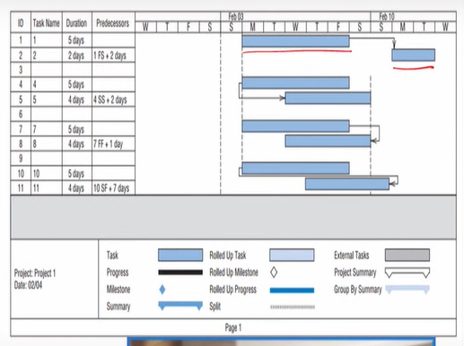

# Lecture 23 Gantt Chart & Scheduling with scrum

## Agenda

* Gantt Chart
    * Benefits and Weaknesses
    * Example
    * Demo in MS Project Software
* Scheduling with scrum
* Techniques for scrum scheduling- Poker 

## Gantt Chart

* One Of the **oldest but still one of the most valuable methods of presenting project schedule
information** is the Gantt chart
* Developed around 1917 by
**Henry L. Gantt**,
pioneer in the field of scientific management.
* The Gantt chart shows planned and actual progress
for several tasks displayed as bars against a
horizontal timescale.
of indicating the
* It is a particularly
**effective and easy-to-read method**
actual current status for each of a set of tasks compared to the planned
progress for each item of the set.
* As a result, the Gantt chart can be **helpful in expediting, sequencing, and
reallocating resources among tasks, as well as in the valuable but mundane
job of keeping track** of how things are going.
* Charts usually contain a number of special symbols to designate or highlight
items of special concern to the situation being charted.
* It is essential for the student to be able to understand just what it is that
networks and Gantt charts show.
* Once understanding is gained, software is easier, faster, and given a project
of a size that reflects reality, far more cost-effective.

### Benefits of Gantt Charts

* First, even though they may contain a great deal of
information, they are easily understood
* While they do require frequent updating (as does any
scheduling/control device), they are easy to maintain as long
as task requirements are not changed or major alterations of
the schedule are not made
* Gantt charts provide a picture of the current state of a project.
* They are as easy to construct as a network.

### Weakness of Gantt charts

* If a project is complex with a large set of activities, it
may be very difficult to follow multiple activity paths I
through the project
* Gantt charts are powerful devices for communicating
to senior management, but networks are usually more
helpful in the hands-on task of managing the project.

### Gantt Chart-Example 

* Its major strength is that it is easy to read
* All popular project management software will prepare Gantt charts, and
most have some options available for customization
* On balance, ease of construction and ease of use have made the Gantt chart
the most popular method for displaying a project schedule.
* Nonetheless, an AON network is still most useful for
the PM to exercise control over the schedule, and the
viewer may be misled if the Gantt chart is not read
carefully or if it does not contain all appropriate
information (Wilkens, 1997)

### Precedence Diagramming Restrictions

* Finish to start
    * Activity 2 must not start before Activity 1 has been
completed.
* This is the typical arrangement of an activity and its
predecessor.
* Other finish—start arrangements are also possible.
* If the predecessor information had been written "IFS +
2 days," Activity 2 would be scheduled to start at least 2 days
after the completion of Activity 1, as shown in Figure .
* For instance, if Activity 1 was the pouring of a concrete
sidewalk, Activity 2 might be any activity that used the
sidewalk.

* Start to start
    * Activity 5 cannot begin until Activity 4 has
been underway for at least 2 days.
    * Setting electrical wires in place cannot begin
until 2 days after framing has begun.

* Finish to finish
    * Activity 7 must be complete at least 1 day before
Activity 8 is completed.
    * If Activity 7 is priming the walls of a house, Activity
8 might be the activities involved in selecting,
purchasing, and finally delivering the wallpaper.
    * It is important not to hang the paper until the wall
primer has dried for 24 hours.

* Start to finish
    * Activity 11 cannot be completed before 7 days since
the start of Activity 10.
    * If Activities 10 and 11 are the two major cruising
activities in a prepaid week-long ocean cruise, the
total time cannot be less than the promised week.
    * The S—F relationship is rare because there are usually
simpler ways to map the required relationship

## Gantt Chart in MS Project

* When we open MSP, the Gantt chart view is typically the default view
displayed (at any time you can display the Gantt chart view by clicking on the
Gantt chart button on the far left of the Task ribbon).
* The Gantt chart view contains two windows.
* On the left is a window that contains a form that is used to enter WBS data into the program.
* The Gantt chart is displayed in the right window

## Demo 1 - MS Project

## Demo 2 - MS Project

## Why Scrum for Scheduling
* Scrum is a popular framework for project management and product
development, and it is used for scheduling due to several key
characteristics that make it effective in managing complex tasks and
projects.

Here are some reasons why Scrum is commonly used for scheduling:  

**Iterative and Incremental:**  
* Scrum promotes an iterative and incremental approach to development.
* Work is organized into time-boxed iterations called sprints, usually I to 4
weeks long.
* This allows for frequent inspection and adaptation,
ensuring that the project stays on track and that any
necessary adjustments can be made quickly.

**Flexibility and Adaptability**  
* Scrum is designed to be flexible and adaptive to change.
* The product backlog can be reprioritized, and the team can adjust its plan at
the beginning of each sprint during the sprint planning meeting.
* This adaptability is crucial in dynamic environments where requirements
may evolve or unexpected challenges arise.

**Customer Feedback:**  
* Regular feedback from stakeholders is integrated into the process through
sprint reviews.
* At the end of each sprint, the team demonstrates the work completed, and
stakeholders provide feedback.
* This feedback loop ensures that the product aligns
with customer expectations and can be adjusted
based on changing requirements.

**Transparency:**  
* Scrum emphasizes transparency in all aspects of the development process.
The product backlog, sprint backlog, and progress are visible to all team I
members, stakeholders, and often even customers.
* Transparency helps in identifying potential issues early, allowing the team
to address them promptly.

**Time-Boxing:**  
* Time-boxing, the practice of fixing the duration of certain events, such as
sprints, helps create a predictable and sustainable pace for the team.
* It provides a sense of urgency and ensures that the team delivers a
potentially shippable product increment at the end of each sprint.

**Collaboration:**  
* Scrum encourages close collaboration between team members and
stakeholders.
* Daily standup meetings, sprint planning, sprint reviews, and retrospectives
facilitate communication and alignment among team members.
* Collaboration helps in identifying and resolving issues
quickly, contributing to efficient scheduling.

**Focus on Value Delivery**  
* Scrum places a strong emphasis on delivering value to the customer.
* The product backlog is prioritized based on value, and the team focuses on
delivering the **most valuable features first.**
* This value-centric approach ensures that the product meets customer
needs and provides a return on investment.