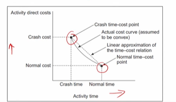
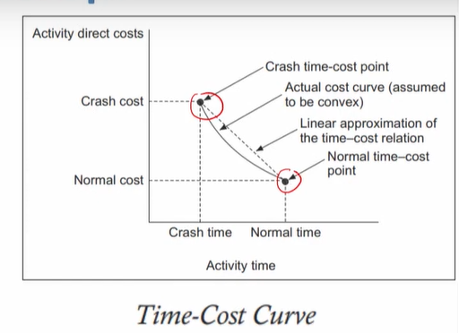
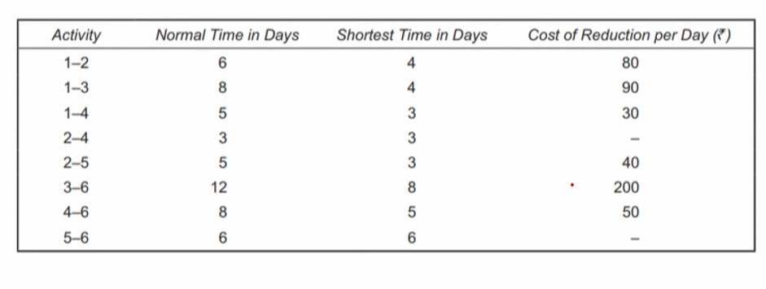
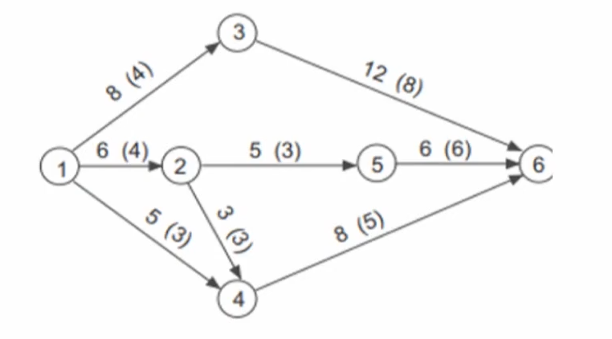
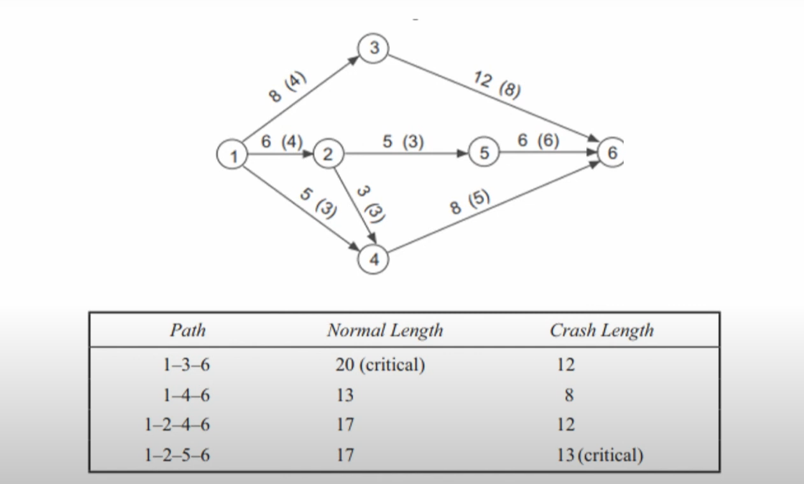

# Lecture 24 Crashing a project

## Agenda
Time-cost Trade-off: Crashing  
Crash time & Crash Cost  
Normal Cost  
The time—cost relationships  
An Example for Crashing  

## Time-cost Trade-off - Crashing
* The critical path method is a very effective tool for
obtaining helpful information like
— the total completion time of a project,  
— the critical activities,  
— the non-critical activities  
— slack of various non-critical activities.  
* The execution of a project involves two types of costs
* Direct
  * The cost of materials  
  * Equipment  
  * direct labour (payroll, overtime, hiring and firing costs)  
  * If the activity is subcontracted and performed by a contractor,
then the activity's direct cost is equal to the price of the
subcontract.  
* Indirect costs. (indirect costs include office space rental, utilities, and
clerical and managerial staff salaries.)
* The total of the direct costs of all project activities is the
project's direct cost.
* If we desire to perform some activities at times shorter
than what they require, then the project cost would
increase.
* The project costs are the overhead charges related to the
project, which include the supervision and other charges,
late completion penalties and rewards for early
completion and so on
* The project's indirect costs are generally a function of
time the project takes to complete.
* Thus, the shorter the project duration lesser would be
the overhead.
* In short, a faster pace of work would mean higher
direct costs, while a slower rate of work would imply
otherwise.
* As indicated, the time-cost trade-off problem is based on the conception that the duration of some of the activities of a project can be cut down if some
additional resources—men, material and/or equipment—are employed on them.

## Crash time & Crash Cost
* For technical reasons, the duration of an activity cannot
be reduced indefinitely.
* The crash time represents the fully expedited or the
minimum activity time duration that is possible, and any
attempts to further 'crash' would only raise the activity
direct costs without reducing the time.
* The activity cost corresponding to the
crash time is
called the crash cost which equals the minimum direct
cost required to achieve the crash performance time.

## Normal Cost
* These are in contrast to the normal activity time and
the normal activity cost.
* The normal cost is equal to the absolute minimum of
the direct costs required to perform an activity.
* The corresponding activity duration is known as the
normal time—which may be stated more specifically
as the shortest time required to perform an activity
under the minimum direct cost constraint.

## The time-cost relationships
* The time—cost relationships can be
visualized graphically in
the form of a time versus
cost curve which is, for a
limited portion at least,
sloping downward, as
depicted in Figure

* The widely accepted convex shape of the
curve between the crash time—cost point
and the normal time-cost point indicates
that it is marginally costlier to induce the
last percentages of reduction in activity
time duration than the first percentages.

* Clearly, our interest lies in the central part of
the curve contained between these two
important points.
* Although the cost curve is convex in nature, for
simplification in network scheduling it is
commonly accepted that linear a approximation of the time-cost relationship be
used .

* This is shown in the figure by two-point
approximation from the normal time-cost
point to the crash time-cost point, the points
being shown joined by a dotted line.

* This linear approximation represents a linear
incremental cost per unit of time saved under
conditions of crashing.
* The incremental cost for an activity can be
determined using the following equation:

`Incremental cost = (crash cost - normal cost)/(nomal time - crash time)`

• For an activity, if the crash cost and time are
700 and 8 days, and if the normal cost and
time are 500 and 12 days, we have

Incremental cost per day = (700-500)/(12-8) = ₹ 50

## An Example for Crashing 

* Table shows for each activity
needed to complete the project the
normal time, the shortest time in
which the activity can completed of
a building contract and the cost per
day for reducing the time of each
activity.

The contract includes a penalty clause of per day over 17 days.  
The overhead cost per day is 160.  
The cost of completing the eight activities in normal time is 6,500  

**Questions -**  
Calculate the normal duration of the project, its cost and the critical path.  
Calculate and plot on a graph the cost/time function for the project and
state:  
— the lowest cost and associated time.  
— the shortest time and associated cost.  

* The network is drawn and shown in
Figure, where the normal and the
shortest (crash) times for various
activities are given.

* We have the normal and minimum duration of the
project equal to 20 and 13 days, respectively.
* Now we shall consider the time—cost relationship
for this project when it is crashed successively by a
period of one day, to know the total cost of the
project for durations of 20 days through 13 days.
.
.
.