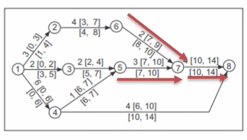
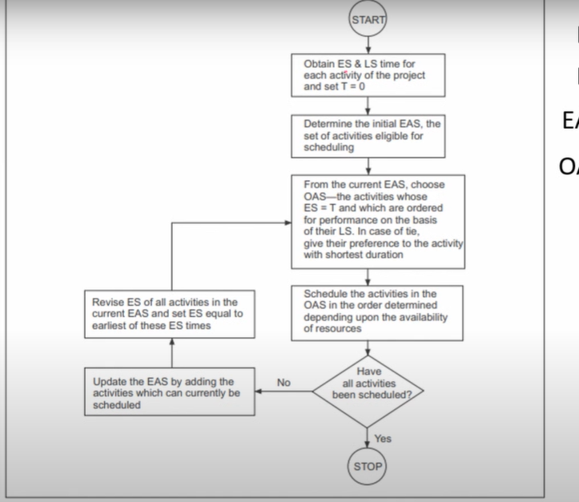

# Lecture 25 Resource Loading

## Agenda
* Resource Allocation
* Importance of Resource Allocation
* Resource Loading
  * Numerical example

## Resource Allocation

* A shortcoming of the scheduling is that **they do not
address the issues of resource utilization and
availability.**
* The focus is on **time** rather than physical resources.
* Also, it will not be sufficient to refer to resource
usage simply as "costs."
* Instead, we must refer to individual types of labor,
specific facilities, kinds of materials, individual
pieces of equipment, and other discrete inputs
that are relevant to an individual project but are
limited in availability
* In addition, we commonly must consider two types of resources:
    * (1) those that are needed in **a specific amount** for an activity (e.g., 2 machine
hours, 5 yards of cement, 12 labor days)
    * (2) those that are needed to **accompany the labor** for as long as the labor is
used, such as a machine.
* This lecture will clarify which type of these two type of resources we are
considering at the time.
* Last, we must not forget that time itself is always a critical resource in
project management, one that is unique because it can neither be
inventoried nor renewed.
* One cannot **save time—one can only spend more or
less of it.**
* The relationship between **progress, time, and
resource availability/usage** is the major focus of this
lecture
* Schedules should be evaluated not merely in terms of
meeting project milestones but also in terms of the
timing and use of scarce resources.

## Importance of Resource Allocation
* A fundamental measure of the PM's success in project management is the
skill with which the trade-offs among scope, time, and cost are managed.
* It is a continuous process of cost—benefit analysis: "l can shorten this
project by a day at a cost of $400.
* "Should I do it?"
* "If I buy 300 more hours of engineering time, I may
be able to improve performance by 2 or 3 percent.
* "Should l, do it?"
* Occasionally, some additional (helpful) resources can be added to a project at little or no cost during a crisis period.
* At other times, some resources in abundant supply may
be traded for scarce ones.
* Most of the time, however, these trades entail additional costs to the organisation, so a primary responsibility for the PM is to make do with what is available.

## Time use vs resource use
**Time Limited**  
* The project must be finished by a specific time, using as few
resources as possible.
* But it is time, not resource usage, that is critical.
**Resource Limited**  
* The project must be finished as soon as possible but
without exceeding some specific level of resource usage or some general resource constraint.

## System constrained resources
* Some industrial processes—heat treating, for
instance—are system-constrained.
* The material must be "cook" for a specified time to
achieve the desired effect.
* More or less "cooking" will not help.
* When dealing with a system-constrained task or
project, no tradeoffs are possible.

## Resource Loading
* Resource loading describes the amounts of individual resources an existing
schedule requires during specific time periods.
* Therefore, it is irrelevant whether we are considering a single work unit or
several projects
* The loads (requirements) of each resource type are simply listed as a
function of time period.
* Resource loading refers to assigning and distributing resources, such as people, equipment, and materials, to specific tasks or activities within a project.
* It involves determining which resources are needed for each part of the project, how much each resource is required, and when they are needed.
* It is an excellent guide for early, rough project planning.
* Obviously, it is also a first step in attempting to reduce excessive demands
on certain resources, regardless of the specific technique used to reduce
the demands.
* Again, we caution the PM to recognize that the use of resources on a
project is often nonlinear.
* Much Of the project management software does not recognize this fact
* If resources of a project are increased by X percent, the output of the
project usually does not increase by X percent, and the time required for
the project does not decrease by X percent.
* The output and time may not change at all, or may change by an amount
seemingly not related to X.
* An increase of 20 percent in the number of notes
played does not necessarily improve the quality of the
music.

## Resource Loading - An Example
* Suppose the network shown in the Figure is
given.
* It is known that each of the activities 5—7, 6—7
and 7—8 require the use of a large crane to
employed.
* The crane can used on a single activity at a time
and has to be employed from the start of the
activity to its finish.

* Now, if we had two cranes, then they would
employ on these activities as soon as needed,
and there would be no delay.
* However, if only one crane is available, then
the question to answered is whether, and by
how much, the project would be delayed.
* From the
network, we observe that
technologically, activity 7-8 can be performed only
when both 5—7 and 6—7 are completed.
* However, activity 5—7 can be performed before or
after the activity 6—7.
* Thus, we have to decide which of the two activities
5—7 and 6—7, should be scheduled first.
* Since both of them have the exact early start
times, the choice would rest on the slack.
* We observe that the activity 5—7 has no slack
while the activity 6—7 has a slack of **one day.**
* These activities could therefore be scheduled
in the order 5—7, 6—7.
* The ordering of the activities would affect the
length of the project.
* Allocate resources 5-7
* When the crane is used on an activity for three
days, the activity 6—7 **cannot start** before the
time IO, with the result that the activity 7—8
would start only at time 12 and not at 10 as
scheduled earlier
* Thus, it would delay the project by two days.
* Notice that if the activities were scheduled as
6—7 followed by 5—7 instead, the project
would have delayed by two days then as well.

## Resource Loading - A Numerical Example

## Eligible Activity Set(EAS)
## Ordered Activities Set(OAS)

## Resource Allocation Algorithms

ES = Earliest start
LS = Latest Start
EAS = Eligible activity set
OAS = Ordered activiety set
