# Lecture 26 - Resource Levelling

## Agenda
Resource leveling  
Need for Resource levelling  
Resource levelling vs Crashing  
Heuristic Procedure for Resource  
Levelling  
Resource Levelling -Example  

## Resource Levelling
* In project management, resource leveling is defined
by Guide to the Project Management Body of
Knowledge (PMBOK Guide) as **"A technique in which
start and finish dates are adjusted based on
resource limitation with the goal of balancing
demand for resources with the available supply."**
* Resource leveling problem could be formulated
as an optimization problem.
* The problem could be solved by different
optimization algorithms such as exact
algorithms or meta-heuristic methods

### Need for Resource levelling
* Networks are not simple sequences of events: activities
can performed only when resources, that is, manpower,
machines, materials and so forth are allocated to them.
*  Of course we cannot assume unlimited availability of the resources.
*  Therefore, whatever resources are available, they must utilised to the maximum extent
* For a given project, we can determine the earliest and the latest possible starting times for all the activities and all the slacks.
* The starting times for activities may be adjusted to achieve objectives other than just completing the
project early.
* One such objective is the levelling of the resources to the total project.
* Often the managements want to keep the total
amount of resources in use during the project
performance as nearly constant as possible through
time and avoid major shifts in manpower and other
resou rces.
* And if constant amounts of resources are given,
managerial planning decisions might aim at their
maximum utilisation, in terms of the least idle time
and, as far as possible, allowing for the smallest
variation.
* The management may wish to level resources to
maintain steady progress, expenditure pattern and
cash flows.
* This analysis, aiming at constancy of the resource
usage is called resource levelling.

### Resource levelling vs Crashing
* In **resource levelling,** then, the aim is to reduce the peak resource requirements and smooth out period-
to-period assignments within a constraint on the
project duration.
* It may be recalled that like resource levelling, the crashing also involves reallocation of resources.
* But whereas in **crashing,**
shortening of the project time is the objective, in resource levelling, smoothening of the resource usage
rate without changing the project duration is
the objective.

## Resource levelling
* It is possible to smooth either individual key resources or all the resources
employed in the project on a daily basis.
* It may easily visualised that such an analysis would very complex when
activities and resources involved are numerous, and it sometimes might
require revising the entire project schedule.
* However, this might worth investigating before key
resources are committed.

## Heuristic Procedure for Resource Levelling
* Here we discuss a heuristic method for the levelling of resources in a
given situation.
* To keep the problem simple, suppose that personnel is the only resource
to be considered.
* The method is explained with the following example.

## Resource Levelling - Example

* You are given in Figure the network corresponding
to a project.
* The project's activities require manpower of
similar type, and the requirements, in terms of the
number of men, are shown in parentheses next to
the activity identification and timing (in days) for
each.
* The network corresponding to a project in Figure

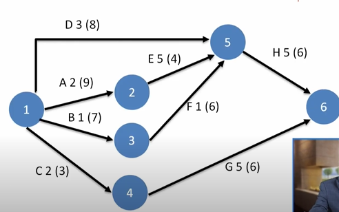
* Determine how the activities of the project may be scheduled in order to
have as smooth a requirement for the manpower as possible, without
causing a delay in the project completion.

### Critical Path

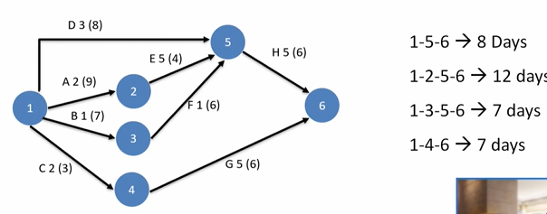

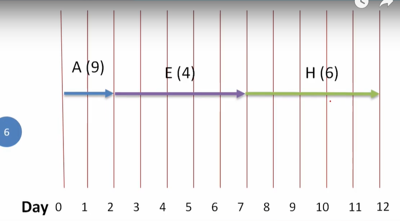

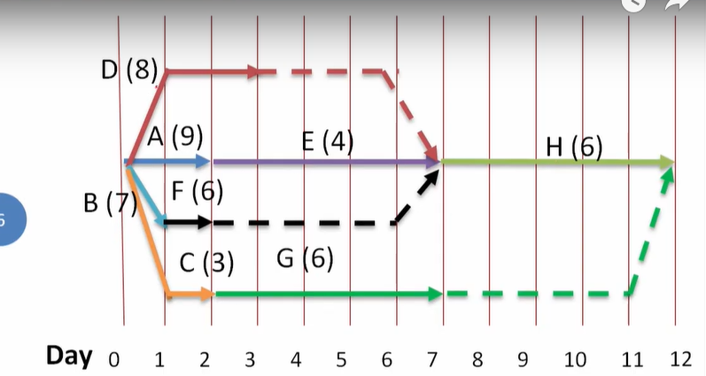

* Action

1. 
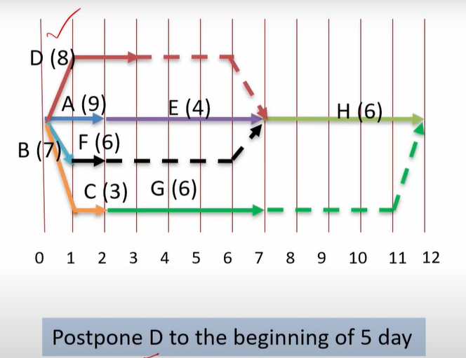

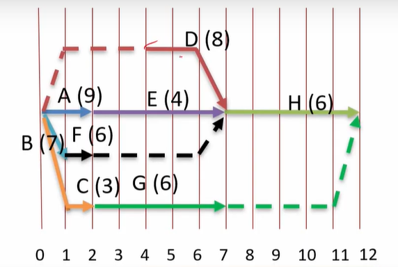

2. 

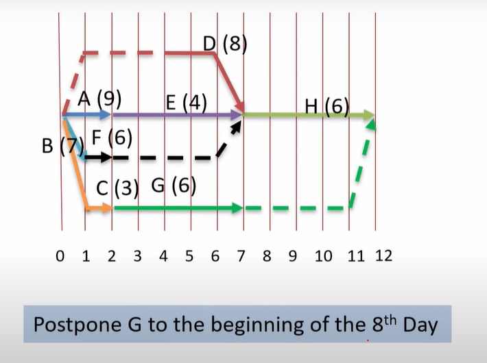

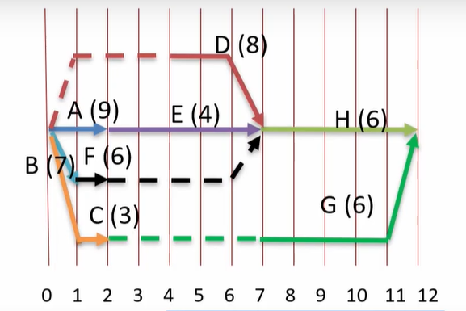

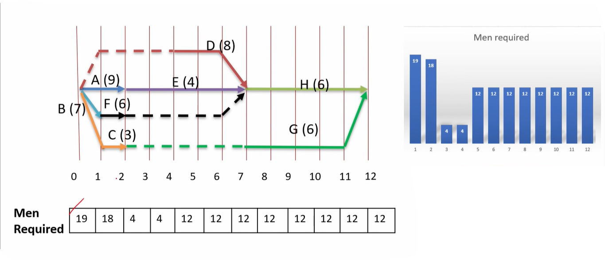

Further Adjustment - 

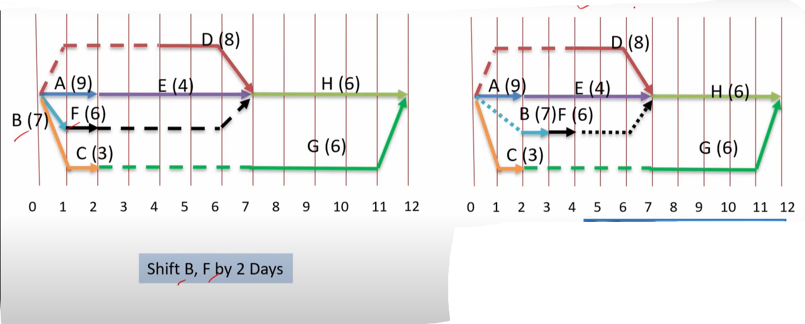

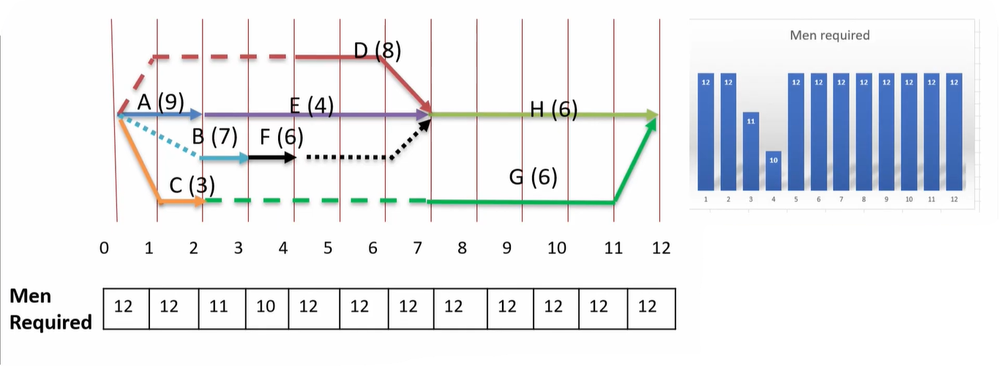

Only for non-critical activities we can adjust , early start time so that it is not violating the overall project duration  

This is trial and error method  

* Obviously, this heuristic procedure becomes quite complicated when
many activities, with many combinations are required to be considered.
* In such situations it may be necessary and useful to employ a computer for the purpose.