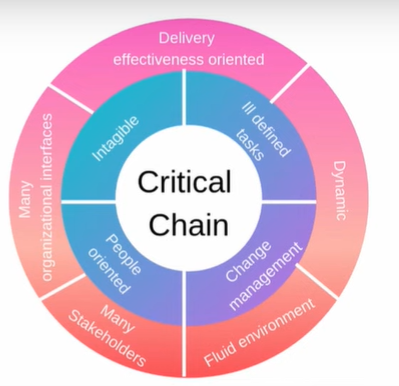
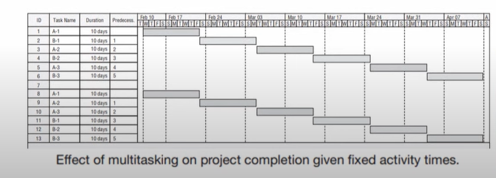
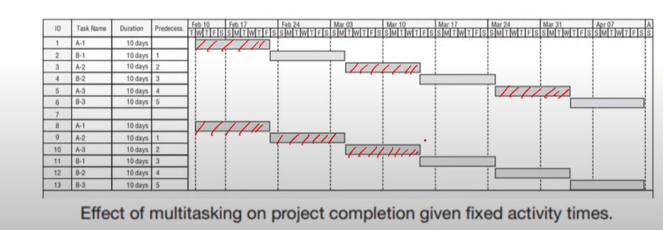
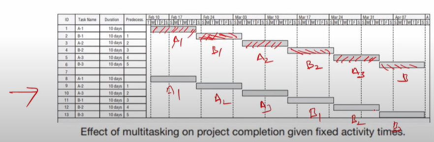
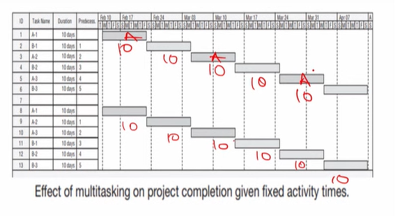

# Lecture 27 - Goldratt’s critical chain

## Agenda
Goldratt's Critical Chain  
Reasons for optimistic bias  
Do Early Finishes and Late Finishes Cancel Out?  
Common Chain of Events  
Goldratt's theory of constraints - Inference from statistics  
* Project Buffer  
    * The Critical Chain  
    * The Feeder Chain  

## Goldratt's Critical Chain
The problem of constrained resource scheduling of
multiple projects could be reduced to the problem of scheduling activities using **scarce resources** in the case of a single project.

### Constrained resource scheduling
* Constrained resource scheduling refers to planning and allocating
resources in a way that considers various constraints and limitations.
* This concept is particularly relevant in project management where
resources such as time, money, manpower, equipment, and materials are
limited.
* However, the best-known attack
constrained scheduling problem is
Chain (1997). on the resource-
Goldratt's Critical
* The celebrated author applies his **"Theory of
Constraints"** to the constrained resource scheduling problem
* The original focus of the Theory of Constraints to project management was the single project case,
but it, too, is just as applicable to multiple projects.
* If we consider all the comments we have heard about the problems PMs have to deal with on a daily basis, many are brought up over and over
again.
* Further, it is interesting to note that these statements are made by PMs working in
**construction, manufacturing, software development,
marketing, communications, maintenance,** and so on
and the list of industries could easily be extended.

## Importance of Goldratt's Critical Chain
* For example, the following issues are raised with high frequency, and this
short list is only indicative, not nearly exhaustive
    * Senior management changes the project's scope
without consultation, without warning, and without
changing the budget or schedule.
    * Project due dates are unrealistic and set with little regard given to availability of resources.
    * There is no possible way of accomplishing a project without exceeding the
given budget.
    * Project workloads and due dates are set by the **sales group**, not by the nature
of the projects and the level of resources needed
    * Project due dates are set unrealistically short as an "incentive" for people to
work harder and faster.
    * It appears that these, and many other, problems are generic.
    * They are independent of the area of application.
    * Note that these issues concern trading off **time, cost, and scope.**
    * To deal with the strong optimistic bias in many project schedules, let us
consider just a few of the things that tend to create it.
    * Optimistic bias refers to the cognitive tendency of individuals to believe
that they are less likely to experience adverse events and more likely to
experience positive events compared to others.

### 1. Thoughtless  optimism
* Some PMs, apparently with a strong need to deny that lateness could be
their fault,
deal with every problem faced by their projects as strict
exceptions, acts of chance that cannot be forecast and hence need not be
the subject of planning.
* These individuals simply ignore risk management.

### 2. Capacity should be set to equal demand
* Some senior managers refuse to recognize that projects are not assembly
lines and are not subject to standard operations management line
balancing methods.
* There is a need for capacity to exceed demand for projects.

### 3. The "Student Syndrome"
* This phrase is Goldratt's term for his view that students often delay
starting school projects until the last possible moment.
* The same tendency is observed in projects where project team members
delay the start of their work.
* The problem with delaying the start of a task is that obstacles are frequently
not discovered until the work has been underway for some time.
* Delaying the start of a task diminishes the opportunity to cope with these I
unexpected obstacles and increases the risk of completing the work late.

### 4. Multitasking to reduce idle time
* Consider a situation where there are two projects, A and B, each with three
sequential activities and with you as the only resource required by both projects.
* Each activity requires 10 days.
* In Figure, see two Gantt charts for sequencing the activities in the two projects.

darker one is Project A in the figure

* In the first, switch from project A (dark) to project B (light) for each of the
three activities, that is, carry out Activity 1 for project A, then Activity 1 for
project B, then Activity 2 for A, and so forth.
* In the second sequence, complete project A before starting project B.

* In both cases, the total time required will
be 60 days.
* In the second, note that project A is
completed after 30 days and B after
60 days.
* In the first chart, however, Project A will be
finished after 50 days and B after 60 days.

* **While the total time required is the same, project A has been delayed for
20 days by the multitasking.**
* Further, this ignores the startup time and loss in efficiency that often
accompanies switching back and forth between tasks.