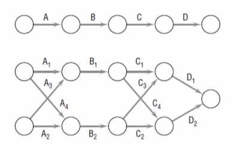
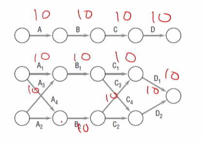
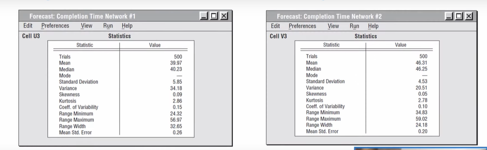
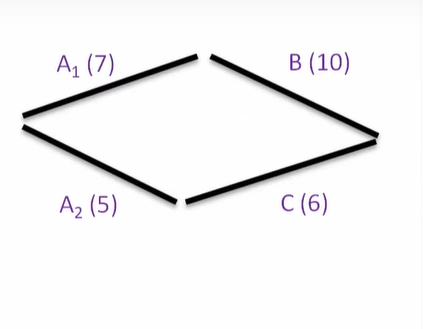
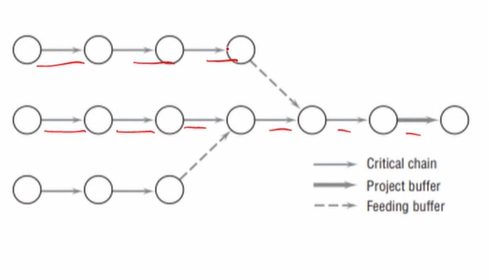

# Lecture 27 - Goldratt’s critical chain

## Agenda
Goldratt's Critical Chain  
Reasons for optimistic bias  
Do Early Finishes and Late Finishes Cancel Out?  
Common Chain of Events  
Goldratt's theory of constraints - Inference from statistics  
* Project Buffer  
    * The Critical Chain  
    * The Feeder Chain  

## Goldratt's Critical Chain
The problem of constrained resource scheduling of
multiple projects could be reduced to the problem of scheduling activities using **scarce resources** in the case of a single project.

### Constrained resource scheduling
* Constrained resource scheduling refers to planning and allocating
resources in a way that considers various constraints and limitations.
* This concept is particularly relevant in project management where
resources such as time, money, manpower, equipment, and materials are
limited.
* However, the best-known attack
constrained scheduling problem is
Chain (1997). on the resource-
Goldratt's Critical
* The celebrated author applies his **"Theory of
Constraints"** to the constrained resource scheduling problem
* The original focus of the Theory of Constraints to project management was the single project case,
but it, too, is just as applicable to multiple projects.
* If we consider all the comments we have heard about the problems PMs have to deal with on a daily basis, many are brought up over and over
again.
* Further, it is interesting to note that these statements are made by PMs working in
**construction, manufacturing, software development,
marketing, communications, maintenance,** and so on
and the list of industries could easily be extended.

## Importance of Goldratt's Critical Chain
* For example, the following issues are raised with high frequency, and this
short list is only indicative, not nearly exhaustive
    * Senior management changes the project's scope
without consultation, without warning, and without
changing the budget or schedule.
    * Project due dates are unrealistic and set with little regard given to availability of resources.
    * There is no possible way of accomplishing a project without exceeding the
given budget.
    * Project workloads and due dates are set by the **sales group**, not by the nature
of the projects and the level of resources needed
    * Project due dates are set unrealistically short as an "incentive" for people to
work harder and faster.
    * It appears that these, and many other, problems are generic.
    * They are independent of the area of application.
    * Note that these issues concern trading off **time, cost, and scope.**
    * To deal with the strong optimistic bias in many project schedules, let us
consider just a few of the things that tend to create it.
    * Optimistic bias refers to the cognitive tendency of individuals to believe
that they are less likely to experience adverse events and more likely to
experience positive events compared to others.

### 1. Thoughtless  optimism
* Some PMs, apparently with a strong need to deny that lateness could be
their fault,
deal with every problem faced by their projects as strict
exceptions, acts of chance that cannot be forecast and hence need not be
the subject of planning.
* These individuals simply ignore risk management.

### 2. Capacity should be set to equal demand
* Some senior managers refuse to recognize that projects are not assembly
lines and are not subject to standard operations management line
balancing methods.
* There is a need for capacity to exceed demand for projects.

### 3. The "Student Syndrome"
* This phrase is Goldratt's term for his view that students often delay
starting school projects until the last possible moment.
* The same tendency is observed in projects where project team members
delay the start of their work.
* The problem with delaying the start of a task is that obstacles are frequently
not discovered until the work has been underway for some time.
* Delaying the start of a task diminishes the opportunity to cope with these I
unexpected obstacles and increases the risk of completing the work late.

### 4. Multitasking to reduce idle time
* Consider a situation where there are two projects, A and B, each with three
sequential activities and with you as the only resource required by both projects.
* Each activity requires 10 days.
* In Figure, see two Gantt charts for sequencing the activities in the two projects.

darker one is Project A in the figure

* In the first, switch from project A (dark) to project B (light) for each of the
three activities, that is, carry out Activity 1 for project A, then Activity 1 for
project B, then Activity 2 for A, and so forth.
* In the second sequence, complete project A before starting project B.

* In both cases, the total time required will
be 60 days.
* In the second, note that project A is
completed after 30 days and B after
60 days.
* In the first chart, however, Project A will be
finished after 50 days and B after 60 days.

* **While the total time required is the same, project A has been delayed for
20 days by the multitasking.**
* Further, this ignores the startup time and loss in efficiency that often
accompanies switching back and forth between tasks.

### 5. Complexity of networks makes no difference
* Consider two different projects, as seen in Figure
* Assume that each activity requires 10 days and is
known with certainty.
* Clearly, both projects are completed in 40 days
though one is considerably more complex than
the other.

* But let's get a bit more accurate.
* Assume that each activity is stochastic, with
normally distributed times.
* The meantime is 10 days, and the standard
deviation is 3 days.
* If we simulate the projects 500 times, we get the
results shown in Tables.

**Project Simulation Statistics for Simple Network #1**

  

### 6. People need a reason to work hard
* Senior managers argue that have enough slack time in their activity
duration estimates to make sure that they can complete the activities on
time and "without too much sweat."
* Therefore, it makes some managerial sense to cut
back on the time allowances until they can serve as an
incentive to the project team.
* It has long been known that for people with a high need for achievement,
the maximum level of motivation is associated with only **moderate,** not
high, levels of risk of failure.

### 7. Game Playing
* This is possibly the most common cause of late projects.
* It is certainly a major cause of frustration for anyone involved in a project
* Senior managers, firm in the belief that project
workers add extra time and resources to activity time
and budget estimates in order to insure a safe and
peaceful life on their portion of a project, routinely
cut schedules and budgets.
* Project workers, suspecting that senior management will cut schedules
and budgets without regard to any logic or reason, increase their
schedules and budgets as much as they guess will be allowed.
* Each assumes that the other is not to be trusted.
* The outcome is simple.
* Rather than practice careful risk management, each
blames the other for any lateness or budget coverage.

## Do Early Finishes and Late Finishes Cancel Out?
* With a few exceptions, early finishes of current activity do not become
early starts of the next activity
* This fact is ignored by most people involved with projects.
* Goldratt feels that project workers will avoid admitting that an activity has
been completed early out of fear that future time estimates will be cut
* Others point out that when the activity schedule is set, it is presumed that
the activity will start immediately after the most likely finish date of its
(latest) predecessor.
* The reason is simple—its resources will not be available until that date.
* There is also a logical explanation of why the start of a successor is usually
delayed until its predetermined expected start time.
* Some say that project workers will not report finishes
before the most likely duration.
* The logic of this position depends on an inherent distrust between project
workers and senior management.
* If an early finish is reported, workers assume that the shorter-than-normal
activity duration will be the expectation for similar activities in the future.
* Senior managers do not really understand the uncertainty faced by project workers.
* The logic of this position depends on an inherent distrust between project
workers and senior management.
* If an early finish is reported, workers assume that the shorter-than-normal
activity duration will be the expectation for similar activities in the future.
* Senior managers do not really understand the uncertainty faced by project workers.

## Common Chain of Events
According to Goldratt, the behaviors and practices discussed lead to the following chain of events:
1. Assuming that activity times are known and that the
paths are independent leads to underestimating the
actual amount of time needed to complete the
project.
2. Because the time needed to complete the project is
underestimated, project team members tend to
inflate their time estimates by some **"safety"** time.
3. Inflated time estimates lead to work filling available
time, workers not reporting that a task has been
completed early, and the ever-present student syndrome.
4. An important caveat is that the safety time is only
visible to the project workers and is often misused.
5. Misused safety time results in missed deadlines and
milestones.
6. Hidden safety time further complicates the PM's task
of prioritizing project activities.
7. The lack of clear priorities likely results in poor
multitasking.
8. Task durations increase as a result of poor
multitasking.
9. Uneven demand on resources—some overloaded and
others underloaded—may also occur as a result of poor
multitasking.
10. To utilize all resources fully, more projects will be
undertaken to make sure that no resources are underutilized.
11. Adding more projects further increases poor mutlittasking.
12. According to Goldratt, this chain of events leads to a vicious cycle.
13. Specifically, as work continues to pile up, team members are pressured to do
more poor multitasking.
14. Increasing the amount of poor multitasking leads to longer activity times.
15. Longer activity times lead to longer project completion times, which ultimately lead to more projects in the waiting line.
16. Determining when to release projects into the system is the primary mechanism for ensuring that the right amount of work is assigned to each person.
17. If projects are started too early, they simply add to the chaos and contribute
to poor multitasking.
18. On the other hand, if projects are started too late, key
resources may go underutilized and projects will
inevitably delayed.
19. Consistent with his Theory of Constraints, Goldratt suggests that the key to
resolving this trade-off is to schedule the start of new projects based on
the availability of **bottleneck (scarce) resources.**
20. It might have occurred to you that one way to reverse this cycle would be to add more resources.
21. The appropriate response is to reduce the number of projects assigned to each person in an effort to reduce the amount of bad multitasking.
22. Incidentally, a simple way to measure the amount of bad multitasking is to calculate the difference between the time required to do the work for a task and the elapsed time required to complete the task.

### Inference from statistics
* Relying on elementary statistics, it can be easily shown that the amount of
safety time needed to protect a particular path is less than the sum of the
safety times required to protect the individual activities making up the path.
* The same approach is commonly used in inventory management where it
can be shown that **less safety stock is needed** at a central warehouse to
provide a certain service level than the amount of safety stock that would
be required to provide this same service level if carried at multiple
distributed locations.

## The Project Buffer
* Imagine you have a big project to complete with many tasks.
* When people work on each task, they often add some extra
time, just in case things take longer than expected.
* This extra time is like a safety cushion to make sure they
finish on time.
* Goldratt, suggests a different approach.
* Instead of each person adding extra time to their tasks, he
recommends reducing that extra time a bit.
* Then, take a portion of that saved time and put it aside as a safety cushion for
the entire project.
* This overall safety cushion for the whole project is called the "project buffer."
* In simple terms, Goldratt is saying: "Don't add too much extra time to each
task individually. Save some of that time as a safety net for the entire
project."
* This way, you can still finish things on time, but you use
your time more efficiently.
* The amount of time each task is reduced depends on
how much of a reduction is needed to get project
team members to change their behavior.
* For example, the allotted time for tasks should be
reduced to the point that the student syndrome is
eliminated.

## The Critical Chain
* Another limitation associated with traditional
approaches to project management is that the
dependency between resources and tasks is often
ignored.
* More specifically, Goldratt argues that two activities
scheduled to be carried out in parallel and using the
same scarce resource are not independent as the
traditional theory would assume.
* If the supply of the scarce resource is not sufficient to allow both activities
to be carried out simultaneously, then whichever of the two is given priority
immediately lengthens the other activity's path but not its actual duration.

### Example - 
* If there is not enough of the scarce resource to fund both A activities, they must be done sequentially.
* If A1 is done first, A2 cannot start until A1 is complete,
thereby adding 7 days to the A2 -C path, making it **18 days**
long and increasing the project finish date by 1 day.
* If A2 is done first, 5 days will be added to the A1 -B path,
making it **22 days**, a 5-day increase over its original 17-day
duration.

* Using Goldratt's meaning of the word "dependent,"
the activities of a
project can be ordered into paths based on their resource dependencies
as well as on their technological precedence requirements.
* The longest of these paths of sequentially time-dependent activities is known as the **"critical chain."**

## The Feeder Chain
* A project, therefore, is composed of its critical
chain and of noncritical chains that feed into
it—see Figure .
* There are two sources of delay for the project.
* One comes from a delay of one or more
activities in the critical chain.

* The second results from a delay in one or more of the
activities on a noncritical or "feeder" chain because
such delays could delay activities on the critical chain.
* A project buffer protects the critical chain, and feeding
buffers protect the feeder paths.
* Resources used by activities on the critical chain are
given priority so that they are available when required