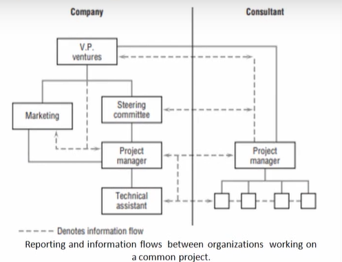

# Phase 3 - Lecture 28- Planning monitoring controlling cycle

## Agenda
* The Planning-Monitoring-Controlling Cycle
* Designing the Monitoring System
    * WBS
    * The measurement of Project performance
* Monitoring- five telltale signs of project
trouble
* Information Needs and Reporting
* The Reporting Process
    * Benefits of timely reports
* Report Types
* Meetings
* Common reporting problems

## The Planning-Monitoring-Controlling Cycle
* The key things to be planned, monitored, and controlled
**time (schedule), cost (budget), and scope are (performance).**
* These, after all, encompass the fundamental objectives
of the project.
* However, we are finding that with more complex
projects, scope is usually by far the most important of the three and invariably changes,
sometimes substantially, as the project progresses.
* Hence, the need for the project owner to work closely with the sponsor and PM.
* There is no doubt that some organizations do not spend sufficient time and effort on planning and controlling projects.
* It is far easier to focus on doing, especially because it appears to be more effective to "stop all the talk and get on with the work."
* We could cite firm after firm that incurred great expense because the planning process was inadequate for the tasks undertaken

### Example of improper planning
1. A major construction project ran over budget by 63 percent and over schedule by 48 percent because the PM decided that, since "he had managed similar projects several times before, he knew what to do
without going into all that detail that no one looks at anyway.
2. A large industrial equipment supplier "took a bath" on a project designed to develop a new area of business because they applied the same planning
and control procedures to the new area that they had used (successfully) on previous, smaller, less complex jobs.
3. A computer store won a competitive bid to supply a computer, five
terminals, and associated software to the Kansas City office of a national firm.
    * Admittedly, insufficient planning made the installation significantly late.
    * Performance of the software was not close to specified levels.
    * This spoiled job prevented the firm from being invited to bid on more than 20
similar installations planned by the client

### Put the hassles up front
* The planning (budgeting and scheduling) methods
we propose **"put the hassles up front."**
* They require a significantly greater investment of time and energy early in the life of the project, but they significantly reduce the extent and cost of poor performance and time/ cost overruns.

## The Planning-Monitoring-Controlling Cycle
* It is useful to perceive the control process as a **closed-loop system,** with
revised plans and schedules (if warranted) following corrective actions.
* It is also useful to construct this process as an internal part of the
organizational structure of the project, not something external to and
imposed on it or, worse, in conflict with it.
* Finally, experience tells us that it is also desirable, though not mandatory,
that the planning—monitoring—controlling cycle be the normal way of life in the parent organization.
* What is good for the project is equally good for the parent firm.
* In any case, unless the PM has a smoothly operating monitoring/ control system, it will be difficult to manage the project effectively

## Designing the Monitoring System
* The first step in setting up any monitoring system is to identify the key factors to be controlled.
* Clearly, the PM wants to monitor scope, cost, and
time but must define precisely which specific
characteristics of scope, cost, and time should be
controlled and then establish exact boundaries
within which control should be maintained.
* There may also be other factors of importance
worth noting at least at milestones or review
points in the life of the project.
* For example, the number Of labor hours used, the
number or extent of process or output changes,
the level of funder satisfaction, and similar items
may be worthy of note on individual projects.

### Designing the Monitoring System - WBS 
* But the best sources of items to be monitored are
the project work breakdown structure (WBS),
change of scope orders, and the risk management
plan.
* The WBS describes what is being done, when, and
the planned level of resource usage for each task,
work package, and work element in the project.
* Monitoring the risks found in the risk management
plan keeps the PM and project team alert to
specific risks and thus lowers the probability of
surprises.
* The monitoring system is a direct connection
between planning and control.
* If it does not collect and report information on some significant element of the plan, control can be faulty or missing.
* The WBS furnishes the key items that must be
measured and reported to the control system, but it
is not sufficient.
* For example, the PM might want to know about changes in the client's
attitudes toward the project.
* Information on the morale of the project team might be useful in preparing
for organizational or personnel changes on the project.
* These two latter items may be quite important but are not usually reflected
in the project's WBS.
* Unfortunately, it is common to focus monitoring
activities on data that are easily gathered—rather than
important—or to concentrate on "objective" measures
that are easily defended at the expense of softer, more
subjective data that may be more important to
control.
* Above all, monitoring should concentrate primarily
on measuring various facets of output rather than
intensity of activity.
* It is crucial to remember that effective PMs are not primarily interested in how hard their project teams work.
* They are interested in achieving results

## Designing the Monitoring System - The measurement of Project performance
* The measurement of project performance usually poses the most difficult
data gathering problem.
* There is a strong tendency to let project inputs serve as surrogate
measures for output.
* If we have spent 50 percent of the budget (or of the scheduled time), we assume that we have also
completed 50 percent of the project or reached 50
percent of our performance goal.
* If the item being referenced is a small work unit, it does not make a
significant difference if we are wrong.
* If, however, the reference is to a task or to the entire project, the input/output of
proportionality (hereafter, the assumption
"proportionality rule") is often seriously misleading.
* Further, it is common to specify performance to a level of precision that is
both unnecessary and unrealistic or a level of lenience that is worthless.
* For example, a communications software project specified that a
telephone "information" system had to locate a phone number and
respond to the queries in 5 seconds or less.
* Is 5.1 seconds a failure?
* Does the specification mean 5 seconds or less every time or merely that
response times should average 5 seconds or less?
* Is the specification satisfied if the response time is 5 seconds or less than
90 percent of the time?
* The monitoring systems we described, however, focus mainly on time and
cost as measures of performance, not scope (performance).
* While we are most certainly concerned with keeping the project "on spec,"
and do consider some of the problems of monitoring output, the subject is
not fully developed here because the software designed to monitor projects
is not constructed to deal with performance adequately

## Monitoring - five telltale signs of project trouble
Alderton (2013) suggests five indicative signs of project trouble it is wise to monitor
1. **Muddy Waters**
* The project plan is often the starting point for project trouble, especially if it is
unduly long or confusing in its goals, scope, deliverables, and processes.
* "The most common cause of troubled projects...is that the scope is not well
defined or well understood."
* Vague or incomplete project requirements are a major
red flag.
2. Mysterious Stakeholders
* Full and detailed stakeholder descriptions and analysis are key to avoiding late problems and delays.
* Incomplete documentation of all stakeholders is a major risk for any project.
* There should be two versions of the stakeholder description:
  * A formal one that identifies who each one is, their role, how to reach them,
and their preferred mode of communication.
* The other also includes whether they are a supporter of the project or a
detractor, or perhaps a fence sitter, so the PM can anticipate any trouble that
may occur later and get to these people early to head it off

3. Unconstrained Constraints

* Knowing how much leeway there is in your schedule and budget for each
task, and where delays or cost overruns can be made up, keeps a project
out of trouble.
* "If you don't have a detailed project schedule, the chance of the project
failing increases exponentially."
* Milestones are especially important since they usually have the least give.
* Establish tolerance limits on each task, and intervene when they are
exceeded.

4. Suspicious Status Reports

* Status reports that are unclear, inconsistent, late, or lack specific measures
are a red flag for coming trouble.
* Vague or overly optimistic language such as "very soon" or "marginal increase" in costs also indicates trouble ahead.

5. Discord and Drama

* Unhappy team members can cause major trouble in the project, though hard to detect early on.
* Meeting minutes can show team members who are consistently missing, have low participation, or seem to have excessive objections and complaints.
* The PM needs to be a coach and mentor for the team by establishing trust
and respect within the team and an open and honest feedback
environment.
* Create a positive team dynamic as soon as possible

## Information Needs and Reporting
* Everyone concerned with the project should be appropriately tied into the
project reporting system.
* The monitoring system ought to be constructed so that it addresses every
level of management, but reports need not be of the same depth or at the
same frequency for each level.
* Lower-level personnel have a need for detailed information about individual tasks and the factors affecting such tasks.
* Report frequency is usually high.
* For the senior management levels, overview reports describe progress in more aggregated terms with less individual task detail unless senior management has a
special interest in a specific activity or task.
* Reports are issued less often.
* In both cases, the structure of the reports should
reflect the WBS, with each managerial level
receiving reports that allow the exercise Of
control at the relevant level.
* At times, it may be necessary to move
information between organizations, as illustrated
in Figure , as well as between managerial levels.

