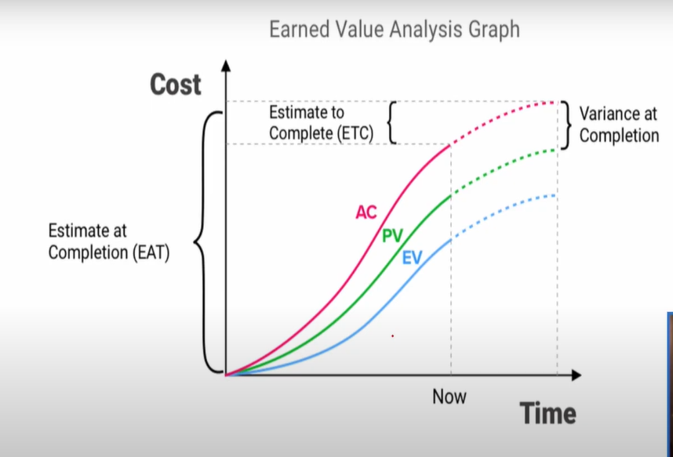
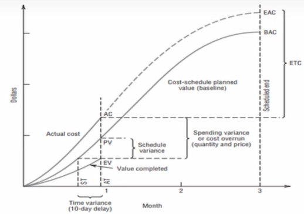
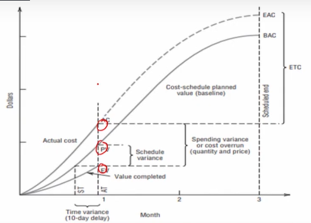
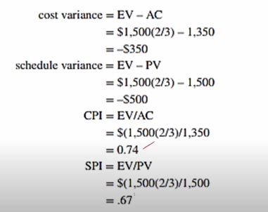
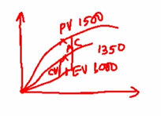
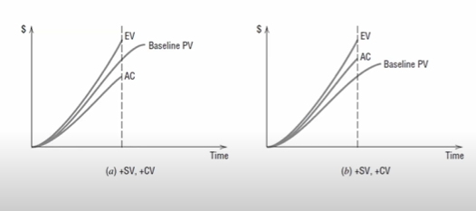
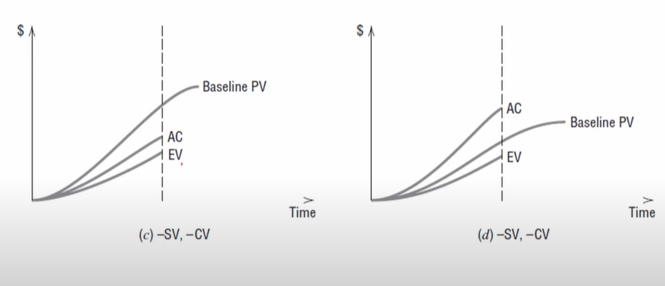
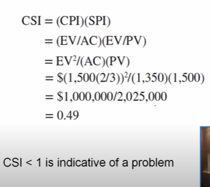
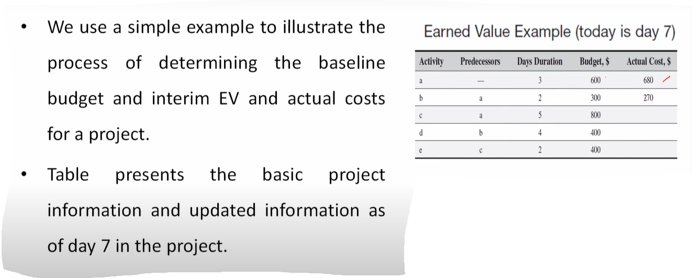

# Lecture 29- Earned value analysis

## Agenda

Earned value analysis  
Earned value chart and calculations  
Estimating 'Percent Completion'  
Earned Value chart  
— Terminologies used  
— Variance  
— Example  
Updating a Project's Earned Value  

## Earned value analysis
* We have covered monitoring for parts of projects.
* Monitoring performance for the entire project is also
crucial because performance is the **"reason for being"**
of the project.
* Individual task performance must be monitored
carefully because the timing and coordination between
tasks are essential.
* But overall project performance is the crux of the matter and must not be
overlooked.
* One way of **measuring overall performance is by using an aggregate performance measure called earned value (EV).**

## Earned value chart and calculations
* A serious difficulty with comparing actual expenditures against budgeted or baseline expenditures for any given time period is that the comparison fails to take into account the **amount of work accomplished** relative to the
cost incurred.
* The earned value of work performed (value completed) for those tasks in progress is **found by multiplying the estimated percentage of physical completion of work for each task by the planned cost for those tasks.**
* Earned value = % of Physical completion of work x Planned cost
* The result is the amount that should have been spent on the task so far.
* This can then be compared with the actual amount spent.
* Making an overall estimate of the per cent completion of a project
without **careful study of each of its tasks and work units** is not sensible—
though some people make such estimates, even so.
* Instead, it is apparent that at any date during the life of a project, the
following general condition exists:
    * Some work units **have been finished and are 100 per cent complete.**  
    * Some work units have **not started yet** and are **0% complete.**  
    * Other units **have been started but are not yet finished,** and we may
estimate a **per cent completion** for this latter group

### Estimating 'Percent Calculation'
* As we said, estimating the **"per cent completion"** of each task (or work
package) **is nontrivial.**
* If the task is to write a piece of software, per cent completion can be
estimated as the number of lines of code written divided by the total
number of lines to be written—given that the latter has been estimated.
* But what if the task is to test the software?
* We have run a known number of tests, but how many remain to be run?

There are several conventions used to aid in estimating percent completion  
**The 50-50 rule**  
1. 50% - Fifty per cent completion is assumed when
the task is begun, and the remaining 50 per
cent when the work is complete.
2. 50% - This seems to be the most popular rule,
probably because it is relatively fair and
doesn't require the effort of attempting to
estimate task progress.
* Since it gives credit for half the task as soon as it has begun, it is excessively
generous at the beginning of tasks.
* Then it doesn't give credit for the other half until the task is finally
complete.
* It is excessively conservative toward the end of tasks, thereby tending to
balance out on an overall basis.

**The 0-100 percent rule**  
* This rule allows no credit for work until the task is complete
* With this highly conservative rule, the project
always seems to be running late, until the very
end of the project when it appears to suddenly
catch up.
* Consequently, the earned value line will always
lag the planned value (PV) line on the graph.

Example - 

**Critical input use rule**  
* This rule assigns task progress according to
the amount of a critical input that has been
used.
* Obviously, the rule is more accurate if the
task uses this input in direct proportion to
the true progress being made.
* For example, when building a house, the task of building the foundation
could be measured by the cubic yards (or meters) of **concrete poured.**
* The task of framing the house could relate to the amount of lumber used
* The roofing task could relate to the sheets of 4 x 8-foot plywood used

**The Proportionality rule**  
* This commonly used rule is also based on
proportionalities but **uses time (or cost) as
the critical input.**
* It thus divides actual task time-to-date by
the scheduled time for the task [or actual
task cost-to-date by total budgeted task
cost] to calculate percent complete.
* If desirable, this rule can be subdivided according to the sub-activities within the task.
* For example, suppose that progress on a task depends on purchasing a
large, expensive machine to do a long and difficult task.
* However, just having the machine does not contribute to substantial task progress.

## Earned Value Chart

* A graph illustrating the concept of earned
value such as that shown in Figure can be
constructed using the aforementioned rules
and provides a basis for evaluating cost and
scope to date.

* If the total value of the work accomplished
is in balance with the planned (baseline)
cost (i.e., minimal scheduling variance), as
well its actual cost (minimal cost as variance),
then top management has no need for a detailed analysis of individual tasks.

* The concept of earned value combines **cost reporting and aggregate scope reporting** into one comprehensive chart

## Terminologies used in Earned Value Chart
* **EV**
  * Earned value is a way to measure how much value or progress a report has achieved compared to the planned or budgeted amount

* **PV**
  * Planned value in project management is the
amount of work that was expected to be
completed at a specific point in time, based on
the project plan and schedule.

* **AC**
  * Actual cost in project management refers
to the total amount of money spent or
incurred on a project up to a specific point
in time.
  * It represents the real expenses associated
with the project's activities and tasks.

* **EAC**
  * Estimate at Completion (EAC) is a projection of the
total cost of the project based on the actual
performance to date.

`EAC = AC + (BAC - EV) ` 

Where,  
EAC is the Estimate at completion  
AC is the Actual Cost  
BAC is the Budget at Completion  
EV is the Earned Value  

* BAC
  * Budget at Completion (BAC) refers to the total
budgeted cost for the entire project.

* ETC
  * ETC stands for "Estimate to Complete."
  * ETC represents the estimated cost required to
complete the remaining work in a project.
  * It is a projection based on the project's current
performance and expenses.
  * There are different ways to calculate ETC, but a common formula is - `ETC = EAC - AC`
  ETC is the Estimate to complete  
  EAC is the Estimate to Completion  
  AC is the Actual Cost  
  * In simple terms, ETC provides an estimate of how much more money will be needed to finish the remaining project work, given the project's current performance and expenditures

* **SV (Schedule Variance)**
  * Schedule Variance is a measure that
indicates whether a project is ahead of or
behind schedule at a specific point in time.
  * The formula for Schedule Variance (SV) is:
  **SV = EV - PV**
  - SV is the Schedule Variance
  - EV is the Earned Value
  - PV is the Planned Value

* **CV (Cost Variance)**
  * Cost Variance is a measure that indicates whether a project is under or over budget at a specific point in time
  * The formula for Cost Variance (CV) is
  `CV = EV - AC`  
  CV is the Cost Variance  
  EV is the Earned Value  
  AC is the Actual Cost  

## Earned Value chart - Variance
* **Cost variance (CV) = EV - AC**
— Cost overrun is negative
* **Schedule variance (SV) = EV - PV**
— SV, behind is negative
* **Time variance (TV) = ST - AT**
— TV, delay is negative
* Typically, variances are defined in such a way that they will be negative
when the project is behind schedule and/or over cost.
* As we have noted, however, this practice is not universal either in the
literature or in practice.

The variances are also often formulated as ratios rather than differences
* CV becomes the cost performance index(CPI) = EV/AC
* SV becomes the schedule performance index(SPI) = EV/PV
* Time variance becomes the time performance index(TPI) = ST/AT
* where values less than 1.0 are **"bad"**
* Use of ratios is particularly helpful when an organization wishes to compare
the performance of several projects (or PMs), or the same project over
different time periods.
* As we just noted, however, the accuracy and usefulness of all these
performance measures depend on the degree in which estimates of
percent completion reflect reality

## Earned Value chart - Example 
* Assume that operations on a work package were expected to cost $1,500(PV) to complete the package.
* They were initially scheduled to have been finished today.
* At this point, however, we have expended $1,350 (AC) and estimate that we
have completed two-thirds of the work (Percent completion).
* What are the cost and schedule variances?

* In other words, we are spending at a higher level than our budget plan
indicates, and we are not as far along as we should be.
* We can also use SPI to calculate the time variance TV if we realize that the
scheduled time, ST, should conceptually be in proportion to (EV/PV):

`ST = (AT)(EV)/PV`
* Since TV = ST - AT, then
  TV = (AT)((EV/PV)-1) = (AT)(SPI - 1)

  (This can be derived through simple trigonometry)

### Six possible arrangements of AC, EV, and baseline PV resulting in four combinations of positive and negative schedule variance(SV) 

### Cost-Schedule Index

### Estimated Cost to Complete(ETC)

ETC = (BAC-EV)/CPI  
=(1500-1000)/0.74  
= $676

### Estimated Actual Cost to Complete(EAC)

EAC = ETC + AC  
= 676 + 1350  
= 2026

rather than original estimate of 1500

## Updating a Project's Earned Value

* The planned AON diagram is shown in Figure, where path a-c-3 is the critical path, with project completion expected at day 10

.

.
