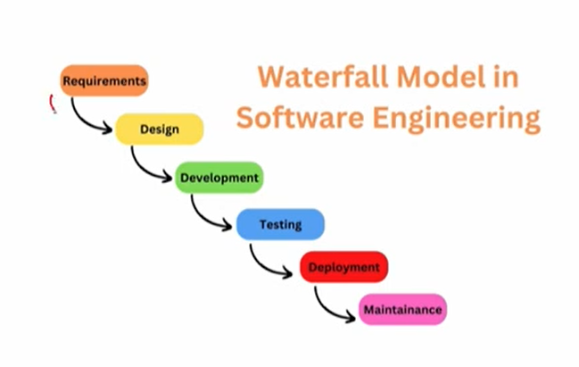

# Lecture 03 : Agile Project Management

## Agenda
Agile project management
Agile principle
Characteristics of Agile Approaches and Scrum
Benefits of Agile project management
Implementing Agile project management

## Waterfall Approach for Project Management

* In the traditional approach to project
management, one phase of the project is
completed before the next phase is started.
* This is typically referred to as the "Waterfall"
method.
* For example,
    * Software development projects
* Six Sigma process improvement projects

Define => Measure => Analyse => Improve => Control phases

## Agile Project Management

* To lower costs, improve project outcomes, and
reduce project completion times, 17 software
developers and project experts met in 2001 to
discuss and identify the characteristics shared by
successful projects.
* Based on these discussions and leveraging
management principles, the group developed a
new approach to project management.
* Foundational values for this new approach were
spelled out in a declaration entitled the
"Manifesto for Agile Software Development"
(agilemanifesto.org)

* Better ways of developing software by doing it and helping others do it.
  * Individuals and interactions OVER Processes and tools
  * Working software OVER Comprehensive Documents
  * Customer collaboration OVER Contract Negotiation
  * Responding to change OVER Following a plan

* The **first value**, individuals and interactions over processes and tools
addresses providing an effective and efficient way to solve problems
and build cohesive teams.
* A critical implication of this value is that Agile teams must be staffed
with people who can work effectively with others.
* The **second value**, working software over comprehensive
documentation, clarifies that the emphasis is on producing
products with working functionality.
* It is also implied that minimal product development activities,
project documents, meetings, and other administrative activities
should be used.
* The **third value** in the Agile Manifesto, customer
collaboration over contract negotiation, clearly defines
the customer's central role in product development
projects.
* With the traditional Waterfall approach, customers are
involved at the start of the project, when the project
scope needs to change, and at the end.
* Aside from these times,
input
customer
discouraged, often creating an adversarial relationship
between the project team and the customer.
* The **final value**, responding to change versus following
a plan, recognises that having the flexibility to adapt to
changing requirements is invaluable to the pursuit of
developing superior products and services
* In the traditional Waterfall approach, the project team
relies on detailed and structured change management
procedures that ultimately discourage changes and
stifle creativity

## 12 Agile Principles
* More specifically, the Agile Principles were developed as guidelines to assist project
teams in implementing the Agile methodology and techniques.
1. Our highest priority is to satisfy the customer through
early and continuous delivery of valuable software.
2. Welcome changing requirements, even late in
development.
3. Deliver working software frequently, from a couple of weeks to a couple of
months, with a preference for the shorter timescale.
4. Businesspeople and developers must work together daily throughout the
project.
5. Build projects around motivated individuals. Give them the environment
and support they need and trust them to get the job done.
6. The most efficient and effective method of conveying information to and
within a development team is face-to-face conversation
7. Working software(automation) is the primary measure of progress.
8. Agile processes promote sustainable development. The sponsors,
developers, and users should be able to maintain a constant pace
indefinitely.
9. Continuous attention to technical excellence and good design enhances
agility.
10. Simplicity—the art of maximizing the amount of work not done—is
essential.
11. The best architectures, requirements, and designs emerge from self-
organizing teams.
12. The team reflects on becoming more effective at regular intervals, then
tunes and adjusts its behaviour accordingly.

## Characteristics of Agile Approaches and Scrum

* While there are several different Agile approaches,
they are all based on the Agile Manifesto and the 12
Principles and they all share the following general
characteristics
* The project is divided into iterations, mostly called
sprints
* Based on its roots in lean management, there is an emphasis on simplicity
* Project teams are self-managing
* Progress on the project is measured in terms of working product
functionality
* Scrum is the most popular Agile approach and was
developed by Ken Schwaber and Jeff Sutherland in
the early 1990s as a framework for **creating and
delivering complex products**
* The scrum framework defines specific scrum team
roles within the scrum team.

* Scrum has been applied in a variety of industries
and types of projects, including
    * Software and hardware development
    * By governments and educational institutions
    * Identifying new markets
    * Autonomous cars
    * Developing cloud operating environments, and
    * Developing services

## Benefits organisations have obtained through the adoption of Agile methods
* Higher customer satisfaction due to receiving customer input and feedback
throughout the project.
* Increased flexibility to incorporate changing requirements.
* Less waste on non-productive work.
* Faster delivery of products with working functionality.
* Higher quality and faster problem detection.
* Reduced risk of project failure.
* Increased collaboration among stakeholders and team members
* Higher team morale resulting from the use of self-managed teams
* Enhanced performance visibility
* Improved predictability of key project outcomes

## Implementing Agile

* Once it has been determined that Agile or some of its
practices are desirable, implementing these practices can
become a significant challenge.
* The challenge stems mainly from the significant change
in mindset required to transition from traditional to Agile
approaches.
* For example, with Agile approaches, the project's
outcome does not require 100 % completion of all
requirements, whereas,
in traditional
customer
approaches, **100% completion is typically expected**.
* The significant change in mindset required complicates
the task of getting buy-in from project team members
and other key stakeholders.
* Several practices have been found to help facilitate the
task of getting the critical buy-in needed.
* For example, the organization can sponsor book clubs
that provide employees with the opportunity to learn
about and discuss the benefits and mechanics of Agile
approaches.
* Additionally, the organisation can establish a Center of Excellence (aka
Community of Practice) to champion and educate project workers about
Agile.
* These centres of excellence can also ensure that Agile practices are
implemented correctly and consistently across the organisation.
* The organisation can also sponsor workshops and other training opportunities
to help communicate the rationale for why Agile is being implemented.
* Finally, project workers can obtain support by networking with other
professionals via professional meetings and conferences
* At the end of the day, it is helpful to recognize that Agile is more of a journey
and less of a destination.
* As the organization gains experience with Agile, it will inevitably realize there
is much more to learn.
* And related to learning, there is often **no better teacher than experience.**
* It is to be expected that teams will fail in some of their early attempts with
Agile.
* But the best management practice is not to focus on preventing these
failures, but rather to help team members learn from them.

## Summary
Agile project management  
Agile principle   
Characteristics of Agile Approaches and Scrum  
Implementing Agile 