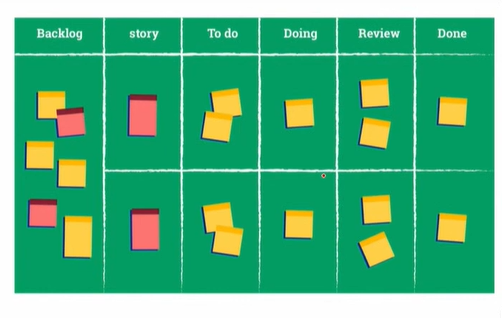
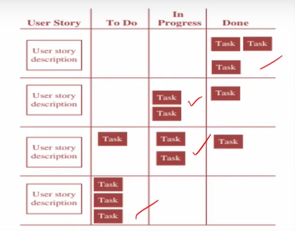
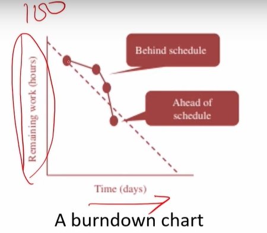
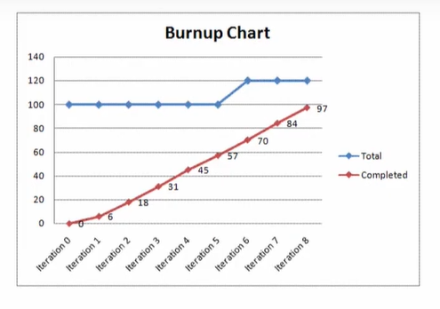

# Lecture 30- Agile tools for tracking project

## Agenda
Agile Tools for Tracking Project Progress  
• Task Boards  
• Burnup and Burndown Charts  
• Burndown Charts  
• Burnup Charts  
MS Project Example  

## Agile Tools for Tracking Project Progress
* Our discussions in earlier lectures highlighted a
variety of ways the Agile approach to project
management differs from more traditional
approaches.
* Given this, it should come as no surprise that
Agile has unique practices, methodologies, and
conventions for monitoring projects.
* In the traditional Waterfall approach, when a project is evaluated to be
90% complete this typically means that there is 90% progress toward
completing the project but likely 0% is completed and operational.

* In the Agile project management context, it means that 90% of the highest
requirement features are completed and operational.
* Actually, the concept of earned value is not particularly applicable to Agile
projects.
* Because earned value is **based on the assumption that the project's scope
is fixed**
* **But Agile explicitly embraces changes to project scope as more is learned
throughout the project.**

## Task Boards
* As was discussed, the product backlog and
sprint backlog are key scrum artefacts that
contain the complete list of the
requirements for the product being
developed or improved and the
requirements to be completed in the
current sprint, respectively.
* Throughout the project, as sprints are completed, the team updates its
average velocity which in turn can be used to assess the progress to date
and to estimate the amount of time required to complete the remaining
product backlog items.
* Furthermore, the sprint backlog is updated daily and available to all team
members providing the team with real-time information on the status of
the sprint.
* As shown in Figure, task boards are divided
into several columns to track the progress of
the tasks to be completed during the sprint.
* The second column in the Figure identifies the
user stories being addressed in the current
sprint.

* The user stories are broken down into more
detailed requirements to create specific tasks,
which are often written on sticky notes.
* The status of the tasks is tracked by placing
the tasks in the appropriate column from to
do (not started) to in-progress (started but not
complete) to done (task completed and
approved by the product owner).
* Also observe how swim lanes (horizontal
lines) are used to facilitate the tracking of
tasks by user story.
* It is important to point out that only the
product owner has the authority to move
tasks to the done column.
* The task board should be displayed in a
prominent location so that it is easily
viewed by all team members.
* As a visual tool, the task board provides
members
with up-to-date
team
information on the status of the sprint.
* A glance at the task board shown in Figure
reveals that the first user story is complete,
progress has been made on the second and
third user stories, and the fourth user story
has not been started.

* Finally, in keeping with lean principles, it is
strongly recommended that task boards be
kept simple, perhaps using little more than a
whiteboard or wall and sticky notes.

## Burnup and Burndown Charts
* Burnup and burndown charts are additional Agile tools that facilitate
monitoring and controlling overall project progress.
* Like other Agile tools, their popularity stems in part from their ease of
interpretation due to their visual nature.

### Burndown Charts
* As shown in Figure , a burndown chart is created
with the remaining work for the sprint on the
vertical axis and time on the horizontal axis.
* The remaining work that needs to be completed
can be expressed in time units such as hours or
user story points.

* The remaining work to finish the sprint (or
project) at various points in time is plotted on
the chart as shown by the solid line in Figure,
which creates a downward-sloping line.
* The plotted line's slope corresponds to the
progress rate, with a steeper line being
associated with a greater rate of progress.
* Based on an estimate of the line's future
slope, the project completion time can be
estimated.
* Also, as shown by the dashed line in Figure,
the planned progress can be included in the
chart.
* When the actual progress (solid line) is above
the planned progress (dashed line), the sprint
is behind schedule.
* Likewise, when the actual progress is below
the planned progress, the sprint is ahead of
schedule.

### Burnup Charts
* While a **burnup chart** contains the same
axes as the burndown chart, two different
lines are plotted on it.
* The first set of data plotted is the work
completed to date, and the second set of
data is the total amount of work, including
scope changes, yet to be completed.

* Both burnup and burndown charts provide the PM with a straightforward
approach for monitoring and communicating overall project progress.
* The choice of one chart versus the other is a matter of personal
preference.