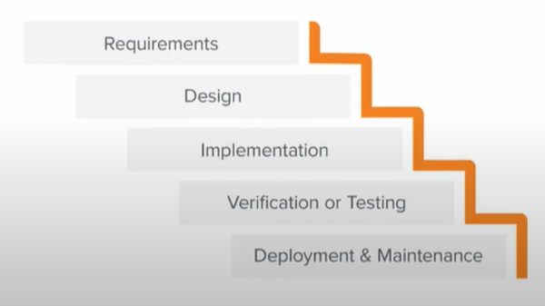

# Lecture 30- Agile tools for tracking project

## Agenda
Agile Tools for Tracking Project Progress  
• Task Boards  
• Burnup and Burndown Charts  
• Burndown Charts  
• Burnup Charts  
MS Project Example  

## Agile Tools for Tracking Project Progress
* Our discussions in earlier lectures highlighted a
variety of ways the Agile approach to project
management differs from more traditional
approaches.
* Given this, it should come as no surprise that
Agile has unique practices, methodologies, and
conventions for monitoring projects.
* In the traditional Waterfall approach, when a project is evaluated to be
90% complete this typically means that there is 90% progress toward
completing the project but likely 0% is completed and operational.

* In the Agile project management context, it means that 90% of the highest
requirement features are completed and operational.
* Actually, the concept of earned value is not particularly applicable to Agile
projects.
* Because earned value is **based on the assumption that the project's scope
is fixed**
* **But Agile explicitly embraces changes to project scope as more is learned
throughout the project.**

## Task Boards
* As was discussed, the product backlog and
sprint backlog are key scrum artefacts that
contain the complete list of the
requirements for the product being
developed or improved and the
requirements to be completed in the
current sprint, respectively.
* Throughout the project, as sprints are completed, the team updates its
average velocity which in turn can be used to assess the progress to date
and to estimate the amount of time required to complete the remaining
product backlog items.