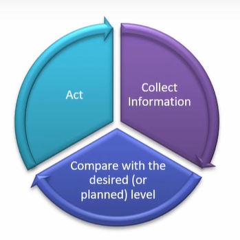

# Lecture 31-Three types of Project Controlling

## Agenda
* Project Control
    * Physical Asset Control
    * Human Resource Control
    * Financial Resource Control
* Three Types Of Control Processes
  * Cybernetic Control  
  * Information Requirements for Cybernetic Controllers  
  * Go/No-GO Controls  
  * Information Requirements for Go/No-Go Controls  
  * Post control  
  * Recommendations for Performance and Process Improvement 

## Project Control

1. Planning - Gantt Charts
2. Monitoring - EVM(Earned Value Management)
3. Controlling - Performance Reporting

* In the previous lectures, we described the monitoring
and information gathering process that would help the
Project Manager (PM), the project owner, and the
sponsor control the project.
* Control is the last element in the implementation cycle
of planning—monitoring— controlling.
* Information is collected about the system performance,
compared with the desired (or
planned) level, and action taken if actual and
desired performance differ enough that the
controller (manager) wishes to decrease the
difference.

* Note that reporting performance,
comparing the differences between
desired and actual performance levels,
and accounting for why such differences
exist are all parts of the control process.

**Control is the act of reducing the
difference between plan and reality.**

* Control is focused on three elements of a project - **scope, cost, and time.**
* The PM is constantly concerned with these three aspects of the project.  
Is the project delivering what it promised to deliver, or
more?  
Is it making delivery at or below the promised cost?  
Is it making delivery at or before the promised time?  
It is strangely easy to lose sight of these fundamental  
targets, especially in large projects with a wealth of 
detail and a great number of subprojects.  
* Large projects develop their own momentum and tend to get out of hand,
going their own way independent of the wishes of the PM and the intent of
the proposal.

Think of a things that can cause a project to require the control of scope,

### Scope
• Unexpected technical problems arise.  
• Insurmountable technical difficulties are present.  
• Quality or reliability problems occur.  
• Client requires changes in system specifications.  
• Interfunctional complications and conflicts arise.  
• Technological breakthroughs affect the project.  

### Cost
• Technical difficulties require more resources.  
• The scope of the work increases.  
• Initial bids or estimates were too low.  
• Reporting was poor or untimely.  
• Budgeting was inadequate.  
• Corrective control was not exercised in time.  

### Time

• Technical difficulties took longer than planned to solve.  
• Initial time estimates were optimistic.  
• Task sequencing was incorrect.  
• Required inputs Of material, personnel, or equipment
were unavailable when needed.  
• Necessary preceding tasks were incomplete.  

## The Fundamental Purposes of Control
* The Two fundamental objectives of control are as follows - 
  * The regulation of results through the alteration of activities
  * The stewardship of organizational assets

