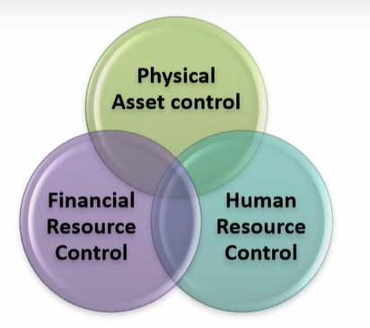
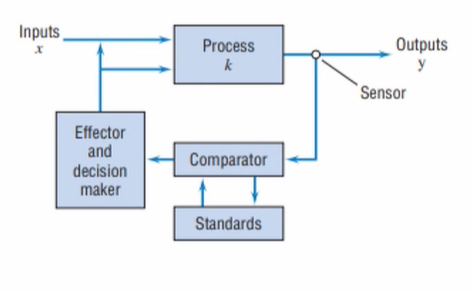

# Lecture 31-Three types of Project Controlling

## Agenda
* Project Control
    * Physical Asset Control
    * Human Resource Control
    * Financial Resource Control
* Three Types Of Control Processes
  * Cybernetic Control  
  * Information Requirements for Cybernetic Controllers  
  * Go/No-GO Controls  
  * Information Requirements for Go/No-Go Controls  
  * Post control  
  * Recommendations for Performance and Process Improvement 

## Project Control

1. Planning - Gantt Charts
2. Monitoring - EVM(Earned Value Management)
3. Controlling - Performance Reporting

* In the previous lectures, we described the monitoring
and information gathering process that would help the
Project Manager (PM), the project owner, and the
sponsor control the project.
* Control is the last element in the implementation cycle
of planning—monitoring— controlling.
* Information is collected about the system performance,
compared with the desired (or
planned) level, and action taken if actual and
desired performance differ enough that the
controller (manager) wishes to decrease the
difference.

* Note that reporting performance,
comparing the differences between
desired and actual performance levels,
and accounting for why such differences
exist are all parts of the control process.

**Control is the act of reducing the
difference between plan and reality.**

* Control is focused on three elements of a project - **scope, cost, and time.**
* The PM is constantly concerned with these three aspects of the project.  
Is the project delivering what it promised to deliver, or
more?  
Is it making delivery at or below the promised cost?  
Is it making delivery at or before the promised time?  
It is strangely easy to lose sight of these fundamental  
targets, especially in large projects with a wealth of 
detail and a great number of subprojects.  
* Large projects develop their own momentum and tend to get out of hand,
going their own way independent of the wishes of the PM and the intent of
the proposal.

Think of a things that can cause a project to require the control of scope,

### Scope
• Unexpected technical problems arise.  
• Insurmountable technical difficulties are present.  
• Quality or reliability problems occur.  
• Client requires changes in system specifications.  
• Interfunctional complications and conflicts arise.  
• Technological breakthroughs affect the project.  

### Cost
• Technical difficulties require more resources.  
• The scope of the work increases.  
• Initial bids or estimates were too low.  
• Reporting was poor or untimely.  
• Budgeting was inadequate.  
• Corrective control was not exercised in time.  

### Time

• Technical difficulties took longer than planned to solve.  
• Initial time estimates were optimistic.  
• Task sequencing was incorrect.  
• Required inputs Of material, personnel, or equipment
were unavailable when needed.  
• Necessary preceding tasks were incomplete.  

## The Fundamental Purposes of Control
* The Two fundamental objectives of control are as follows - 
  * The regulation of results through the alteration of activities
  * The stewardship of organizational assets

### Physical Asset Control
Physical asset control requires control of the use of
physical assets.  
It is concerned with asset maintenance, whether
preventive or corrective.  
At issue, also is the timing of maintenance or
replacement as well as the quality of maintenance.  

Physical inventory, whether equipment or
material, must also be controlled.  
It must be received, inspected (or certified), and
possibly stored prior to use.  
Records of all incoming shipments must be
carefully validated so that payment to suppliers
can be authorized  

### Human Resource control

* Stewardship of human resources requires
controlling and maintaining the growth and
development of people.  
* Projects provide particularly fertile ground for
cultivating people. 
* Because projects are unique, differing one from
another in many ways, it is possible for people
working on projects to gain a wide range of
experience in a reasonably short time. 

### Financial Resource Control

* The techniques of financial control, both
conservation and regulation, are well
known.
* They include current asset controls, and
project budgets as well as capital investment
controls.
* These controls are exercised through a series
of analyses and audits conducted by the
accounting/controller function for the most
part.
* Representation of this function on the project
team is mandatory.

## Three Types of Control mechanism
1. Cybernetic control
2. Go/no-go control
3. Post-control

### Cybernetic Control

* Cybernetic, or steering, control is by far the
most common type of control system.
* The key feature of cybernetic control is **its
automatic operation.**
* Consider the diagrammatic model of a
cybernetic control system shown in Figure

* As Figure shows, a system is operating with inputs
being subjected to a process that transforms them
into outputs.
* It is this system that we wish to control.
* In order to do so, we must monitor the system
output.
* This function is performed by sensors that measure
one or more aspects of the output, presumably those
aspects one wishes to control.
taken by a sensor are
* Measurements
transmitted to the comparator, which compares
them with a set of predetermined standards.
* The difference between actual and standard is sent to the decision maker, which determines
whether or not the difference is of sufficient size
to deserve correction.
* If the difference is large enough to warrant
action, a signal is sent to the effector, which acts
on the process or on the inputs to produce
outputs that conform more closely to the
standard
* A cybernetic control system that acts to reduce
deviations from standard is called a **negative feedback
loop.**
* If the system output moves away from standard in one
direction, the control mechanism acts to move it in
the opposite direction.
* The speed or force with which the control operates is,
proportional to the size of the deviation from
standard.

**Information Requirements for Cybernetic Controllers**
* In order to establish total control over a system, the
controller must be able to take a counteraction for
every action the system can take .
* For complex systems, particularly those containing a
human element, this is simply not possible.
* Thus, we need a strategy to aid the PM in
developing a control system.
* One such strategy is to use a cost/benefit approach
to control—to control those aspects of the system
for which the expected benefits of control are
greater than the expected costs.
* However, relatively few elements of a project (as
opposed to the elements of a system that operates
more or less continuously) are subject to automatic control.

### Go/No-Go Controls

* **Go/no-go controls** take the form of testing to see if
some specific precondition has been met.
* Most of the control in project management, if it exists at all, falls into this category.
* This type of control can be used on almost every aspect of a project.
* For many facets of the project's scope, cost, and time, it
is sufficient to know that the predetermined
specifications have been met.
* Certain characteristics of output may be required to fall within precisely determined limits if the output is to be accepted by the client
* In regard to time and cost, there may be penalties
associated with nonconformance with the approved
plans.
* **Penalty clauses** that make late (or too early) delivery
costly for the producer are often included in the
project contract.
* Cost overruns may be shared with the client or borne by the project.
* Some contracts arrange for the first $X Of cost overrun to be shared by client
and producer, with any further overrun being the producer's responsibility.
* The number and type Of go/no-go controls on a project are limited only by
the imagination and desire Of the contracting parties.
* Go/no-go controls **operate only when and if the controller uses** them.
* In many cases, go/no-go controls
**function periodically,** at regular, preset intervals.
* The intervals are usually **determined by clock, calendar, or the operating cycles**
of some machine system.
* Such periodicity makes it easy to administer a control system, but it often allows errors to be compounded
before they are detected

**Information Requirements for Go/No-Go Controls**
* The **project proposal, plans, specifications, schedules,
and budgets** (complete with approved change orders)
contain all the information needed to apply go/no-go
controls to the project.
* **Milestones** are often key events that serve as a focus for ongoing control activity.
* These milestones are the **project's deliverables** in the
form of **in-process output** or final output.
* If the milestones occur on time, on budget, and at the planned level of quality, the PM and senior management can take comfort from the fact that things are proceeding properly.

### Post control
* **Post controls** (also known as post performance controls or reviews, or post
project controls or reviews) are applied after the fact.
* One might draw parallels between post control and "locking the barn after
the horse has been stolen," but post control is not a vain attempt to alter
what has already occurred.

## The Project Objectives

* The post-control report will contain a description of
the objectives of the project.
* Usually, this description is taken from the project
proposal, and the entire proposal often appears as an
appendix to the post-control report.
* As reported here, project objectives include the effects of all change orders issued and approved
during the project

### Milesstones, Gates, and Budgets

* This section of the post-control document starts with a full project performance report against the planned schedule and budget.
* This can be prepared by combining and editing the various project status reports made during the project's life.
* Significant deviations of actual schedule and budget
from planned schedule and budget should be
highlighted.
* Explanations of why these deviations occurred will be offered in the next section of the post-control report.

## The Final Report on Project Results

* When significant variations of actual from planned project performance are indicated, no distinction should be made between favorable and unfavorable variations.
* While this is quite natural, it leads to complete documentation on why some things went wrong and little or no documentation on why some things went particularly well.
* Both sides, the good and the bad, should be chronicled here.

## Recommendations for Performance and Process Improvement

* The culmination of the post control report is a set of recommendation
covering the ways that future projects can be improved.
* Many of the explanations appearing in the previous
slides are related to one-time happenings—sickness,
weather, strikes, or the appearance of new technology—
these are not apt to affect future projects, although
other, different one-time events may affect them.
* But some of the deviations from plan were caused by
happenings that are very likely to recur.
* Examples Of recurring problems might be a chronically
late supplier, a generally noncooperative functional
department, a habitually optimistic cost estimator, or a
highly negative project team member.
* Provision for such things can be factored into future
project plans, adding to predictability and control.
* This is risk identification and management in practice.
* We cannot over emphasise the importance of this section.