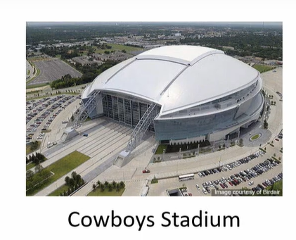

# Lecture 32 - Control of change scope and scope creep

## Agenda

Causes for Project Change  
Scope Creep reason  
Purpose of the formal change control system  
Guidelines for effective change control  
* Controlling Creative Activities  
    * Process Review  
    * Personnel Reassignment  
    * Control of Input Resources  

## Causes for Project Change
* The initial project plans will **likely change** before they are finished.
* Project changes result from three basic causes:
  * Uncertainty about the **technology** on which the work
of the project or its output is based
  * An increase in the **knowledge base** or sophistication
of the client/user leading to scope creep
  * **Modification of the rules** applying to the process of carrying out the project or to its output

* All three causes are especially common in
software projects, where scope creep is
legendary.
* When a project's process or output is changed,
there is almost always an associated change in
the budget and/or schedule
* Coping with changes and changing priorities is perceived as the most
important single problem facing the PM—or if not the most important,
certainly the most irritating.
* Changing project requirements was the most frequent risk class and
impacted project performance.

## Control of Change and Scope Creep
* The most common changes are those due to
the natural tendency of the client and project
team members to try to improve the product
or service.
* New demands and scope requirements
become apparent to the client, which were not
realized at the time of project initiation.

## Scope Creep reason
* Hunsberger (2011) agrees and attributes scope creep to just two reasons:
* Stakeholders only being consulted at the **beginning of the project**
* Requirements were **changing due to new information** about the project's needs.
* New technologies become available or better ideas occur to the team as
work progresses.
* As noted earlier, the later these changes are made in the project, the more
difficult and costly they are to complete.
* Burba (2013) recommends that PMs frame the project
in such a way that sponsors and clients can see for
themselves what the trade-offs of a desired scope
change are.

## Control of Change and Scope Creep

* Instead of telling the client "No," say, "Sure, we can change the design. I'll
reply with this change's schedule and budget impact."
* Without control, a continuing accumulation of little changes can significantly impact the project's schedule and cost.
* **Control of scope creep**
is accomplished with a formal change control
system, which, in some industries, is a part of their configuration
management system responsible for integrating and coordinating changes
throughout the systems development cycle.
* The purpose of the formal change control system is to  
    * review all requested changes to the project
(both content and procedures)
    * identify all task impacts

### Purpose of the formal change control system

* Review all requested changes to the project (both
content and procedures)
* Identify all task impacts
* Translate these impacts into project scope, cost, and schedule
* Evaluate the benefits and costs of the requested changes
* Identify alternative changes that might accomplish the
same ends
* Accept or reject the requested changes
* Communicate the changes to all concerned parties
* Ensure that the changes are implemented properly
* Prepare monthly reports that summarize all changes to
date and their project impacts

## Guidelines for Effective change control
* All project contracts or agreements must **include a
description Of how requests for a change** in the
project's plan, budget, schedule, and/or deliverables I
will be **introduced and processed.**
* Once a project is approved, any change in the
project will be in the form Of a **change order** that will
include a **description Of the agreed-upon change**
together with any changes in the plan, budget,
schedule, and/or deliverables that result from the
change.
* For any but **minor changes, a risk identification and
analysis study** should be performed.
* To **study the potential impact** Of change, it is Often
possible to conduct a **simulation study.**
* The **PM must be consulted on all desired changes**
prior to the preparation and approval Of the change
order.
* The **PM's approval,** however, is **not required.**
* Changes must **be approved**, in writing, **by the client's
agent and by an appropriate representative Of senior
management** Of the firm responsible for carrying out
the project.
* Once the **change order has been completed and approved**, the project plan should be **amended to
reflect the change, and the change** order becomes a
part of the project plan.

## Controlling Creative Activities
* For example, controlling research and development projects, design
projects, and similar processes that depend intimately on the creativity of
individuals and teams.
* **First,** the more creativity involved, the greater the uncertainty surrounding
outcomes.
* **Second,** too much control tends to inhibit creativity.
* Control is not the enemy of creativity
* While the exact outcomes of creative activity may be uncertain, the process of getting the outcome is
usually not uncertain.
* If the potential payoff for the creative activity is high, the need for careful risk management is also high

* To control creative projects, the PM must adopt onel
or some combination of three general approaches to
the problem:  
(1) Process review  
(2) Personnel Reassignment  
(3) Control of input resources  

## Process Review
* The process review focuses on the process of
reaching outcomes rather than on the outcomes
itself.
* Because the outcomes are partially dependent on
the process used to achieve them, uncertain though
they may be, the process is subjected to control.
* For example, in research projects, the researcher
cannot be held responsible for the outcome Of the
research but can most certainly be held responsible
for adherence to the research proposal, the budget,
and the schedule.
* The process is controllable even if the precise results are not.
* Control should be instituted at each project milestone, an obvious
opportunity for phase-gate controls.
* If research results are not as expected or desired,
milestones provide a convenient opportunity to assess
the state of progress, the value of accomplishment to
date, the probability of valuable results in the future,
and the desirability of changes in the research design.
* Again, the object of control is ensuring that the
research design is sound and carried out as planned
or amended.
* The review process should be participative.
* Unilateral judgments from the superior are not apt to be accepted or effective.
* Care must be taken not to overstress the method as
opposed to the result.
* Method is controllable and should be controlled, but results are still what counts.

## Personnel Reassignment
* This type of control is **straightforward**—individuals who
are productive are kept
* Those who are not are moved to other jobs or other organisations.
* Problems with this technique can arise because it is easy to create an elite group.
* While the favoured few are highly motivated to further
achievement, everyone else tends to be demotivated.
* It is also important not to apply control with too
fine an edge.
* While it is not difficult to identify those who fall in the top and bottom quartiles of productivity, it is
usually quite challenging to make clear distinctions
between people in the middle quartiles.

## Control of Input Resources
* In this case, **the focus is on efficiency.**
* The ability to manipulate input resources carries
with it considerable control over output.
* Obviously, efficiency is not synonymous with
creativity, but the converse is equally untrue—
creativity is not synonymous with the extravagant
use Of resources.
* The results flowing from creative activity tend to
arrive in batches.
* Considerable resource expenditure may occur with
no visible results, but then, seemingly all of a sudden,
many outcomes may be delivered.
* The milestones for application of resource control
must therefore be chosen with great care.
* The controller who decides to withhold resources just
before the completion of a research project is apt to
become an ex-controller
* Sound judgment argues for some blend of these three approaches when
controlling creative projects.
* The **first and third approaches** concentrate on the process because the
process is observable and can be affected.
* But the process is not a matter Of moment; results are.
* The **second approach** requires us to measure (or at
least to recognize) output when it occurs.
* This is often quite difficult.
* Thus, the wise PM will use all three approaches:
— checking processes and methods  
— manipulating resources  
— culling those who can not produce.  
