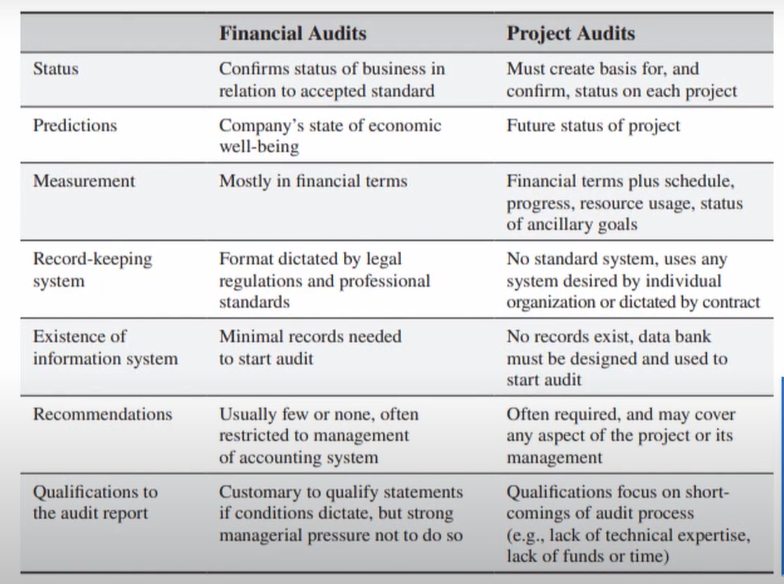

# Lecture 33 - Project Audit

## Agenda
* Project Audit
* Purposes of Evaluation—GoaIs of the System
    * Direct Goals
    * Ancillary Goals
* Project Audit Report format
* Financial vs Project Audits
* Depth of the Audit
* Information in the Audit Report
* Responsibilities of the Project
Auditor/Evaluator
* Steps for carrying out an Audit
* Project Audit Life Cycle

## Introduction
* In the previous lecture, we discussed post-control.
* Post control cannot change the past, but it tries to capture the essence of
project successes and failures so that future projects can benefit from past
experiences.
* Project evaluation should be conducted at several points
during the life cycle, for instance, at major phase gates,
and especially if there is a crisis or major problem in the
project.
* A handy vehicle for evaluation is **the project audit, a formal inquiry into
any aspect of the project.**
* We associate the word audit with a detailed examination of financial
matters, but a project audit is highly flexible and may focus on whatever
matters senior management desires.

## Project Audit
* The **project audit** is a **thorough examination of the
management of a project, its methodology and
procedures, its records, its properties, its budgets
and expenditures, and its degree of completion.**
* It may deal with the project as a whole or only with
a part of the project.
* Proactively determining how a project is performing through periodic
project audits provides timely insights into the project that can be
leveraged to increase the odds of successful project completion.
* **From a strategic perspective, project audits play an
essential role by helping ensure project success,** which
subsequently translates into improved competitive
success.

## Purposes of Evaluation - Goals of the System
* Success dimension(Shenhar et al., 1997)
  * Efficiency
  * Funder impact/satisfaction
  * Business/direct success
  * Future potential

* Identify problems earlier
* Clarify scope, cost, and time relationships
* Improve project performance
* Locate opportunities for future technological advances
* Evaluate the quality of project management
* Reduce costs
* Improve the process of risk identification
management
* Speed up the achievement of results
* Identify mistakes, remedy them, and avoid them in 
the future
* Provide information to the client
* Reconfirm the organization's interest
in and commitment to the project

## Direct Goals
* The stated **project objectives,** including **funder satisfaction,** are the
project's "direct goals."

## Ancillary goals
(A secondary or supporting goal that helps achieve the main objective.)

* Improve understanding Of the ways in which projects
may be of value to the organization
* Improve the processes for organizing and managing
projects, better known as the firm's project management "maturity"
* Provide information and experience for entering new
markets
* Provide a conducive environment in which project team
members can work creatively together
* Identify organizational strengths and weaknesses in
project-related personnel, general management, and
decision-making techniques and systems
* Identify and improve the response to risk factors in the firm's use of projects
* Allow access to project policy decision-making by
external stakeholders
* Improve the way projects contribute to the professional
growth of project team members
* Identify project personnel who have high potential for
managerial leadership

## Project Audit Report format
The formal report may be presented in various formats but should contain comments on the following points - 
1. **Status of the project**
   1. Does the work completed match the planned level of completion?

2. **Future Status**
   1. Are significant schedule/cost/scope changes likely?
   2. If so, indicate the nature of the changes

3. **Status of crucial tasks**
   1. What progress has been made on tasks that could decide the success or failure of the project?

4. **Risk assessment**
— What is the potential for project failure or monetary loss?

5. **Information pertinent to other projects**
— What lessons learned from the audited project can be applied to other projects undertaken by the organisation?

6. **Limitations of the audit**
— What assumptions or limitations affect the data in an audit

## The primary differences between Financial and Project Audits
* Note that the project audit is not a **financial audit.**
* The audit processes are similar in that each
represents a careful investigation of the subject of
the audit, but the outputs of these processes are
quite different.
* The principal distinction between the two is that
the financial audit has a limited scope.
* It concentrates on the use and preservation of the
organization's assets.
* The project audit is far broader in scope and may
deal with the project as a whole or any component
or set of components of the project.

## Depth of the Audit
* There are several practical constraints that may limit the depth of the
project auditor's investigation.
* **Time and money** are two of the most common (and obvious) limits on the depth of investigation and level of detail presented in the audit report.
* Of course, the audit/evaluation process incurs
additional costs beyond the standard professional and
clerical time spent.
* **Accumulation, storage, and maintenance of auditable
data** are essential cost elements.
* First, no matter how skilled the evaluator is, **an audit/evaluation process constantly distracts those working on the project.**
* Worrying about audit results can lead to excessive
self-protective activity, reducing project activity and
causing a decrease in overall performance.
* Second, if the **evaluation report is not written with a "constructive" tone, project morale will suffer.**
* Depending on the severity of the drop in morale, work on the project may receive a **severe setback.**

## Timing of the Audit
* Given that all projects of significant size or
importance should be audited, **the first audits are
usually done early in the project's life.**
* The **sooner a problem is discovered,** the **easier** it is to
deal with.
* Early audits are often focused on the technical issues
to ensure that critical technical problems have been
solved or are under competent attack.
* Ordinarily, audits **done later in the life cycle of a project**
are of **less immediate value to the project but are of more value to the parent organisation**
* As the project develops, technical issues are less likely to be matters of concern.
* Conformity to the schedule and budget becomes the primary interest.
* **Management issues** are significant matters of interest for audits made late in the project's life (e.g., disposal of equipment or reallocation of project personnel).

* Post project audits are conducted with several basic objectives in mind.
    * First, a post project audit is often a legal necessity because the client specified such an audit in the
contract.
    * Second, the post project audit is a major part Of the post
project report, which is, in turn, the main source of
managerial feedback to the parent firm.
    * Third, the post project audit is needed to account for all
project property and expenditures.

## Format and Use of the Audit Report
* The type of project being audited and the uses for which the audit is intended dictate some specifics of the audit report format.
* Within any particular organisation, however, it is helpful to establish a
general format to which all audit reports must conform.
* The audit report serves as a communication tool for
PMs, auditors, and organizational management,
ensuring a shared understanding and expectations.

## Timing and Value of Project Audits/Evaluations

## Information in the Audit Report

The following items cover the minimum information that should be contained in the audit report
1. **Introduction**
* This section contains a description of the project to provide a framework of understanding for the reader.
* Project objectives (direct goals) must be delineated.
* The project proposal may be beneficial to include explanatory parts as an addendum to the report if the objectives are complex.

2. **Current Status**
* Status should be reported as of the time of the audit
and, among other things, should include the following
measures of performance:  
— Cost  
— Schedule  
— Scope  
— Quality  

3. **Future Project Status**

This section contains the auditor's conclusions
regarding progress together with
recommendations for any changes in technical
approach, schedule, or budget that should be
made in the remaining tasks.

4. **Critical Management Issues**

* All issues that the auditor feels require close monitoring by senior management should be included in this section, along with a brief explanation of the relationships between these issues and the objectives of the project.
* A brief discussion Of time/cost/scope trade-offs will give
senior management useful input information for
decisions about the future of the project.

5. **Risk Management**

* This section should contain a review of major risks
associated with the project and their projected impact on project time/cost/scope.
* If alternative decisions exist that may significantly alter future risks, they can be noted at this point in the report.
* Once again, we note that the audit report is not the proper place to second-guess those who wrote the
project proposal.

6. **Caveats, Limitations, and Assumptions**

* This section of the report may be placed at the end
or may be included as a part of the introduction.
* The auditor is responsible for the accuracy and
timeliness Of the report, but senior management still
retains full responsibility for the interpretation of the report and for any action(s) based on the findings

## Responsibilites of the Project Auditor/Evaluator
* First and foremost, the auditor should **"tell the truth."**
* This statement is not as simplistic as it might appear.
* It is a recognition that various levels of truth are associated with any project.
* The auditor must approach the audit objectively and
ethically and assume responsibility for what is included
and excluded from consideration in the report.

## Steps for carrying out an Audit
* Assemble a small team of experienced experts
* Familiarize the team with the requirements of the project
* Audit the project on site
* After completion, debrief the project's management
* Produce a written report according to a prespecified format
* Distribute the report to the PM and project team for their response
* Follow up to see if the recommendations have been
implemented

## The Project Audit Life Cycle

1. **Project Audit Initiation**

This step involves starting the audit process, defining the purpose and
scope of the audit, and gathering sufficient information to determine the
proper audit methodology

2. **Project Baseline Definition**

This cycle phase normally consists Of identifying the performance areas to
be evaluated, determining standards for each area through benchmarking
or some other process, ascertaining management performance
expectations, and developing a program to measure and assemble the
requisite information.

3. **Establishing an Audit Database**

* Once the baseline standards are established, execution of the audit
begins.
* The next step is to create a database for use by the audit team.

4. **Preliminary Analysis of the Project**

* After standards are set and data collected, judgments are made.
* Some auditors avoid judgment on the grounds that such a delicate but
weighty responsibility must be reserved to senior management.
* But judgment often requires a sophisticated
understanding of the technical aspects of the project,
and/or of statistics and probability, subjects that may
elude some managers.

5. **Audit Report Preparation**

* This part Of the audit life cycle includes the preparation Of the audit
report, organized by whatever format has been selected for use.
* A set Of recommendations, together with a plan for implementing them, is
also a part of the audit report.
* If the recommendations go beyond normal practices
of the organization, they will need support from the
policy-making level of management.

6. **Project Audit Termination**

* As with the project itself, after the audit has accomplished its designated task,
the audit process should be terminated.
* When the final report and recommendations are released, there will be a
review of the audit process.
* This is done to improve the methods for conducting the audit.
* When the review is finished, the audit is truly complete, and the audit team should be formally disbanded.