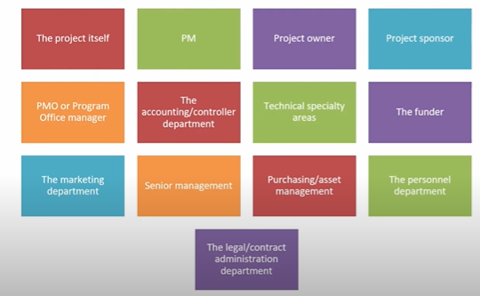
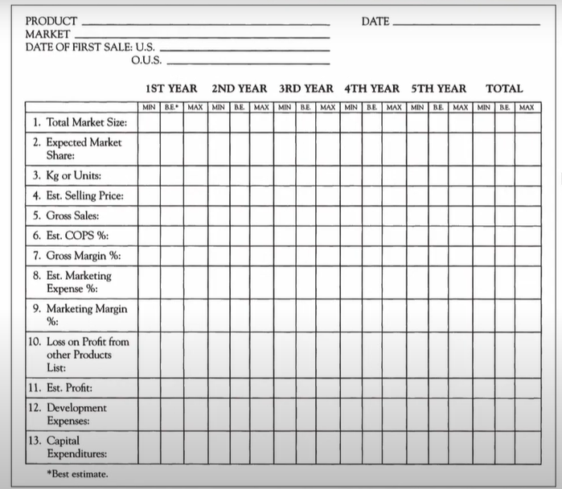
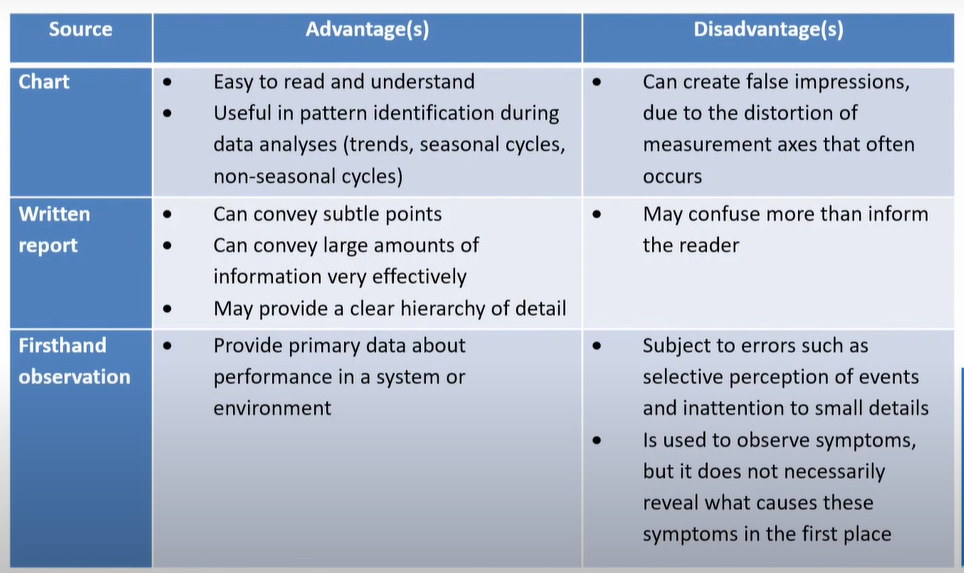

# Lecture 34 - Essentials of an audit evaluation

## Agenda
Some Essentials of an Audit/Evaluation  
The A/E Team  
Access to Records  
Access to Project Personnel and Other
Measurement  
A Note to the Auditor/Evaluator  
Charts, written reports, and firsthand observation  
The auditor: 7 golden rules  
The auditee: 7 golden rules  

## Some Essentials of an Audit/Evaluation

* For an audit/evaluation (hereafter, a/e) to be conducted with skill and
precision, several essential conditions must be met to be credible and
generally acceptable to senior management, the project team, and the
client.
* The a/e team must be properly selected, all records
and files must be accessible, and free contact with
project members must be preserved.

## The A/E Team
* The choice of the a/e team is critical to the success of
the entire process.
* It may seem unnecessary to note that team members
should be selected because Of their ability to
contribute to the a/e procedure.
* Still, sometimes members are selected merely
because they are available.
* The size of the team will generally be a function of the size and complexity of the project.
* For a small project, one person can often handle all the tasks of the a/e, but for a large project, the team may require representatives from several different constituencies.
* Typical areas that might furnish a/e team members are - 

* The main role of the a/e team is to conduct a thorough and complete
examination of the project or some prespecified aspect.
* The team must determine which items should be brought to
management's attention.
* It should report information and make recommendations in such a way as
to maximize the utility of its work.
* The team is responsible for constructive observations and advice based on
the training and experience of its members.
* Members must be aloof from personal involvement with conflicts among
project team staff and from rivalries between projects.
* The a/e is a highly disciplined process; all team members must willingly and
sincerely subject themselves to that discipline.

## Access to Records
* For the a/e team to be effective,
information relevant to the project.
* This may present some problems on
it must have
free access to all
government projects that may be
classified for reasons of national security.
* In such cases, a subgroup of the a/e team may be formed from qualified
("cleared") individuals.
* Most of the information needed for an a/e will come
from the project team's records and those of the
PMO, and/or from various departments such as
accounting, personnel, and purchasing.
* The a/e team is responsible for data collection, not the project management team, while the project team is responsible for keeping project records up-to-date throughout the project's life.
* In addition to the formal records of the project, some of the most valuable
information comes from documents that predate the project.  
— for example, correspondence with the funder that led to the RFP,
minutes of the Project Selection Committee, and minutes of senior
management committees that decided to pursue a specific area of technical interest.
* Clearly, project status reports, relevant technical
memoranda, change orders,
information about
project organisation and management methods, and
financial and resource usage information are also
important.
* The a/e team may have to extract much of these
data from other documents because the required
information is often not in the form needed.
* Data collection is time-consuming, but careful work
is vital for an effective, credible a/e.

## Access to Project Personnel and Others
* The a/e team should maintain free communication with
project team members and other organisational
members with project knowledge.
* One exception is contact between the a/e team and the funder; such contacts are not made without clearance from senior management.
* This restriction would hold even when the funder is
represented on the audit team and should also hold for in-house clients.
* In any case, several rules should be followed when contacting project personnel.
    * Care must be taken to avoid misunderstandings between a/e team
members and project team members.
    * Project personnel should always be made aware of the in-progress a/e.

## Access to Project Personnel and Others
* Critical comments should be avoided.
* Particularly serious is the practice of delivering on-the-spot, off-the-cuff
opinions and remarks that may not be appropriate or represent the consensus opinion of the a/e team.

## Measurement
* Measurement is an integral part of the a/e process.
* Several aspects of a project that should be
measured are apparent and, fortunately, relatively
easy to measure.
* For the most part, it is not difficult to know when a
milestone has been completed.
* It may be difficult
to tell when a chemical
experiment is finished, and it is almost impossible to
tell when a complex
computer program is finally
"bug free."
* Largely, however, milestone completion can be
measured adequately.
* There is
to such measurement
no theoretically acceptable solution
problems, but there are politically acceptable solutions.
* All the cost/revenue allocation decisions must be made when the various
projects are initiated.
* If this is done, the battles are fought "up front," and the equity of
cost/revenue allocations ceases to be so severe an issue.
* If allocations are made by a formula, major conflict is avoided—or, at least, mitigated.

## Baseline Marketing data for a new product

## A Note to the Auditor/Evaluator: Rules of Engagement
* In the context of auditing, "rules of engagement" refer
to a set of guidelines or procedures that auditors
follow when conducting an audit.
* These rules are designed to provide a framework for
the audit process, ensuring consistency, objectivity,
and adherence to professional standards.
* The rules of engagement help define the audit's scope, the auditor's
responsibilities, and the expectations of both the auditor and the auditee
(the entity being audited).

## Key elements of the Rules of Engagement for an auditor
* Scope of the Audit:
— Clearly defining the areas or processes to be audited.  
— Identifying the period covered by the audit.
* Objectivity and Independence:
— Emphasizing the need for auditors to remain impartial and
independent.  
— Addressing any potential conflicts of interest.  
* Audit Methodology
— Outlining the specific audit approach or
methodology to be used.  
— Describing the techniques and tools that will be
employed during the audit.  

* Communication Protocols
— Establishing channels of communication between
the auditor and the auditee.  
— Defining reporting requirements and timelines for communication of findings.  

* Documentation Standards
— Specifying the documentation practices and
standards to be followed.  
— Ensuring that audit work papers are organised,
complete, and in compliance with relevant
standards.

* Confidentiality and Security:
— Addressing the confidentiality of audit
information.  
— Outlining procedures to safeguard sensitive data
and information.

* Ethical Considerations:
— Reinforcing adherence to professional ethics and codes of conduct.  
— Addressing ethical dilemmas that may arise during the audit.
* Client Cooperation:
— Outlining expectations for cooperation from the auditee.
— Defining the responsibilities of the auditee in providing access to information and personnel

## A Note to the Auditor/Evaluator: Permission to enter the System
* It refers to the authorisation granted to auditors to access and examine an information system, network, or specific IT resources as part of an audit engagement.
* This permission is crucial for auditors to perform their evaluations, assess controls, and gather evidence related to the security integrity, and functionality of the system.

## Charts, written reports, and firsthand observation

## The auditor: 7 golden rules
1. The auditor's behavior should be neutral.
Rudeness or a nervous approach will lead to
resistance. Being overly friendly may convey the
message that the audit is not serious.
2. The auditor asks open questions, then allows
time for answers and listens carefully.
3. In most cases, the auditor should avoid "naming names." The point is not to attack the person but to
check the conformance to requirements.
4. The auditor should communicate effectively with management.
5. The auditor refrains from giving recommendations
regarding the actions because it can compromise the audit's objectivity.
6. The auditor should report any safety issues regardless of the audit scope.
7. The auditor is fluent in the agreed-upon language of the audit.

## The auditee - 7 golden rules
1. The documents are identified and updated with proper classification.
2. Order and cleanliness of the work environment must be respected.
3. The auditee knows and applies references
4. The auditees are punctual, available, factual and inspire confidence.
5. The auditee does not give answers they are unsure of and, if needed, seeks
help from their manager or colleagues.
6. If a non-conformity is found, the auditee acts according to the defined
reaction rules.
7. Answers are transparent and do not compromise the confidentiality of
information.
