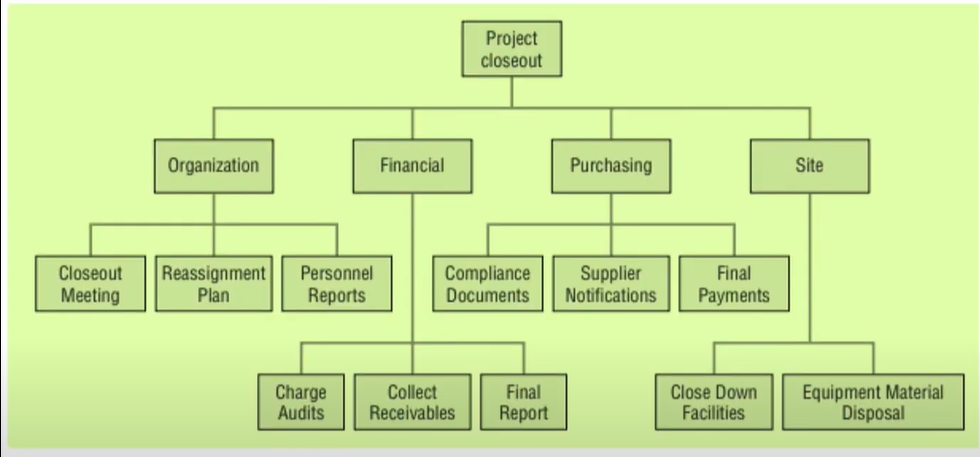
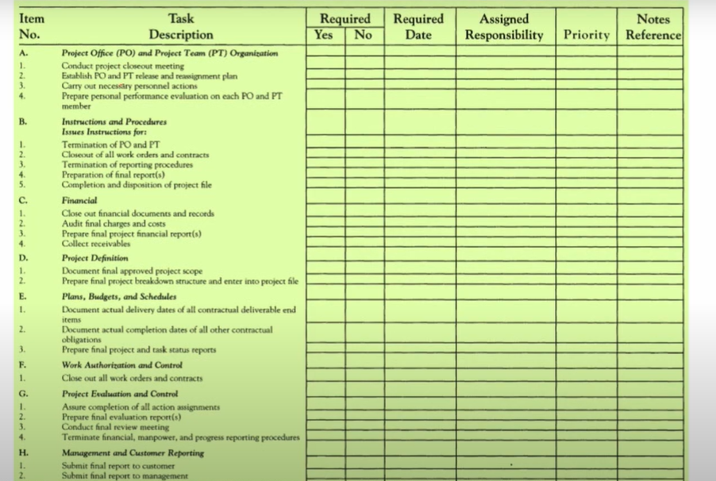

# Lecture 35 - When to close a project ?

## Agenda
* Project Closure
* The Varieties Of Project Closure
    * extinction, addition, integration, and starvation
* Critical Success Factors for Project Implementation
* Fundamental Reasons why some Projects fail
* Other Reasons why Projects fail
* Nontechnical reasons why projects are closed
* Closing Agile Projects
* The Closure Process
* Role of Project Manager in Project Closure

## Project Closure
* A project can be said to be closed
    * **when work on the substance of the project has ceased or
slowed** to the point that further progress on the project is
no longer possible,
    * When **the project has been indefinitely delayed**
    * when **its resources have been deployed to other projects**
    * when project personnel (especially the PM) become
**personae non-gratae** with senior management and in the
company lunchroom.

## The Varieties of Project Closure
There are 4 fundamentally different ways to close out a project - 
1. Extinction
2. Addition
3. Integration
4. Starvation

### 1. Closure by Extinction
* The project is stopped.
* It may end because it has been successful and achieved its goals:
    * The new product has been developed and handed over to the Client, or the software has been installed and is running at the client's facility.
* The project may also be stopped because it is unsuccessful or has been
superseded:
    * The new drug failed efficacy tests, and alternatives are available for
better, faster, cheaper, or prettier results, or it may be too expensive
and take too long to achieve the desired performance.
* Changes in the external environment can kill
projects as well.
* The explosion of the Challenger shuttle
stopped several space shuttle projects
overnight.

### 2. Closure by Addition
* Most projects are "in-house," that is, carried out by the
project team for use in the parent organization.
* If a project is a major success, it may be closed by
institutionalizing it as a formal part of the parent
organization
* For example, most software engineering and/or information systems
departments began by reorganizing an engineering or business school
"subspecialty" into a full-fledged department.

### 3. Closure by Integration
* This method of closing a project is the most common way of dealing with
successful and complex projects.
* The property, equipment, material, personnel, and functions of the
project are distributed among the existing elements of the parent
organization.
* The output of the project becomes a standard part of
the operating systems of the parent or client.

### 4. Closure by Starvation
* There is a fourth type Of project closure, although Strictly speaking, it is not a "closure" at all.
* It is **"slow starvation by budget decrement."**
* Project managers involved in projects for a significant period have faced Budget cuts during business recessions.
* Budget cuts, or decrements, are not rare.
* Because they are common, they are sometimes used to
mask a project closure
* There may be several reasons why senior management does not wish to
close an unsuccessful or obsolete project.
* In some firms, for example, it is politically dangerous to admit that one has championed a failure, and closing a project that has not accomplished its goals is an admission Of failure.
* The project budget may be significantly reduced,
potentially halting project progress and necessitating
the reassignment of numerous team members.
* The project is technically closed, but it still exists as a
legal entity with sufficient staff, including an
administrative assistant who annually issues a "no-
progress" report.

## Critical success factors for Project Implementation
* **Project Mission**
— Clearly defined goals and general directions.
* **Top-Management Support**
— Willingness of top management to provide the
necessary resources and authority/power for
project success.
* **Project Schedule/Plan**
— A detailed specification of the individual action
steps for project implementation.
* **Client Consultation**
— Communication, consultation, and active
listening to all impacted parties.
* **Personnel**
— Recruitment, selection, and training
necessary personnel for the project team.
* **Technical Tasks**
— Availability of the required technology and 
expertise to accomplish the specific technical
action steps.
* **Client Acceptance**
— The act of "selling" the final project to its intended
users.
* **Monitoring and Feedback**
— Timely provision of comprehensive control
information at each stage in the implementation
process.
* **Communication**
— The provision of an appropriate network and
necessary data to all key actors in the project
implementation.
* **Trouble-shooting**
— Ability to handle unexpected crises and deviations
from plan.

## Fundamentals Reasons why Projects fail

1. **A Project Organization Was Not Required**
   * The use of the project form of organisation was inappropriate for this task
or in this environment.
   * The parent organisation must understand the conditions that require
instituting a project.

2. **Insufficient Support from Senior Management**
    * Projects invariably develop needs for resources that were not originally allocated.
    * Arguments between functional departments over the command of such resources are prevalent.
    * Without the direct support of a champion in senior
management, the project is almost certain to lose the
resource battle.

3. Naming the Wrong Person as Project Manager
   * A common mistake is to appoint an individual with excellent technical skills
but weak managerial skills or training as a PM.

4. **Poor Planning**
* This is a prevalent cause of project failure.
* In the rush to get the project's substance underway, competent planning is
neglected.
* Crisis management becomes a routine in such
situations, leading to increased difficulties and errors,
project delays, and budget overruns.

### Other Reasons why Projects fail
* No use was made of earlier project Final Reports that
contained several recommendations for operating
projects in the future.
* Time/cost estimates were not prepared by those
responsible for the work.
* Starting late, the PM jumped into the tasks without
adequate planning.
* Project personnel were moved without adjusting the
schedule or reassigned during slow periods and
unavailable when needed.
* project auditors/evaluators were reluctant to
conduct careful, detailed, meaningful evaluations.
* The project was allowed to continue long after it had
ceased to make cost-effective progress.

## Nontechnical reasons why projects are closed
* There are several nontechnical reasons why projects are closed, but
almost always, these closures seem to be associated with conflict when
the conflict is anticipated at the beginning of the project.
* **Political Closures**
    * We mentioned this type of project demise when discussing termination by
murder.
    * These closures are typically the result of conflict among senior managers,
one of whom may be terminated along with the project.
* **Cross-Cultural Closures**
    * Multinational projects often fail due to communication issues between
cultural groups or incompatible working Styles.
    * Conflicts arise due to poor communication or diverse working styles, leading
to competition for ascendancy or win/lose negotiations among different
cultures.
    * The same cross-cultural forces operate when different disciplines,
marketing and engineering, develop precisely the same problems.

* Senescence Closures
    * There are projects that die simply because senior managers, the project champion, the PM, and even key project workers lose interest in the
project.
    * The project has neither failed nor succeeded.
    * It simply exists.
    * Meanwhile, other exciting new ideas are being projected.
    * The organisation's attention (and resources) is being directed elsewhere.
    * The conflict between the old and the new may not be active.
    * The senescent project gives way to the new.

## Closing Agile Projects
* In Agile approaches the project may be terminated at any time if the product
owner determines the cost required to complete the remaining features in
the product backlog exceed the benefits of adding these features.
* Thus, Agile projects can be closed when sufficient
functionality has been delivered and when it is
determined that future investments would be less
than the incremental future value.
* Furthermore, no stigma is associated with closing a project early in Agile.
* Rather, it is **regarded as a good business practice** to redeploy project team
members and resources when the business value of completing the
remaining backlog is less than the costs (including opportunity costs) of
completing the remaining items in the product backlog.

## The Closure Process
**The Decision Process**  
* Decision-aiding models for the closure decision fall into three generic
categories.
* **First,** some models base the decision on the degree to which the project qualifies **against a set of factors** generally associated with successful (or failed) projects.
* **Second**, some models base the decision on the degree to which the
project meets its goals and objectives.
* **Third**, there are projects that have fallen far enough behind their schedules and planned progress that the cost to complete them is no longer justifiable.

**The Implementation Process**  
* Once it has been decided to close a project, the process by which it will be terminated must be implemented.
* The closure can be planned and orderly or a simple hatchet job.
* The former is apt to have significantly better results, so we suggest that the closure process be planned, budgeted, and scheduled just as is done for any other phase of the project life cycle.

**Design for Project closure**  

### Role of Project Manager in Project Closure
* The processing of the project closeout is conducted under the direct
supervision of the PM, but this often raises dilemmas.
* For many PMs, closure signals the end of their reign as project leaders.
* If the PM has another project to lead, the issue may not be serious; but if
there is no other project and the PM faces a return to a staid life in a
functional division, there may be a great temptation to stretch out the
shutdown process.
* Special closure managers are sometimes helpful in completing the long and
involved process Of shutting down a project.
* In such cases, the PM is transferred to another project or reassigned to a
functional "home."
* The closure manager does not have to deal with substantive project tasks
and, therefore, maybe a person familiar with the administrative
requirements Of closure and the environment within which the project will
be operating (if it continues to live).

## Checklist for project closure

The Primary duties of the closure manager are encompassed in the following nine general task - 
1. Ensure completion Of the work, including tasks
performed by subcontractors.
2. Notify the client of project completion and ensure
that delivery (and installation) is accomplished.
Acceptance of the project must be acknowledged by
the client.
3. Complete documentation, including evaluating project deliverables and preparing the final report, should be completed, including lessons learned from project administration and management.
4. Clear for final billings and oversee preparation of the final invoices sent to the client.
5. Redistribute personnel, materials, equipment, and any other resources to the appropriate places.
6. Clear project with legal counsel or consultant.
File for patents if appropriate.
Record and archive all "nondisclosure" documents.
7. Determine what records (manuals, reports, and
other paperwork) to keep.
Ensure that such documents are stored in the proper
places and that responsibility for document retention is
turned over to the parent organization's archivist.
8. Ascertain any product support requirements (e.g.,
spares, service), decide how such support will be
delivered, and assign responsibility.
9. Oversee the closing of the project's books.