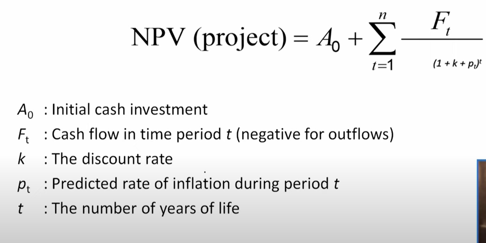
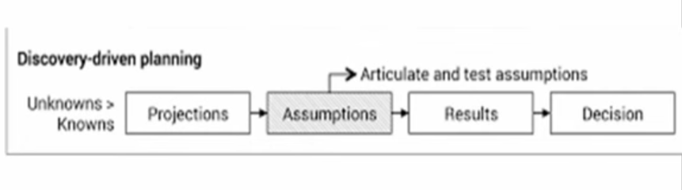

# Lecture 04 : Project Selection Models

## Agenda

1. Non-numeric(Qualitative method of choosing a project)
    * Sacred Cow
    * Operating Necessity
    * Competitive Necessity
    * Product Line Extension
    * Comparative Benefit
    * Sustainability
2. Numeric(Quantitative method of choosing a project)
    * Payback
    * NPV
    * Scoring
    * Window of opportunity
    * Discovery-driven

## Types of Project Selection Models

* Nonnumeric models
* Numeric models

These can be used simultaneously

## Non-numeric Models
* Models that do not return a numeric value for a project to be compared
with other projects
* These are really not "models" but rather justifications for projects
* Just because they are not true models does not make them all "bad"

### Types of Nonnumeric Models
1. Sacred Cow  
    * Often suggested by top management
    * Maintained until completion or boss
terminates it

2. Operating Necessity
    * A project that is required to protect lives or property or to keep the company in operation

3. Competitive Necessity
    * A project that is required to maintain the
company's position in the marketplace

4. Product Line Extension
    * Project evaluated on fit with existing product
line
    * fills a gap
    * strengthens a weak link or extends a line

5. Comparative Benefit
   * Projects are subjectively rank ordered based on their perceived benefit to the company

6. Sustainability
   * — Focusing on long-term profitability rather than short-run payoff

## Numeric Models
* Models that return a numeric value for a project that can be easily compared with other projects
* Major types
    * Profit/profitability
    * Scoring
    * Window-of-opportunity analysis
    * Discovery-driven planning

1. Profit/Profitability
Models that look at costs and revenues
    * Payback period  
    * Discounted cash flow (NPV)  

*  **Payback Period**
    * The length of time until the original investment has been recovered by the project
    * A shorter payback period is better

Payback Period Drawbacks  
* Does not consider time value of money
* More difficult to use when cash flows change over time
* Less meaningful for longer periods of time (due to time value of money)

*  **Discounted Cash Flow**

* The value of a stream of cash inflows and outflows in today's dollars
* Also know as discounted cash flow or just discounting
* Widely used to evaluate projects
* Includes the time value of money
* Includes all inflows and outflows, not just the ones through payback point
* Requires a percentage to use to reduce future cash flows
    * This is known as the discount rate
* The discount rate may also be known as a hurdle rate or cutoff rate
* There will usually be one overall discount rate for the company

* NPV Formula Terms - 

Decision Criteria for NPV Method - 
* A higher NPV is better
* Higher the discount rate lower the NPV

2. Scoring

Mimics how managers evaluate investments  
Uses multiple criteria  
— Can utilize both monetary and qualitative factors  
Weighted factor scoring model  

**Weighted Factor Scoring Model**
Each factor is weighted relative to its importance  
— Weighting allows important factors to stand out  
A good way to include non-numeric data in the analysis  
Factors need to sum to one  
All weights must be set up, so higher values mean more desirable  
Small differences in totals are not meaningful  

**Advantages of Scoring Model**
Allow multiple criteria  
Structurally simple  
Intuitive and reflect actual thinking process  
Direct reflection of managerial policy  
Easily altered  
Allow for more important factors  
Allow easy sensitivity analysis  

**Disadvantages of Scoring Model**
Relative measure
Linear in form
Can have large number of criteria
Unweighted models assume equal importance

3. Window-of-Opportunity Analysis
   
* A Window of Opportunity Analysis is a strategic  
assessment that identifies and evaluates a specific  
time period during which favorable conditions exist  
for pursuing a particular action, project, or strategy.  
* This concept is often used in various fields, including  
business, politics, and economics, to make informed  
decisions about when to take advantage of a unique  
opportunity.

**Window-of-Opportunity Analysis**  
Here are the key elements of a window of opportunity
analysis:
**Identification of Opportunities** The analysis begins
with identifying a potential opportunity.
**Time Sensitivity:** A crucial aspect of a window of
opportunity is that it is time-bound
**External Factors:** External factors, such as changes
in the market, regulatory environment, technology

4. **Discovery-driven Planning**

* Discovery-driven planning is a
strategic approach to planning and
decision-making that is especially
useful when dealing with high levels
of uncertainty and innovation.
* It was developed by Rita McGrath
and Ian MacMillan and introduced
in the Harvard Business Review in

* The central premise of discovery-driven planning is  
that, in certain situations, you can't use traditional  
planning methods because you don't have enough  
information to make accurate forecasts.
* Instead, the planning process is focused on  
learning, adapting, and discovering as you go.

Key principles of discovery-driven planning include  
— Start with Assumptions  
— Learning-Oriented  
— Resource Allocation  
— Scenario Planning  

## Difference between window of opportunity analysis and discovery driven planning

* **Nature of Approach**:
  * **Window of Opportunity Analysis:** This approach
primarily focuses on identifying and capitalizing on
specific time-bound opportunities or favorable
conditions.
  * **Discovery-Driven Planning:**
Discovery-driven planning is a broader and ongoing approach that is not necessarily tied to a specific window of opportunity.

* **Emphasis on Assumptions -** 
  * **Window of Opportunity Analysis:** While
assumptions are considered, the emphasis is on
recognizing and exploiting opportunities within a
limited timeframe.
  * **Discovery-Driven Planning:** Assumptions are a
central part of the approach, and the process
begins with setting and testing assumptions as the
situation evolves.

* **Use of KPIs** - 
    * **Window of Opportunity Analysis:** The emphasis
may be less on predefined Key Performance
Indicators (KPIs) and more on capitalizing on the
opportunity.
    * **Discovery-Driven Planning:** KPIs play a critical role
in the approach, helping to track progress and
adjust plans based on data and insights.

## Choosing a project selection model
Weighted scoring models favored:  
- Allow multiple objectives to be considered  
- Easily adapted  
- Not biased toward short-run like the profitability models  

## Risk consideration in project selection
* Both costs and benefits are uncertain
    * Benefits are more uncertain
* There are many ways of dealing with risk
* Can make estimates about the probability of outcomes
    * Subjective probabilities
* Uncertainty about:
    * Timing
    * What will be accomplished?
    * Side effects