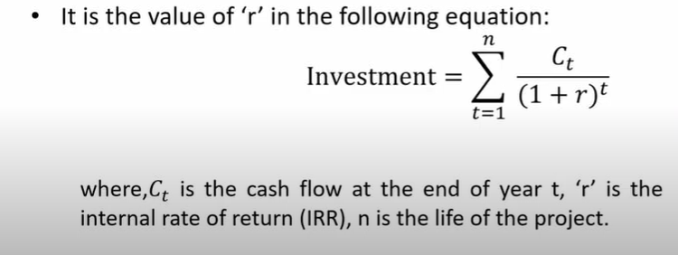
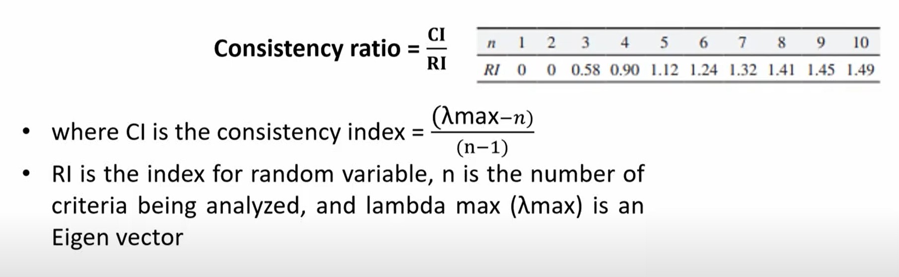

# Lecture 05 : Examples of Project Selection Models

## Agenda

* The Net Present Value (NPV)
    * Calculation of NPV using Excel
* Weighted Scoring Model
* Internal Rate of Return (IRR)
  * Calculation of IRR using Excel
* Analytic Hierarchy Process (AHP)
    * Calculation of AHP using Excel

## The Net Present Value(NPV)
The net present value (NPV) of a project is the sum of the present values of
all the cash flows - positive as well as negative - that are expected to occur
over the life of the project. The general formula for NPV is:

Example1 - ?
Example2 - ?

Hence, the decision rule associated with the net present value criterion is:
* Accept the project if the net present value is positive
* Reject the project if the net present value is negative
* (if the net present value is zero, it is a matter of indifference)

## Weighted Scoring Model
Consider buying a house as a project and you have different criteria by
which you are going to make a decision

* Location: The neighbourhood and proximity to
amenities, work, and schools.
The cost of the home and associated
* Price:
expenses.
The square footage and number of rooms in
* Size:
the house.
* Safety: The security of the area and crime rates.
* Resale Value: The potential for the home's value to
appreciate over time.
* School Quality: The quality of schools in the area
for families with children.

## Internal Rate of Return (IRR)
* The internal rate of return (IRR) of a project is the discount rate, which
makes its NPV equal to zero.
* Put differently, it is the discount rate which equates the present value of
future cash flows with the initial investment.

* In the NPV calculation we assume that the discount rate (cost of capital)
is known and determine the NPV
* In the IRR calculation, we set the NPV equal to zero and determine the
discount rate that satisfies this condition.

Example - ?

The decision rule for IRR is as follows:  
* **Accept** :lf the IRR is greater than the cost of capital
* **Reject** : If the IRR is less than the cost of capital

## Analytic Hierarchy Process (AHP)

* Analytic Hierarchy Process (AHP) is a Multi-Criteria Decision-Making Technique introduced by T. L. Saaty
* Different studies have been carried out in the past to determine the optimal
size, location, and technology by using other MCDM methods

### AHP Example for selection of a car
Suppose selecting a car is a project selection problem.
Here, we are trying to make a well-informed decision by analyzing
different criteria in order to compare three cars, A, B and C and
determine which is the best car for selection

**Check for consistency**
* Consistency of data is checked according to the procedure suggested by T. L. Saaty
* The consistency check is done by performing the "consistency ratio check"

Consistency ratio = CI/RI

