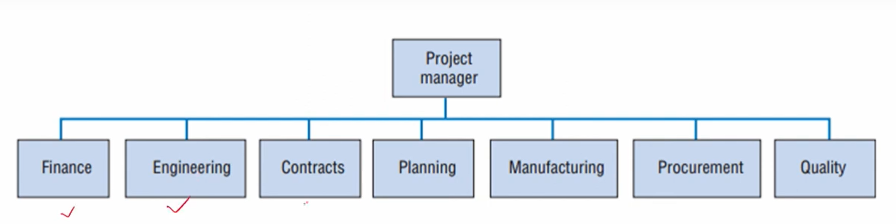

# Lecture 06 : Project Manager
Project Manager & Functional Manager  
Major Questions Facing Project Managers  
Project Manager Responsibilities  
Project Manager Career Paths  
Special Demands on the Project Manager  
— Characteristics for Team Members    
— Tuckman Ladder  
— Scope Creep  
— Other special demands  

## Project Manager

* The project manager can be chosen and installed as soon as the project is selected for funding  
— This simplifies several start-up activities
* The project manager can be chosen later  
— This makes things difficult
* Senior management briefs the project manager  
* The project manager begins with a budget and schedule
— As people are added, these are refined

Project management organisation showing typical responsibilities of a project manager.

* Project managers are usually generalists
* It would be very unusual for a project manager to have all the technical
skills that are used in their projects
* Project managers:
— Rarely decide who performs each task  
— Lack the technical skills to evaluate much of the work performed on a particular project  
— Exercise control very little over most aspects of the work that gets performed on the project  

## Functional Manager

* Department heads are usually functional specialists
* They have the required technical skills to evaluate all
members of their organisation
* Functional managers:
— Decide who performs each task  
— Decide how the task is performed  
— Exercise a great deal of control over every aspect
of the work that gets performed within their area  

## Comparing Functional & Project Managers
| Feature                  | Functional Managers                      | Project Managers                         |
|--------------------------|------------------------------------------|------------------------------------------|
| Skills Needed            | Need technical skills                    | Need negotiation skills                  |
| Analytical/Synthesis     | Should be more skilled at analysis      | Should be more skilled at synthesis      |
| Approach                 | Use the analytic approach                | Use systems approach                     |
| Scope of Responsibility  | Responsible for a small area             | Responsible for the big picture          |
| Role                     | Act as managers                          | Act as facilitators                      |
| Scope of Responsibility  | Responsible for a small area             | Responsible for the big picture          |
| Supervisory Style        | Act as direct, technical supervisors     | Act as facilitators and generalists      |

## Three Major Questions Facing Project Managers
* What needs to be done?
* When must it be done?
* How are the resources required to do the job to be obtained?

## Project Manager Responsibilites
* **The parent organization**

Proper usage of resources  
Timely and accurate reports  
— Covered in detail later
Keep project sponsor informed  
* **The project and the client**
Preserve the integrity of the project  
— This may be difficult with all sides wanting  
changes
Keep the client informed of major changes  

* **The project team** 

    * Very few people will work for the project
manager
    * The "team" will disband at the end of the project
    * The project manager must look out for
everyone's future
        * This is in the best interest of the project
otherwise as the project winds down,
everyone will be looking after themselves

## Career Paths for Project Manager
Might work on several projects simultaneously  
Small short-term projects train new project managers  
Start on small projects and work up to large projects  
Experience as a project manager is often seen as a desirable step on the corporate ladder  

**Trainee:**  
— a six-month position to learn about project management  
**Cost Analysis/Schedule Engineer:**  
— a 6—18-month team position reporting to a project manager  
**Site Manager:**  
— a 6—12-month position responsible for a large site and reporting to a
program manager  
**Small Project Manager:**  
— sole responsibility for a $1M to $3M revenue project  
**Project Manager:**  
— responsible for $3M to $25M projects  
**Program Manager:**  
— responsible for multiyear projects and programs over $25M  

## Special Demands on the Project Manager
Basically what we are expecting from the project manager. 

**Acquiring adequate resources**  
Project budgets are usually inadequate  
Resource trade-offs must be considered  
Crises occur that require special resources  
Availability of resources is seen as a "win-lose" proposition  

**Acquiring and motivating personnel**  
Most project workers are borrowed from functional managers  
The project manager negotiates for the desired worker but  
— the project manager wants the best qualified individual  
— the functional manager decides who to assign  

The functional manager also decides:  
— the skill level to assign  
— the pay and promotion of the worker  
Worker will most likely return to the functional manager once the project is finished  
Once workers are assigned to a project, the project manager must motivate them  
— The project manager has little or no control over
pay and promotion  

**Dealing with obstacles** 
* Every project is unique  
* The project manager should be ready to face a series of crises  
* A big problem is "**scope creep.**"  
Good project managers are fire preventers hopefully, but also firefighters   
- **Scope creep**  
Scope creep happens when changes are made to
the project scope without any control procedure
like change requests.  
Those changes also affect the project schedule,
budget, costs, and resource allocation and might
compromise the completion of milestones and
goals.  
Scope creep is one of the most common project
management risks.  
* **Reasons for scope screep**

1. **Ambiguous Scope Definition - Solutions**
* Sponsors:
— Develop charters with specific product features
* Project managers
— Create tight scope statements, with features in
and out of scope
— Decompose deliverables into work packages using
a WBS
* Business analysts:
— Create scope models to align the project team's
mental models
— Define detailed and complete
requirements

2. **Scope and Requirements Not Managed- Solutions**
* Project managers  
Include a change management process in the
scope management plan and follow them
both  
* Business analysts  
Create a requirements management plan to
be included in the overall scope management
plan and follow it, including requirements
traceability.  
* Both  
Formally communicate, review, and approve
all requirements; use traceability to manage
the process.

3. **Inconsistent Process for Collecting Product Requirements- Solutions**
* Project Manager and Business Analyst:  
Define requirements processes related to
scope, analysis, prioritisation, traceability, and
new requests  
* Business analysts  
Use context diagrams to scope/stakeholders early (e.g., SIPOCs, Context
Diagrams); add detail in layers as appropriate
* Both  
Define scope and requirements iteratively in
"layers" throughout requirements analysis  

4. **Lack of Sponsorship and Stakeholder Involvement: Solutions**

* Sponsors:  
— Develop Charters that communicate desired
product features, emphasising project benefits  
* Project managers 
Provide project status that engages sponsors,
focusing on how deliverables are being realised  
* Both 
— Use tools like **RACI** to get a commitment for
approvals and for providing input, review, testing,
etc.  
R - Responsible
A - Accountable
C - counltant
I - Informed

5. **Project Length-Solutions**
* Sponsors:
— Keep projects as short as possible and focused.
* Project managers:
Decompose projects into smaller subprojects  
— Close out sub-projects to maintain momentum and show results  

* Early problems are associated with resources
* Later problems are associated with:
    * Last-minute schedule and technical changes  
    * The happenings to a team when the project is completed  

**Making project goal trade-offs**  
* Project managers must make trade-offs between the project goals of:  
Cost  
Time  
Scope  
Ancillary goals  
* Multiple projects  
* Project goals and organizational goals  

**Maintaining a balanced outlook**  
Hard to tell where a project is headed  
Outlook can change over the life of a project  
Technical problems cause waves of pessimism and optimism  
Mood swings can hurt performance  
Maintaining a positive outlook is a delicate job  

**Breadth of communication**  
Most of a project manager's time is spent communicating  
In order to properly communicate, the PM must deal with or understand:  
why the project exists  
that some projects fail  
that support of the top management is needed  
a strong information network is needed  
they must be flexible  

**Negotiation**  
In order to meet the demands of the job of a PM as mentioned before, the PM must be a highly skilled negotiator  
There is almost no aspect of the PM's job that does not depend directly on this skill  

## Important Characteristics for Team Members
High-quality technical skills  
Political and general sensitivity  
Strong problem orientation  
Strong goal orientation  
High self-esteem  

## Essential Characteristics for Team Members
* The PM should expect conflict with the creation of a new project team
where the individual team members do not know one another
* To help navigate the conflict, it is helpful if the PM understands the way
teams tend to develop
* One of the more popular classic models of team develo ment is one
referred to as the **"Tuckman ladder."**

## Tuckman's Five Stages of Group Development (Tuckman Ladder)
Teams progress through four development phases:  
Forming  
Storming  
Norming  
Performing  
Adjourning  

