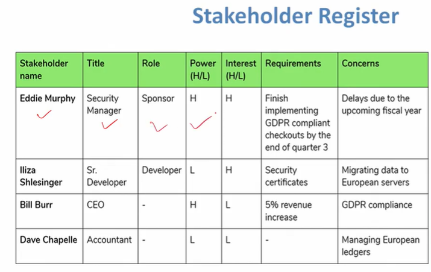
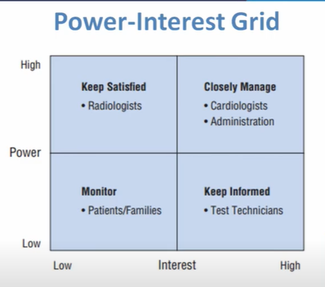
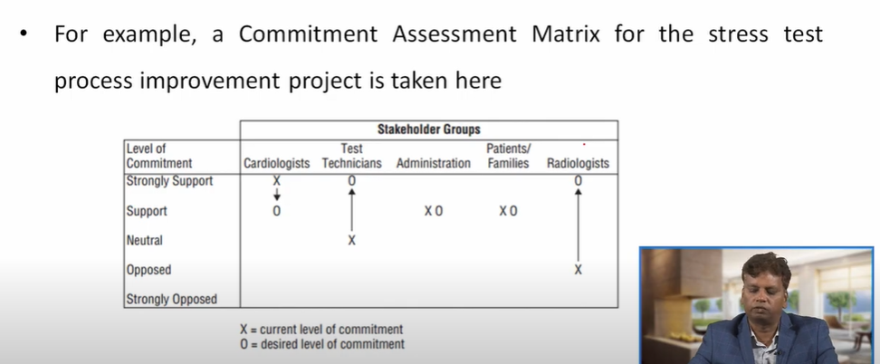

# Lecture 08 : Managing for Stakeholders
* Stakeholders  
* Stakeholders Analysis  
    * Power-Interest Grid  
    * Commitment Assessment Matrix  
* Managing Stakeholder Engagement

## Stakeholders
Definitions - 
Stakeholders are defined by Eskerod (2017) as "any
individual, group, or entity who can affect or is affected
by the project process or the project outcomes."

* According to the PMI, project stakeholders are defined as
  * "Individuals and organisations who are actively
involved in the project, or whose interests may be
positively or negatively affected as a result of
successful project
project execution or
completion."

* For a private firm or organisation, this can include
  * Top management
  * Functional management
  * Project manager(PM)
  * Project Team
  * Individual workers
  * contractors
  * Clients
  * customers
  * Public at large
  * Governmental groups
  * Regulators
* For a public organisation such as a
  * Municipalities
  * State body
  * central Govt
  * External stakeholders such as local citizens
  * Any executing contractors

## Four important reasons to be aware of the roles of stakeholders

1. The project may need contributions from the stakeholders, such as  
expertise, ideas, funds, approvals, compliance, and proper usage of the  
project's deliverables.
2. Stakeholder resistance may negatively affect the project during its front-end   
formulation, its execution, or closure where benefits realisation is attempted
3. The project may affect stakeholders in ways not anticipated, either positive
or negative.
4. Stakeholders may have their criteria for evaluating the "success" of the
project.

## Management of Stakeholders

* The idea of including the consideration of all
stakeholders in the formulation, execution, and
delivery/closure of the project was first noted
by Freeman (1984).
* This concept was later referred to by the term
"management of stakeholders".
* 'Management of Stakeholders' phrasing was considered a bit arrogant and
misleading in that the intended objective was not to manipulate the
stakeholders, as we might "manage" project costs or tasks, but rather to
work with them to achieve the benefits desired of the project.
* Hence, the new term "Management for stakeholders"
was coined to correct the problem
* In trying to manage stakeholders, there are frequently a
great many stakeholders that could be identified
* Do they all have an equal voice in the project?
* Clearly not, and although the funder's voice may be the
most important, some stakeholders may be so powerful
or have so much influence that they will have to take
high priority also
* However, it is essential to keep in mind that
which stakeholders are key can also vary over
the duration and phases of the project
* we are usually referring to the key stakeholders
when we make suggestions for identifying and
working with them

## Identifying Stakeholders
* Before the goals of the stakeholders can be aligned
with the purpose of the project, they must be
identified
* Most commonly, the expert judgment of the PM,
the project owner, and the project team are
employed to identify the stakeholders
* The first item on this group's 'To Do' list should be to carefully familiarize
themselves with all the documentation of the project that is available,
such as:
— Business case  
— Communications management plan  
— Scope document  
— Benefits management plan and so on  
* Additional documentation for clues would be stakeholder registers from
previous projects that were similar to this one and any lessons learned from
those projects
* Talking with the PMs or whoever wrote those as well as
the current documents, could provide the group with
additional insights about who else should be included as
stakeholders and how critical each of those stakeholders
might be or were to the project
* Be sure to include ancillary internal stakeholders such
as
— legal, human resources, audit/accounting,
information technology
* External stakeholders including
— regulatory agencies, local politicians and citizens,
investors, contractors etc
* Finally, reexamine the project in terms of its potential
such as environmental,
social,
consequences
technological, historical, and any other contexts that
could identify other possible stakeholders

## Analyzing Stakeholders

* After identifying the stakeholders,
register should be created to
information about them, including
— contact information
a stakeholder
maintain key
— probable requirements and expectations
— what stage in the project they will likely have the
most interest in.

### Stakeholder register

* Apart from the stakeholder register, a stakeholder issue
log should be initiated to catalogue issues that arise
and how they were resolved
* Next, we'll engage with stakeholders to update the
register with detailed personal information and project-
related feedback for better communication and
engagement.
* Hopefully, the PM should be able to show the benefits
that each stakeholder will be able to realise from the
project
* As additional information is learned about a
stakeholder throughout the project, the stakeholder
register and issue log should be updated.
* The Project Management Institute has found that
the primary method project groups use to obtain
stakeholder feedback is regular and structured
face-to-face meetings
* The Project Management Institute has found that
the primary method project groups use to obtain
stakeholder feedback is regular and structured
face-to-face meetings
* Secondary methods include employee surveys and
customer satisfaction surveys

## Analyzing Stakeholders - Example
* we will use the example of a process improvement project that is about to
be launched at a hospital with the goal of reducing the turnaround times for
patients' stress tests.
* The turnaround time for a stress test is measured as the elapsed time from
when a cardiologist ordered the stress test until a radiologist signs off the
results
* Delays in receiving the results from stress tests impact the timeliness of
treating patients, which in turn impacts the patient's length of stay at the
hospital
* For the purpose of this example, we further assume that during an early
project team meeting, the PM and process improvement team identified the
following stakeholder groups:
    * Radiologists
    * Cardiologists
    * Hospital administration
    * The stress test technicians, and
    * The patients/families

## Power-Interest Grid

* The power/interest grid is a matrix used for
categorising stakeholders during a change
project to allow them to be effectively
managed.
* Stakeholders are plotted on the grid in
relation to the power and interest they have
regarding the project.

The grid categorises stakeholders into the following four groups:  
High power/high interest  
High power/low interest  
Low power/high interest  
Low power/low interest  

## Commitment Assessment Matrix

* In addition to thoughtfully considering the type of relationship the PM and
project team should have with stakeholders, it is also essential to assess
how much engagement and commitment is needed from various
stakeholder groups for the project to succeed.
* A useful tool for assessing the level of commitment needed from
stakeholders is the Commitment Assessment Matrix
* In this matrix, both the current level of commitment and the desired level
of commitment are assessed for each stakeholder group.

* In comparing the current and desired levels of commitment to the process
improvement project, we observe that the cardiologists are more
committed than desired, indicating a possible risk that they will interfere
in unproductive ways with the project
* On the other hand, for the project to
greater commitment is needed from
technicians and especially the radiologists.
succeed,
the test
* Thus, the PM and project team need to develop an appropriate
communication plan to reduce the cardiologists' commitment to the
project and to substantially increase the commitment of the test
technicians and radiologists

## Managing Stakeholder Engagement

Managing stakeholder engagement involves the following activities  
* Obtaining and confirming stakeholders' commitment to the project's
success at the appropriate stages in the project
* Communicating regularly with stakeholders to make sure their
expectations remain realistic as the project progresses
* Proactively addressing stakeholder concerns before they become major
issues
* Resolving issues in a timely fashion once they have been identified