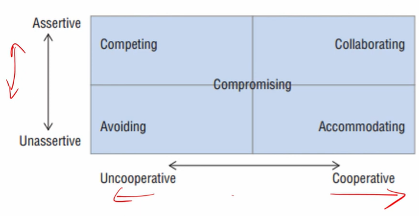

# Lecture 09 : Resolving Conflicts

## Agenda

* Conflict
* Conflict and Project life cycle
* Dealing With Conflict

## Conflict

**Conflict:** the process which begins when one
party perceives that the other has frustrated
some concern of his  

Our concern is goal conflicts that occur when
a group pursues goals different from other
groups  

**Negotiation:** the skills required to resolve
most conflicts

## Categories of Conflict

1. Different Goals and Expectations

* Some conflicts happen as day-to-day work on projects is usually carried
out by many different units of the organisation that often differ in their
objectives and technical judgments
* These units have different expectations about
the project, its costs, rewards, relative importance, and timing
* Conflicts about schedules, intra and interproject priorities, cost estimates,
and staff time tend to fall into this category.
* At base, they arise because the PM and the functional managers have
different goals.
* The project owner and PM's concern is the project.

2. Uncertainty about authority

* Other conflicts reflect the fact that both technical and administrative procedures are important aspects of project management
* Uncertainty about who has the authority to make
decisions on resource allocation, administrative
procedures, communication, technological choices,
and all the other matters affecting the project
produces conflict between the various stakeholders.
* It is simple enough (and correct) to state that the functional manager
controls who works on the project and makes technical decisions, while
the PM controls the schedule and flow of work.
* In practice, amid the day's countless little crises faced by project and
functional manager alike, the distinction is rarely clear.

3. Interpersonal conflict

* While cooperating with many persons, it seems inevitable that some
personalities will clash
* Also, in conflicts between the project and senior management, it is the
PM who personifies the project and thus is generally a party to the
conflict

## Project conflicts by Category and Stakeholders

## Conflict and Project life cycle - Project Formation

* Conflict centers around the confusion of starting a
new project  
— Many of the policies and procedures have not yet
been formed  
— The objectives of the project are not yet finalized  
* Conflict cannot be avoided at this phase
* In fact, much of this conflict is good conflict

## Handling Project Formation conflict

Four fundamental issues that must be handled to get order - 
1. Technical objectives must be set
2. Senior management and line managers must commit to the project
3. Organizational structure of the project must be established
4. The priority for the project must be set

## Project Buildup

* Conflicts tend to be technical in nature
* Conflicts between the PM and the functional areas tend to predominate

## Main Program

## Project Phase-out

1. Deadlines are a major source of conflict
2. Technical problems are rare
3. Personality conflicts will be a big deal due to time pressures

## Dealing With Conflict

* People deal with conflict along two dimensions
Assertive => Unassertive
Cooperative => Uncooperative
* **Assertiveness** is the quality of being self-assured and
confident without being aggressive to defend a right
point of view or a relevant statement.

## Conflict Resolution Strategies

### Dealing with Conflict - competing

* Referring to Figure , approaching a situation
assertively and being unwilling to cooperate is
referred to as a "competing" strategy.
* When a competing strategy is employed, the
person views the situation as though someone
must lose for the other to win, or, in this case,
I win, and you lose (win—lose).
* This competing strategy may be appropriate
when the decision must be made quickly.

### Dealing With Conflict —Avoiding

* Alternatively, when the position is not asserted
aggressively, but the person is still unwilling to cooperate, we have a conflict "avoiding" strategy.
* This is a lose-lose strategy
cooperating with the other
achieve their goals, nor are
your own goals
because you are not
person to help them
you actively pursuing
* This strategy might be applied when the issue is not
that important to you or you deem the detrimental
effects of the conflict outweigh the benefits of
resolving the issue in a desirable way

### Dealing With Conflict —Collaborating
* When you
assertively state your position but
do so in a spirit of cooperation,
you are
employing a **"collaborating"** strategy
* Here your focus is on achieving your goals but
with the recognition that the best solution is
one that benefits both parties.
* Thus,
the collaborating strategy can be
considered a win—win strategy.
* Preferred strategy in most situations and
particularly in situations where the needs of
both parties are important.

### Dealing With Conflict - Accommodating

* In situations where you
**do not assert your
position and focus more on cooperating**
with the other party, you employ an
"accommodating" strategy.
* In this case, the focus is on resolving the
issue from the other person's point of view.
* Here the situation can be described as I lose,
you win, or lose—win.
* It would be appropriate to employ the
accommodating strategy when you were
wrong, or the issue is much more important
to the other person.

### Dealing With Conflict- Compromising

* Finally, when you take a **middle-ground position on both  dimensions** you are "compromising."
* In these cases, nobody wins, and nobody
loses.
* Thus, you have likely arrived at a solution that
you and the other party can live with but are
not particularly happy about.
* You might employ a compromising strategy
when the potential benefits of trying to
develop a win—win solution are exceeded by
the costs.

### Dealing With Conflict

* The value of this framework is, it helps us to recognize that there are
alternative strategies that can be utilized to resolve conflicts.
* Successful project management requires that when
conflict arises, the situation is carefully evaluated and
the approach for managing the conflict is proactively
chosen in a way that best enhances the quality of the
relationship between the parties.

## Pareto optimal solution

* Pareto-optimal solution to the two-party conflict
and discusses the nature of the bargaining
process required to reach optimality, a complex
and time-consuming process
* For example, if you want to buy a car, you may
have objectives such as Iow price, high fuel
efficiency, good safety rating, and so on

* The PM must remember that he or she will be negotiating with project
stakeholders many times in the future
* If he or she conducts a win—lose negotiation and the other party loses,
from then on, he or she will face a determined adversary who seeks to
defeat him or her. This is not helpful