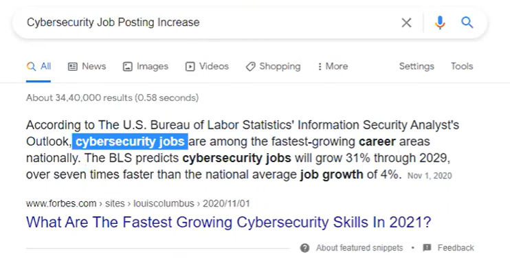
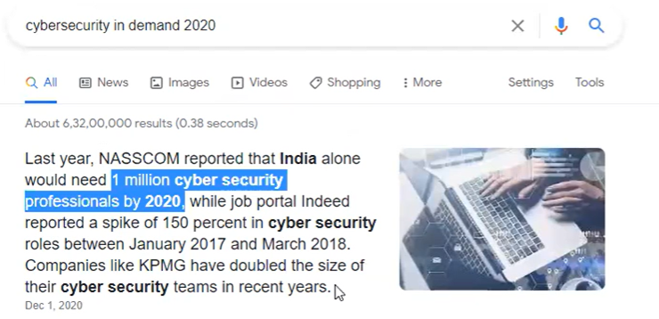

# 2. What is Security Testing?
Securit Testing is performed to identify/uncover the
Security Loopholes(vulnerabilities) in the Application and get them fixed,
with an intention of protecting the Application data/information
from getting hacked

## 3. Importance of Security Testing

* https://informationisbeautiful.net/visualizations/worlds-biggest-data-breaches-hacks/

* Lose their reputation, trust
* Lose the money

## 4. Security Testing - Future (Jobs, Skill Shortage, Demand, unemployment rate, Pay & Career Advice)

* Cybersecurity Job Posting Increase
    * As the hacks and data-breaches increase, the Jobs too increase
* Cybersecurity skills shortage 2020
    * Less people and hence less competition
    * More time to fill the positions
* Cybersecurity - unemployment rate
* cybersecurity In demand 2020

* Pay scale - 1.5 to 3 times more than other Software Testing jobs
* Rewarded more and valued more, as this is a specialized skill
* career Advice for the different experienced people
* Experience - 3 Years to more than => Adds value to your existing job

## 5. Security Testing versus Vulnerability Assessment versus Penetration Testing
* Security Testing has 2 things
  * Vulnerability Assessment
    * We identify the security loopholes(i.e. Vulnerabilities)
  * Penetration Testing
    * We will simulate the Hacker activities
      * hack/breach/intrude
      * checking or proving to see to what extent this security loophole is causing the damage/posing risk

* We should not perform penetration testing until the client insists you to do so(consult with the client)
* Sometimes client does not know what is penetration testing
  * In that case Educate the client

## 6. Security Testing Versus Hacking
- With an intention of learning Security Testing, don't end up in purchasing Hacking Course
  - Security Testing is about identifying the loopholes in the application.
- Hacking Courses don't teach you -  how to identify the Security Loopholes in the Application, which is actually required for Security Testing Job role.
- Hacking Courses will only teach you how to hack or breach data or intrude applications.
  - They will not teach you how to identify the Security Loopholes in the Application
- May be you can take Hacking Courses to improve your knowledge, once you are good at Security Testing

## 7. Security Testing - Don't end up in Jail (Very Important)
- Its very important that, we should not be performing Security Testing on the Applications that we don't have the permissions for.
- If you perform Security Testing on some random applications, with an intention of learning or practicing it, this may be treated as Hacking activity, case may be reported by Cyber Branch and you may end up in Jail.
- Only practice Security Testing on the applications which are open for such kind of Testing (I will provide them in the upcoming sessions) or the Applications that are given by the Client for performing Security Testing.

## 8. Manual Security Testing Versus Security Testing Tools
- We have to learn how to perform Security Testing manually over just depending on tools
  - Basically here we have to identify vulnerabilities without any tools
  - Knowledge matters first than we can move into tools
- Tools will make our job easy, but they should not be used for replacing Manual Security Testing
  - Learning tools is very simple, but once we have good understanding of security testing the understanding of tools become easy
