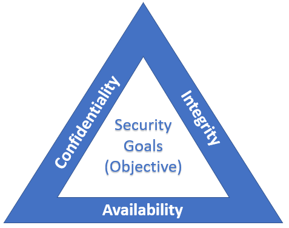

# CIA Triad - Basic High Level Objectives of Security Testing
- **Basic or high level Goals and Objectives** of **Security Testing or Security Program** is to achieve CIA Triad
- C.I.A Traid stands for - Confidentiality, Integrity and Availability  
  - C => **Confidentiality** - Information is private and secured
    - > How secured is the data in the application
  - I => **Integrity** - Only Authorized people should be able to update (add,modify,delete) Information
  - A => **Availability** - Application/System is available all the time to the intended users.
    - > Hacker will try to simulate false traffic to this application. Hacker will try to make the system down
    - > Application should not accept false traffice

