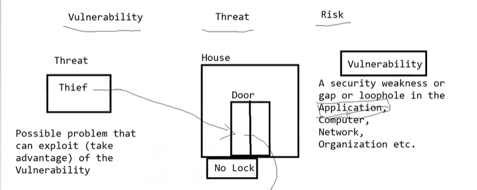
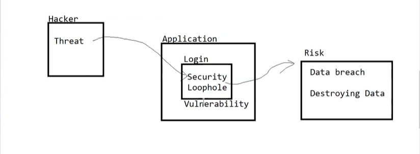
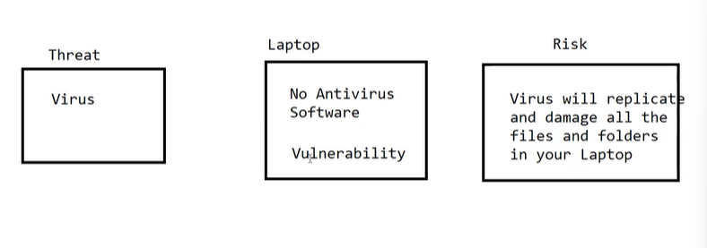

# Security Testing - Vulnerability versus Threat versus Risk

* **Vulnerability** - A security weakness or gap or loophole in the application, computer, network, Organization etc.
* **Threat** - Possible problem that can exploit(Take advantage) a vulnerability. This may be intentional or unintentional
* **Risk** - Potential for loss, damange as a result of a Threat exploiting a vulnerability

Analogy -  A house with a door but with no lock

