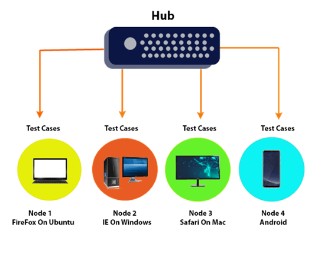

## What is Selenium Grid?
Selenium Grid is a feature in Selenium that allows you to run test cases in different   
machines across different platforms.

The control of triggering the test cases is on the local machine, and when the test   
cases are triggered, they are automatically executed by the remote machine. Suppose   
you have 5 test cases. Your local machine is running multiple applications, so you want   
to run your test cases in a remote machine. You need to configure the remote server so   
that the test cases can be executed there.

It supports distributed test execution. Initially, you have a local machine   
where you write the test cases and executes on the same machine. However, in a   
big organization, you have multiple test cases, and it's not possible to run all   
the test cases in the same machine. In a large organization, you have multiple   
servers, so local machine distributes the test cases across different machines/servers.

## Architecture of Selenium Grid

## Hub
* A Hub is a central point or a local machine that receives all the test requests and   
distributes them to the right nodes. The machine which actually triggers the test case   
known as Hub
* There can be only one hub in a selenium grid.
* The machine which is containing the hub triggers the test case, but you will see the   
browser being automated on other machines.

## Node
Nodes are the selenium instances which will execute the test cases that you loaded on the hub.   
Nodes can be launched on multiple machines with different platforms and browsers.

## Why Selenium Grid?
Selenium Grid is useful of the following reasons:
1. Run on different platforms.
2. Parallel execution